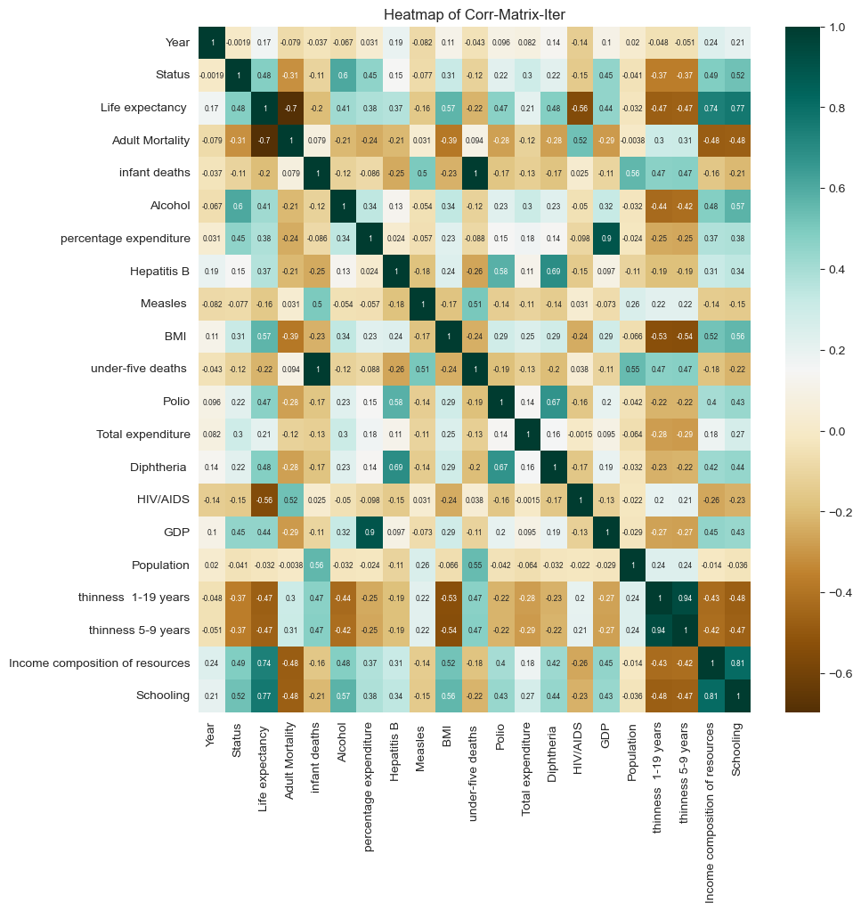
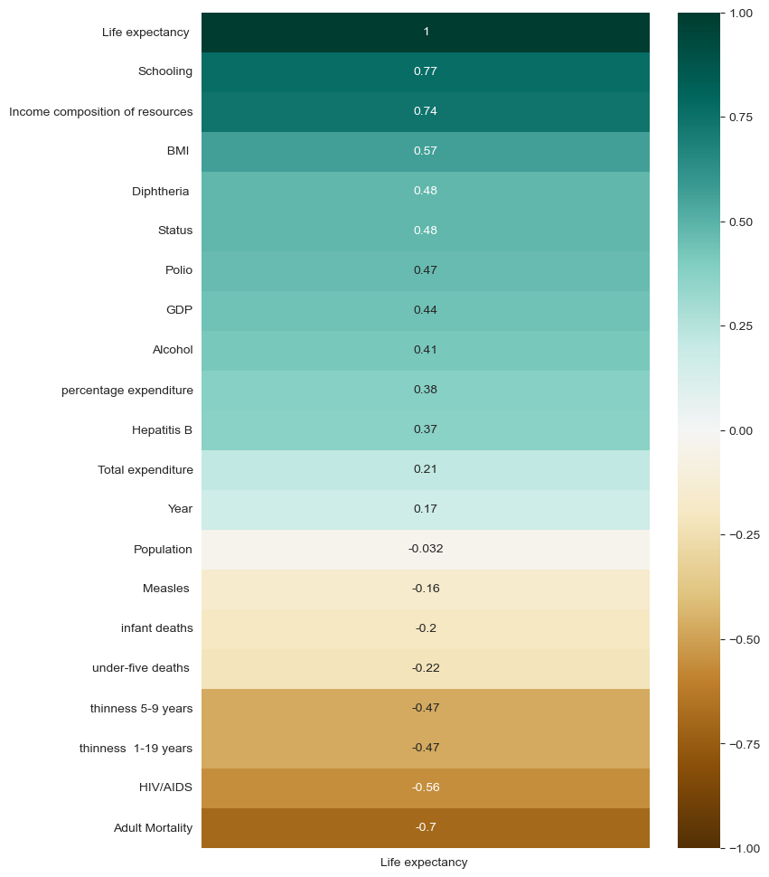

# Life Expectancy (WHO) Machine Learning

We will examine the `Life Expectancy` within the health status dataset collected by the WHO in the year 2015 using **Support Vector Regression**.


```python
#import libraries
import pandas as pd
import seaborn as sns
import matplotlib.pyplot as plt
from scipy.stats import skew, kurtosis
import plotly.express as px
from plotly.offline import init_notebook_mode
import warnings

#Imputation
from sklearn.experimental import enable_iterative_imputer
from sklearn.impute import IterativeImputer
from sklearn.impute import KNNImputer
from sklearn.impute import SimpleImputer

#Preproccessing & model_selection
from sklearn.preprocessing import StandardScaler
from sklearn.model_selection import train_test_split

#SVR
from sklearn.svm import SVR
from sklearn.model_selection import GridSearchCV

color_pal = sns.color_palette(palette="muted")
init_notebook_mode(connected=True)
warnings.filterwarnings("ignore")

```


<script type="text/javascript">
window.PlotlyConfig = {MathJaxConfig: 'local'};
if (window.MathJax && window.MathJax.Hub && window.MathJax.Hub.Config) {window.MathJax.Hub.Config({SVG: {font: "STIX-Web"}});}
if (typeof require !== 'undefined') {
require.undef("plotly");
requirejs.config({
    paths: {
        'plotly': ['https://cdn.plot.ly/plotly-2.12.1.min']
    }
});
require(['plotly'], function(Plotly) {
    window._Plotly = Plotly;
});
}
</script>


```python
#import data
life = pd.read_csv("Life Expectancy Data.csv")
```


```python
life
```


<div>
<style scoped>
    .dataframe tbody tr th:only-of-type {
        vertical-align: middle;
    }

    .dataframe tbody tr th {
        vertical-align: top;
    }

    .dataframe thead th {
        text-align: right;
    }
</style>
<table border="1" class="dataframe">
  <thead>
    <tr style="text-align: right;">
      <th></th>
      <th>Country</th>
      <th>Year</th>
      <th>Status</th>
      <th>Life expectancy</th>
      <th>Adult Mortality</th>
      <th>infant deaths</th>
      <th>Alcohol</th>
      <th>percentage expenditure</th>
      <th>Hepatitis B</th>
      <th>Measles</th>
      <th>...</th>
      <th>Polio</th>
      <th>Total expenditure</th>
      <th>Diphtheria</th>
      <th>HIV/AIDS</th>
      <th>GDP</th>
      <th>Population</th>
      <th>thinness  1-19 years</th>
      <th>thinness 5-9 years</th>
      <th>Income composition of resources</th>
      <th>Schooling</th>
    </tr>
  </thead>
  <tbody>
    <tr>
      <th>0</th>
      <td>Afghanistan</td>
      <td>2015</td>
      <td>Developing</td>
      <td>65.0</td>
      <td>263.0</td>
      <td>62</td>
      <td>0.01</td>
      <td>71.279624</td>
      <td>65.0</td>
      <td>1154</td>
      <td>...</td>
      <td>6.0</td>
      <td>8.16</td>
      <td>65.0</td>
      <td>0.1</td>
      <td>584.259210</td>
      <td>33736494.0</td>
      <td>17.2</td>
      <td>17.3</td>
      <td>0.479</td>
      <td>10.1</td>
    </tr>
    <tr>
      <th>1</th>
      <td>Afghanistan</td>
      <td>2014</td>
      <td>Developing</td>
      <td>59.9</td>
      <td>271.0</td>
      <td>64</td>
      <td>0.01</td>
      <td>73.523582</td>
      <td>62.0</td>
      <td>492</td>
      <td>...</td>
      <td>58.0</td>
      <td>8.18</td>
      <td>62.0</td>
      <td>0.1</td>
      <td>612.696514</td>
      <td>327582.0</td>
      <td>17.5</td>
      <td>17.5</td>
      <td>0.476</td>
      <td>10.0</td>
    </tr>
    <tr>
      <th>2</th>
      <td>Afghanistan</td>
      <td>2013</td>
      <td>Developing</td>
      <td>59.9</td>
      <td>268.0</td>
      <td>66</td>
      <td>0.01</td>
      <td>73.219243</td>
      <td>64.0</td>
      <td>430</td>
      <td>...</td>
      <td>62.0</td>
      <td>8.13</td>
      <td>64.0</td>
      <td>0.1</td>
      <td>631.744976</td>
      <td>31731688.0</td>
      <td>17.7</td>
      <td>17.7</td>
      <td>0.470</td>
      <td>9.9</td>
    </tr>
    <tr>
      <th>3</th>
      <td>Afghanistan</td>
      <td>2012</td>
      <td>Developing</td>
      <td>59.5</td>
      <td>272.0</td>
      <td>69</td>
      <td>0.01</td>
      <td>78.184215</td>
      <td>67.0</td>
      <td>2787</td>
      <td>...</td>
      <td>67.0</td>
      <td>8.52</td>
      <td>67.0</td>
      <td>0.1</td>
      <td>669.959000</td>
      <td>3696958.0</td>
      <td>17.9</td>
      <td>18.0</td>
      <td>0.463</td>
      <td>9.8</td>
    </tr>
    <tr>
      <th>4</th>
      <td>Afghanistan</td>
      <td>2011</td>
      <td>Developing</td>
      <td>59.2</td>
      <td>275.0</td>
      <td>71</td>
      <td>0.01</td>
      <td>7.097109</td>
      <td>68.0</td>
      <td>3013</td>
      <td>...</td>
      <td>68.0</td>
      <td>7.87</td>
      <td>68.0</td>
      <td>0.1</td>
      <td>63.537231</td>
      <td>2978599.0</td>
      <td>18.2</td>
      <td>18.2</td>
      <td>0.454</td>
      <td>9.5</td>
    </tr>
    <tr>
      <th>...</th>
      <td>...</td>
      <td>...</td>
      <td>...</td>
      <td>...</td>
      <td>...</td>
      <td>...</td>
      <td>...</td>
      <td>...</td>
      <td>...</td>
      <td>...</td>
      <td>...</td>
      <td>...</td>
      <td>...</td>
      <td>...</td>
      <td>...</td>
      <td>...</td>
      <td>...</td>
      <td>...</td>
      <td>...</td>
      <td>...</td>
      <td>...</td>
    </tr>
    <tr>
      <th>2933</th>
      <td>Zimbabwe</td>
      <td>2004</td>
      <td>Developing</td>
      <td>44.3</td>
      <td>723.0</td>
      <td>27</td>
      <td>4.36</td>
      <td>0.000000</td>
      <td>68.0</td>
      <td>31</td>
      <td>...</td>
      <td>67.0</td>
      <td>7.13</td>
      <td>65.0</td>
      <td>33.6</td>
      <td>454.366654</td>
      <td>12777511.0</td>
      <td>9.4</td>
      <td>9.4</td>
      <td>0.407</td>
      <td>9.2</td>
    </tr>
    <tr>
      <th>2934</th>
      <td>Zimbabwe</td>
      <td>2003</td>
      <td>Developing</td>
      <td>44.5</td>
      <td>715.0</td>
      <td>26</td>
      <td>4.06</td>
      <td>0.000000</td>
      <td>7.0</td>
      <td>998</td>
      <td>...</td>
      <td>7.0</td>
      <td>6.52</td>
      <td>68.0</td>
      <td>36.7</td>
      <td>453.351155</td>
      <td>12633897.0</td>
      <td>9.8</td>
      <td>9.9</td>
      <td>0.418</td>
      <td>9.5</td>
    </tr>
    <tr>
      <th>2935</th>
      <td>Zimbabwe</td>
      <td>2002</td>
      <td>Developing</td>
      <td>44.8</td>
      <td>73.0</td>
      <td>25</td>
      <td>4.43</td>
      <td>0.000000</td>
      <td>73.0</td>
      <td>304</td>
      <td>...</td>
      <td>73.0</td>
      <td>6.53</td>
      <td>71.0</td>
      <td>39.8</td>
      <td>57.348340</td>
      <td>125525.0</td>
      <td>1.2</td>
      <td>1.3</td>
      <td>0.427</td>
      <td>10.0</td>
    </tr>
    <tr>
      <th>2936</th>
      <td>Zimbabwe</td>
      <td>2001</td>
      <td>Developing</td>
      <td>45.3</td>
      <td>686.0</td>
      <td>25</td>
      <td>1.72</td>
      <td>0.000000</td>
      <td>76.0</td>
      <td>529</td>
      <td>...</td>
      <td>76.0</td>
      <td>6.16</td>
      <td>75.0</td>
      <td>42.1</td>
      <td>548.587312</td>
      <td>12366165.0</td>
      <td>1.6</td>
      <td>1.7</td>
      <td>0.427</td>
      <td>9.8</td>
    </tr>
    <tr>
      <th>2937</th>
      <td>Zimbabwe</td>
      <td>2000</td>
      <td>Developing</td>
      <td>46.0</td>
      <td>665.0</td>
      <td>24</td>
      <td>1.68</td>
      <td>0.000000</td>
      <td>79.0</td>
      <td>1483</td>
      <td>...</td>
      <td>78.0</td>
      <td>7.10</td>
      <td>78.0</td>
      <td>43.5</td>
      <td>547.358878</td>
      <td>12222251.0</td>
      <td>11.0</td>
      <td>11.2</td>
      <td>0.434</td>
      <td>9.8</td>
    </tr>
  </tbody>
</table>
<p>2938 rows × 22 columns</p>
</div>


```python
life.info()
```

    <class 'pandas.core.frame.DataFrame'>
    RangeIndex: 2938 entries, 0 to 2937
    Data columns (total 22 columns):
     #   Column                           Non-Null Count  Dtype  
    ---  ------                           --------------  -----  
     0   Country                          2938 non-null   object 
     1   Year                             2938 non-null   int64  
     2   Status                           2938 non-null   object 
     3   Life expectancy                  2928 non-null   float64
     4   Adult Mortality                  2928 non-null   float64
     5   infant deaths                    2938 non-null   int64  
     6   Alcohol                          2744 non-null   float64
     7   percentage expenditure           2938 non-null   float64
     8   Hepatitis B                      2385 non-null   float64
     9   Measles                          2938 non-null   int64  
     10   BMI                             2904 non-null   float64
     11  under-five deaths                2938 non-null   int64  
     12  Polio                            2919 non-null   float64
     13  Total expenditure                2712 non-null   float64
     14  Diphtheria                       2919 non-null   float64
     15   HIV/AIDS                        2938 non-null   float64
     16  GDP                              2490 non-null   float64
     17  Population                       2286 non-null   float64
     18   thinness  1-19 years            2904 non-null   float64
     19   thinness 5-9 years              2904 non-null   float64
     20  Income composition of resources  2771 non-null   float64
     21  Schooling                        2775 non-null   float64
    dtypes: float64(16), int64(4), object(2)
    memory usage: 505.1+ KB
    

There are 2938 entries with total 22 columns. 21 columns are features and the column **Life expectancy** will be handled as target columns

**Country** and **Status** are two categorical features. While for **Country** it is clear that we have several unique outcomes, let's check whether we can transform **Status** to a numerical variable


```python
life.Status.value_counts()
```


    Developing    2426
    Developed      512
    Name: Status, dtype: int64


For **Status** there are two outcomes:
1. Developing
2. Developed

But before we start with the analysis, let us have some fun with ploty. Just because I like interactive graphics :)


```python
life_plot = life.dropna()
life_plot["Year"] = life_plot["Year"].apply(str)

fig=px.line(life_plot.sort_values(by=["Country", "Year"]), x="Year", y="Life expectancy ", animation_frame="Country", animation_group="Year", color="Country", markers=True,title="Country wise Life Expectancy over Years")
fig.update_layout(yaxis=dict(range=[40,90]))
fig.show()
```


<div>                            <div id="ae7e1d45-5de4-40fb-b160-7db529519289" class="plotly-graph-div" style="height:525px; width:100%;"></div>            <script type="text/javascript">                require(["plotly"], function(Plotly) {                    window.PLOTLYENV=window.PLOTLYENV || {};                                    if (document.getElementById("ae7e1d45-5de4-40fb-b160-7db529519289")) {                    Plotly.newPlot(                        "ae7e1d45-5de4-40fb-b160-7db529519289",                        [{"hovertemplate":"Country=Afghanistan<br>Year=%{x}<br>Life expectancy =%{y}<extra></extra>","ids":["2000","2001","2002","2003","2004","2005","2006","2007","2008","2009","2010","2011","2012","2013","2014","2015"],"legendgroup":"Afghanistan","line":{"color":"#636efa","dash":"solid"},"marker":{"symbol":"circle"},"mode":"lines+markers","name":"Afghanistan","orientation":"v","showlegend":true,"x":["2000","2001","2002","2003","2004","2005","2006","2007","2008","2009","2010","2011","2012","2013","2014","2015"],"xaxis":"x","y":[54.8,55.3,56.2,56.7,57.0,57.3,57.3,57.5,58.1,58.6,58.8,59.2,59.5,59.9,59.9,65.0],"yaxis":"y","type":"scatter"}],                        {"template":{"data":{"histogram2dcontour":[{"type":"histogram2dcontour","colorbar":{"outlinewidth":0,"ticks":""},"colorscale":[[0.0,"#0d0887"],[0.1111111111111111,"#46039f"],[0.2222222222222222,"#7201a8"],[0.3333333333333333,"#9c179e"],[0.4444444444444444,"#bd3786"],[0.5555555555555556,"#d8576b"],[0.6666666666666666,"#ed7953"],[0.7777777777777778,"#fb9f3a"],[0.8888888888888888,"#fdca26"],[1.0,"#f0f921"]]}],"choropleth":[{"type":"choropleth","colorbar":{"outlinewidth":0,"ticks":""}}],"histogram2d":[{"type":"histogram2d","colorbar":{"outlinewidth":0,"ticks":""},"colorscale":[[0.0,"#0d0887"],[0.1111111111111111,"#46039f"],[0.2222222222222222,"#7201a8"],[0.3333333333333333,"#9c179e"],[0.4444444444444444,"#bd3786"],[0.5555555555555556,"#d8576b"],[0.6666666666666666,"#ed7953"],[0.7777777777777778,"#fb9f3a"],[0.8888888888888888,"#fdca26"],[1.0,"#f0f921"]]}],"heatmap":[{"type":"heatmap","colorbar":{"outlinewidth":0,"ticks":""},"colorscale":[[0.0,"#0d0887"],[0.1111111111111111,"#46039f"],[0.2222222222222222,"#7201a8"],[0.3333333333333333,"#9c179e"],[0.4444444444444444,"#bd3786"],[0.5555555555555556,"#d8576b"],[0.6666666666666666,"#ed7953"],[0.7777777777777778,"#fb9f3a"],[0.8888888888888888,"#fdca26"],[1.0,"#f0f921"]]}],"heatmapgl":[{"type":"heatmapgl","colorbar":{"outlinewidth":0,"ticks":""},"colorscale":[[0.0,"#0d0887"],[0.1111111111111111,"#46039f"],[0.2222222222222222,"#7201a8"],[0.3333333333333333,"#9c179e"],[0.4444444444444444,"#bd3786"],[0.5555555555555556,"#d8576b"],[0.6666666666666666,"#ed7953"],[0.7777777777777778,"#fb9f3a"],[0.8888888888888888,"#fdca26"],[1.0,"#f0f921"]]}],"contourcarpet":[{"type":"contourcarpet","colorbar":{"outlinewidth":0,"ticks":""}}],"contour":[{"type":"contour","colorbar":{"outlinewidth":0,"ticks":""},"colorscale":[[0.0,"#0d0887"],[0.1111111111111111,"#46039f"],[0.2222222222222222,"#7201a8"],[0.3333333333333333,"#9c179e"],[0.4444444444444444,"#bd3786"],[0.5555555555555556,"#d8576b"],[0.6666666666666666,"#ed7953"],[0.7777777777777778,"#fb9f3a"],[0.8888888888888888,"#fdca26"],[1.0,"#f0f921"]]}],"surface":[{"type":"surface","colorbar":{"outlinewidth":0,"ticks":""},"colorscale":[[0.0,"#0d0887"],[0.1111111111111111,"#46039f"],[0.2222222222222222,"#7201a8"],[0.3333333333333333,"#9c179e"],[0.4444444444444444,"#bd3786"],[0.5555555555555556,"#d8576b"],[0.6666666666666666,"#ed7953"],[0.7777777777777778,"#fb9f3a"],[0.8888888888888888,"#fdca26"],[1.0,"#f0f921"]]}],"mesh3d":[{"type":"mesh3d","colorbar":{"outlinewidth":0,"ticks":""}}],"scatter":[{"marker":{"line":{"color":"#283442"}},"type":"scatter"}],"parcoords":[{"type":"parcoords","line":{"colorbar":{"outlinewidth":0,"ticks":""}}}],"scatterpolargl":[{"type":"scatterpolargl","marker":{"colorbar":{"outlinewidth":0,"ticks":""}}}],"bar":[{"error_x":{"color":"#f2f5fa"},"error_y":{"color":"#f2f5fa"},"marker":{"line":{"color":"rgb(17,17,17)","width":0.5},"pattern":{"fillmode":"overlay","size":10,"solidity":0.2}},"type":"bar"}],"scattergeo":[{"type":"scattergeo","marker":{"colorbar":{"outlinewidth":0,"ticks":""}}}],"scatterpolar":[{"type":"scatterpolar","marker":{"colorbar":{"outlinewidth":0,"ticks":""}}}],"histogram":[{"marker":{"pattern":{"fillmode":"overlay","size":10,"solidity":0.2}},"type":"histogram"}],"scattergl":[{"marker":{"line":{"color":"#283442"}},"type":"scattergl"}],"scatter3d":[{"type":"scatter3d","line":{"colorbar":{"outlinewidth":0,"ticks":""}},"marker":{"colorbar":{"outlinewidth":0,"ticks":""}}}],"scattermapbox":[{"type":"scattermapbox","marker":{"colorbar":{"outlinewidth":0,"ticks":""}}}],"scatterternary":[{"type":"scatterternary","marker":{"colorbar":{"outlinewidth":0,"ticks":""}}}],"scattercarpet":[{"type":"scattercarpet","marker":{"colorbar":{"outlinewidth":0,"ticks":""}}}],"carpet":[{"aaxis":{"endlinecolor":"#A2B1C6","gridcolor":"#506784","linecolor":"#506784","minorgridcolor":"#506784","startlinecolor":"#A2B1C6"},"baxis":{"endlinecolor":"#A2B1C6","gridcolor":"#506784","linecolor":"#506784","minorgridcolor":"#506784","startlinecolor":"#A2B1C6"},"type":"carpet"}],"table":[{"cells":{"fill":{"color":"#506784"},"line":{"color":"rgb(17,17,17)"}},"header":{"fill":{"color":"#2a3f5f"},"line":{"color":"rgb(17,17,17)"}},"type":"table"}],"barpolar":[{"marker":{"line":{"color":"rgb(17,17,17)","width":0.5},"pattern":{"fillmode":"overlay","size":10,"solidity":0.2}},"type":"barpolar"}],"pie":[{"automargin":true,"type":"pie"}]},"layout":{"autotypenumbers":"strict","colorway":["#636efa","#EF553B","#00cc96","#ab63fa","#FFA15A","#19d3f3","#FF6692","#B6E880","#FF97FF","#FECB52"],"font":{"color":"#f2f5fa"},"hovermode":"closest","hoverlabel":{"align":"left"},"paper_bgcolor":"rgb(17,17,17)","plot_bgcolor":"rgb(17,17,17)","polar":{"bgcolor":"rgb(17,17,17)","angularaxis":{"gridcolor":"#506784","linecolor":"#506784","ticks":""},"radialaxis":{"gridcolor":"#506784","linecolor":"#506784","ticks":""}},"ternary":{"bgcolor":"rgb(17,17,17)","aaxis":{"gridcolor":"#506784","linecolor":"#506784","ticks":""},"baxis":{"gridcolor":"#506784","linecolor":"#506784","ticks":""},"caxis":{"gridcolor":"#506784","linecolor":"#506784","ticks":""}},"coloraxis":{"colorbar":{"outlinewidth":0,"ticks":""}},"colorscale":{"sequential":[[0.0,"#0d0887"],[0.1111111111111111,"#46039f"],[0.2222222222222222,"#7201a8"],[0.3333333333333333,"#9c179e"],[0.4444444444444444,"#bd3786"],[0.5555555555555556,"#d8576b"],[0.6666666666666666,"#ed7953"],[0.7777777777777778,"#fb9f3a"],[0.8888888888888888,"#fdca26"],[1.0,"#f0f921"]],"sequentialminus":[[0.0,"#0d0887"],[0.1111111111111111,"#46039f"],[0.2222222222222222,"#7201a8"],[0.3333333333333333,"#9c179e"],[0.4444444444444444,"#bd3786"],[0.5555555555555556,"#d8576b"],[0.6666666666666666,"#ed7953"],[0.7777777777777778,"#fb9f3a"],[0.8888888888888888,"#fdca26"],[1.0,"#f0f921"]],"diverging":[[0,"#8e0152"],[0.1,"#c51b7d"],[0.2,"#de77ae"],[0.3,"#f1b6da"],[0.4,"#fde0ef"],[0.5,"#f7f7f7"],[0.6,"#e6f5d0"],[0.7,"#b8e186"],[0.8,"#7fbc41"],[0.9,"#4d9221"],[1,"#276419"]]},"xaxis":{"gridcolor":"#283442","linecolor":"#506784","ticks":"","title":{"standoff":15},"zerolinecolor":"#283442","automargin":true,"zerolinewidth":2},"yaxis":{"gridcolor":"#283442","linecolor":"#506784","ticks":"","title":{"standoff":15},"zerolinecolor":"#283442","automargin":true,"zerolinewidth":2},"scene":{"xaxis":{"backgroundcolor":"rgb(17,17,17)","gridcolor":"#506784","linecolor":"#506784","showbackground":true,"ticks":"","zerolinecolor":"#C8D4E3","gridwidth":2},"yaxis":{"backgroundcolor":"rgb(17,17,17)","gridcolor":"#506784","linecolor":"#506784","showbackground":true,"ticks":"","zerolinecolor":"#C8D4E3","gridwidth":2},"zaxis":{"backgroundcolor":"rgb(17,17,17)","gridcolor":"#506784","linecolor":"#506784","showbackground":true,"ticks":"","zerolinecolor":"#C8D4E3","gridwidth":2}},"shapedefaults":{"line":{"color":"#f2f5fa"}},"annotationdefaults":{"arrowcolor":"#f2f5fa","arrowhead":0,"arrowwidth":1},"geo":{"bgcolor":"rgb(17,17,17)","landcolor":"rgb(17,17,17)","subunitcolor":"#506784","showland":true,"showlakes":true,"lakecolor":"rgb(17,17,17)"},"title":{"x":0.05},"updatemenudefaults":{"bgcolor":"#506784","borderwidth":0},"sliderdefaults":{"bgcolor":"#C8D4E3","borderwidth":1,"bordercolor":"rgb(17,17,17)","tickwidth":0},"mapbox":{"style":"dark"}}},"xaxis":{"anchor":"y","domain":[0.0,1.0],"title":{"text":"Year"}},"yaxis":{"anchor":"x","domain":[0.0,1.0],"title":{"text":"Life expectancy "},"range":[40,90]},"legend":{"title":{"text":"Country"},"tracegroupgap":0},"title":{"text":"Country wise Life Expectancy over Years"},"updatemenus":[{"buttons":[{"args":[null,{"frame":{"duration":500,"redraw":false},"mode":"immediate","fromcurrent":true,"transition":{"duration":500,"easing":"linear"}}],"label":"&#9654;","method":"animate"},{"args":[[null],{"frame":{"duration":0,"redraw":false},"mode":"immediate","fromcurrent":true,"transition":{"duration":0,"easing":"linear"}}],"label":"&#9724;","method":"animate"}],"direction":"left","pad":{"r":10,"t":70},"showactive":false,"type":"buttons","x":0.1,"xanchor":"right","y":0,"yanchor":"top"}],"sliders":[{"active":0,"currentvalue":{"prefix":"Country="},"len":0.9,"pad":{"b":10,"t":60},"steps":[{"args":[["Afghanistan"],{"frame":{"duration":0,"redraw":false},"mode":"immediate","fromcurrent":true,"transition":{"duration":0,"easing":"linear"}}],"label":"Afghanistan","method":"animate"},{"args":[["Albania"],{"frame":{"duration":0,"redraw":false},"mode":"immediate","fromcurrent":true,"transition":{"duration":0,"easing":"linear"}}],"label":"Albania","method":"animate"},{"args":[["Algeria"],{"frame":{"duration":0,"redraw":false},"mode":"immediate","fromcurrent":true,"transition":{"duration":0,"easing":"linear"}}],"label":"Algeria","method":"animate"},{"args":[["Angola"],{"frame":{"duration":0,"redraw":false},"mode":"immediate","fromcurrent":true,"transition":{"duration":0,"easing":"linear"}}],"label":"Angola","method":"animate"},{"args":[["Argentina"],{"frame":{"duration":0,"redraw":false},"mode":"immediate","fromcurrent":true,"transition":{"duration":0,"easing":"linear"}}],"label":"Argentina","method":"animate"},{"args":[["Armenia"],{"frame":{"duration":0,"redraw":false},"mode":"immediate","fromcurrent":true,"transition":{"duration":0,"easing":"linear"}}],"label":"Armenia","method":"animate"},{"args":[["Australia"],{"frame":{"duration":0,"redraw":false},"mode":"immediate","fromcurrent":true,"transition":{"duration":0,"easing":"linear"}}],"label":"Australia","method":"animate"},{"args":[["Austria"],{"frame":{"duration":0,"redraw":false},"mode":"immediate","fromcurrent":true,"transition":{"duration":0,"easing":"linear"}}],"label":"Austria","method":"animate"},{"args":[["Azerbaijan"],{"frame":{"duration":0,"redraw":false},"mode":"immediate","fromcurrent":true,"transition":{"duration":0,"easing":"linear"}}],"label":"Azerbaijan","method":"animate"},{"args":[["Bangladesh"],{"frame":{"duration":0,"redraw":false},"mode":"immediate","fromcurrent":true,"transition":{"duration":0,"easing":"linear"}}],"label":"Bangladesh","method":"animate"},{"args":[["Belarus"],{"frame":{"duration":0,"redraw":false},"mode":"immediate","fromcurrent":true,"transition":{"duration":0,"easing":"linear"}}],"label":"Belarus","method":"animate"},{"args":[["Belgium"],{"frame":{"duration":0,"redraw":false},"mode":"immediate","fromcurrent":true,"transition":{"duration":0,"easing":"linear"}}],"label":"Belgium","method":"animate"},{"args":[["Belize"],{"frame":{"duration":0,"redraw":false},"mode":"immediate","fromcurrent":true,"transition":{"duration":0,"easing":"linear"}}],"label":"Belize","method":"animate"},{"args":[["Benin"],{"frame":{"duration":0,"redraw":false},"mode":"immediate","fromcurrent":true,"transition":{"duration":0,"easing":"linear"}}],"label":"Benin","method":"animate"},{"args":[["Bhutan"],{"frame":{"duration":0,"redraw":false},"mode":"immediate","fromcurrent":true,"transition":{"duration":0,"easing":"linear"}}],"label":"Bhutan","method":"animate"},{"args":[["Bosnia and Herzegovina"],{"frame":{"duration":0,"redraw":false},"mode":"immediate","fromcurrent":true,"transition":{"duration":0,"easing":"linear"}}],"label":"Bosnia and Herzegovina","method":"animate"},{"args":[["Botswana"],{"frame":{"duration":0,"redraw":false},"mode":"immediate","fromcurrent":true,"transition":{"duration":0,"easing":"linear"}}],"label":"Botswana","method":"animate"},{"args":[["Brazil"],{"frame":{"duration":0,"redraw":false},"mode":"immediate","fromcurrent":true,"transition":{"duration":0,"easing":"linear"}}],"label":"Brazil","method":"animate"},{"args":[["Bulgaria"],{"frame":{"duration":0,"redraw":false},"mode":"immediate","fromcurrent":true,"transition":{"duration":0,"easing":"linear"}}],"label":"Bulgaria","method":"animate"},{"args":[["Burkina Faso"],{"frame":{"duration":0,"redraw":false},"mode":"immediate","fromcurrent":true,"transition":{"duration":0,"easing":"linear"}}],"label":"Burkina Faso","method":"animate"},{"args":[["Burundi"],{"frame":{"duration":0,"redraw":false},"mode":"immediate","fromcurrent":true,"transition":{"duration":0,"easing":"linear"}}],"label":"Burundi","method":"animate"},{"args":[["Cabo Verde"],{"frame":{"duration":0,"redraw":false},"mode":"immediate","fromcurrent":true,"transition":{"duration":0,"easing":"linear"}}],"label":"Cabo Verde","method":"animate"},{"args":[["Cambodia"],{"frame":{"duration":0,"redraw":false},"mode":"immediate","fromcurrent":true,"transition":{"duration":0,"easing":"linear"}}],"label":"Cambodia","method":"animate"},{"args":[["Cameroon"],{"frame":{"duration":0,"redraw":false},"mode":"immediate","fromcurrent":true,"transition":{"duration":0,"easing":"linear"}}],"label":"Cameroon","method":"animate"},{"args":[["Canada"],{"frame":{"duration":0,"redraw":false},"mode":"immediate","fromcurrent":true,"transition":{"duration":0,"easing":"linear"}}],"label":"Canada","method":"animate"},{"args":[["Central African Republic"],{"frame":{"duration":0,"redraw":false},"mode":"immediate","fromcurrent":true,"transition":{"duration":0,"easing":"linear"}}],"label":"Central African Republic","method":"animate"},{"args":[["Chad"],{"frame":{"duration":0,"redraw":false},"mode":"immediate","fromcurrent":true,"transition":{"duration":0,"easing":"linear"}}],"label":"Chad","method":"animate"},{"args":[["Chile"],{"frame":{"duration":0,"redraw":false},"mode":"immediate","fromcurrent":true,"transition":{"duration":0,"easing":"linear"}}],"label":"Chile","method":"animate"},{"args":[["China"],{"frame":{"duration":0,"redraw":false},"mode":"immediate","fromcurrent":true,"transition":{"duration":0,"easing":"linear"}}],"label":"China","method":"animate"},{"args":[["Colombia"],{"frame":{"duration":0,"redraw":false},"mode":"immediate","fromcurrent":true,"transition":{"duration":0,"easing":"linear"}}],"label":"Colombia","method":"animate"},{"args":[["Comoros"],{"frame":{"duration":0,"redraw":false},"mode":"immediate","fromcurrent":true,"transition":{"duration":0,"easing":"linear"}}],"label":"Comoros","method":"animate"},{"args":[["Costa Rica"],{"frame":{"duration":0,"redraw":false},"mode":"immediate","fromcurrent":true,"transition":{"duration":0,"easing":"linear"}}],"label":"Costa Rica","method":"animate"},{"args":[["Croatia"],{"frame":{"duration":0,"redraw":false},"mode":"immediate","fromcurrent":true,"transition":{"duration":0,"easing":"linear"}}],"label":"Croatia","method":"animate"},{"args":[["Cyprus"],{"frame":{"duration":0,"redraw":false},"mode":"immediate","fromcurrent":true,"transition":{"duration":0,"easing":"linear"}}],"label":"Cyprus","method":"animate"},{"args":[["Djibouti"],{"frame":{"duration":0,"redraw":false},"mode":"immediate","fromcurrent":true,"transition":{"duration":0,"easing":"linear"}}],"label":"Djibouti","method":"animate"},{"args":[["Dominican Republic"],{"frame":{"duration":0,"redraw":false},"mode":"immediate","fromcurrent":true,"transition":{"duration":0,"easing":"linear"}}],"label":"Dominican Republic","method":"animate"},{"args":[["Ecuador"],{"frame":{"duration":0,"redraw":false},"mode":"immediate","fromcurrent":true,"transition":{"duration":0,"easing":"linear"}}],"label":"Ecuador","method":"animate"},{"args":[["El Salvador"],{"frame":{"duration":0,"redraw":false},"mode":"immediate","fromcurrent":true,"transition":{"duration":0,"easing":"linear"}}],"label":"El Salvador","method":"animate"},{"args":[["Equatorial Guinea"],{"frame":{"duration":0,"redraw":false},"mode":"immediate","fromcurrent":true,"transition":{"duration":0,"easing":"linear"}}],"label":"Equatorial Guinea","method":"animate"},{"args":[["Eritrea"],{"frame":{"duration":0,"redraw":false},"mode":"immediate","fromcurrent":true,"transition":{"duration":0,"easing":"linear"}}],"label":"Eritrea","method":"animate"},{"args":[["Estonia"],{"frame":{"duration":0,"redraw":false},"mode":"immediate","fromcurrent":true,"transition":{"duration":0,"easing":"linear"}}],"label":"Estonia","method":"animate"},{"args":[["Ethiopia"],{"frame":{"duration":0,"redraw":false},"mode":"immediate","fromcurrent":true,"transition":{"duration":0,"easing":"linear"}}],"label":"Ethiopia","method":"animate"},{"args":[["Fiji"],{"frame":{"duration":0,"redraw":false},"mode":"immediate","fromcurrent":true,"transition":{"duration":0,"easing":"linear"}}],"label":"Fiji","method":"animate"},{"args":[["France"],{"frame":{"duration":0,"redraw":false},"mode":"immediate","fromcurrent":true,"transition":{"duration":0,"easing":"linear"}}],"label":"France","method":"animate"},{"args":[["Gabon"],{"frame":{"duration":0,"redraw":false},"mode":"immediate","fromcurrent":true,"transition":{"duration":0,"easing":"linear"}}],"label":"Gabon","method":"animate"},{"args":[["Georgia"],{"frame":{"duration":0,"redraw":false},"mode":"immediate","fromcurrent":true,"transition":{"duration":0,"easing":"linear"}}],"label":"Georgia","method":"animate"},{"args":[["Germany"],{"frame":{"duration":0,"redraw":false},"mode":"immediate","fromcurrent":true,"transition":{"duration":0,"easing":"linear"}}],"label":"Germany","method":"animate"},{"args":[["Ghana"],{"frame":{"duration":0,"redraw":false},"mode":"immediate","fromcurrent":true,"transition":{"duration":0,"easing":"linear"}}],"label":"Ghana","method":"animate"},{"args":[["Greece"],{"frame":{"duration":0,"redraw":false},"mode":"immediate","fromcurrent":true,"transition":{"duration":0,"easing":"linear"}}],"label":"Greece","method":"animate"},{"args":[["Guatemala"],{"frame":{"duration":0,"redraw":false},"mode":"immediate","fromcurrent":true,"transition":{"duration":0,"easing":"linear"}}],"label":"Guatemala","method":"animate"},{"args":[["Guinea"],{"frame":{"duration":0,"redraw":false},"mode":"immediate","fromcurrent":true,"transition":{"duration":0,"easing":"linear"}}],"label":"Guinea","method":"animate"},{"args":[["Guinea-Bissau"],{"frame":{"duration":0,"redraw":false},"mode":"immediate","fromcurrent":true,"transition":{"duration":0,"easing":"linear"}}],"label":"Guinea-Bissau","method":"animate"},{"args":[["Guyana"],{"frame":{"duration":0,"redraw":false},"mode":"immediate","fromcurrent":true,"transition":{"duration":0,"easing":"linear"}}],"label":"Guyana","method":"animate"},{"args":[["Haiti"],{"frame":{"duration":0,"redraw":false},"mode":"immediate","fromcurrent":true,"transition":{"duration":0,"easing":"linear"}}],"label":"Haiti","method":"animate"},{"args":[["Honduras"],{"frame":{"duration":0,"redraw":false},"mode":"immediate","fromcurrent":true,"transition":{"duration":0,"easing":"linear"}}],"label":"Honduras","method":"animate"},{"args":[["India"],{"frame":{"duration":0,"redraw":false},"mode":"immediate","fromcurrent":true,"transition":{"duration":0,"easing":"linear"}}],"label":"India","method":"animate"},{"args":[["Indonesia"],{"frame":{"duration":0,"redraw":false},"mode":"immediate","fromcurrent":true,"transition":{"duration":0,"easing":"linear"}}],"label":"Indonesia","method":"animate"},{"args":[["Iraq"],{"frame":{"duration":0,"redraw":false},"mode":"immediate","fromcurrent":true,"transition":{"duration":0,"easing":"linear"}}],"label":"Iraq","method":"animate"},{"args":[["Ireland"],{"frame":{"duration":0,"redraw":false},"mode":"immediate","fromcurrent":true,"transition":{"duration":0,"easing":"linear"}}],"label":"Ireland","method":"animate"},{"args":[["Israel"],{"frame":{"duration":0,"redraw":false},"mode":"immediate","fromcurrent":true,"transition":{"duration":0,"easing":"linear"}}],"label":"Israel","method":"animate"},{"args":[["Italy"],{"frame":{"duration":0,"redraw":false},"mode":"immediate","fromcurrent":true,"transition":{"duration":0,"easing":"linear"}}],"label":"Italy","method":"animate"},{"args":[["Jamaica"],{"frame":{"duration":0,"redraw":false},"mode":"immediate","fromcurrent":true,"transition":{"duration":0,"easing":"linear"}}],"label":"Jamaica","method":"animate"},{"args":[["Jordan"],{"frame":{"duration":0,"redraw":false},"mode":"immediate","fromcurrent":true,"transition":{"duration":0,"easing":"linear"}}],"label":"Jordan","method":"animate"},{"args":[["Kazakhstan"],{"frame":{"duration":0,"redraw":false},"mode":"immediate","fromcurrent":true,"transition":{"duration":0,"easing":"linear"}}],"label":"Kazakhstan","method":"animate"},{"args":[["Kenya"],{"frame":{"duration":0,"redraw":false},"mode":"immediate","fromcurrent":true,"transition":{"duration":0,"easing":"linear"}}],"label":"Kenya","method":"animate"},{"args":[["Kiribati"],{"frame":{"duration":0,"redraw":false},"mode":"immediate","fromcurrent":true,"transition":{"duration":0,"easing":"linear"}}],"label":"Kiribati","method":"animate"},{"args":[["Latvia"],{"frame":{"duration":0,"redraw":false},"mode":"immediate","fromcurrent":true,"transition":{"duration":0,"easing":"linear"}}],"label":"Latvia","method":"animate"},{"args":[["Lebanon"],{"frame":{"duration":0,"redraw":false},"mode":"immediate","fromcurrent":true,"transition":{"duration":0,"easing":"linear"}}],"label":"Lebanon","method":"animate"},{"args":[["Lesotho"],{"frame":{"duration":0,"redraw":false},"mode":"immediate","fromcurrent":true,"transition":{"duration":0,"easing":"linear"}}],"label":"Lesotho","method":"animate"},{"args":[["Liberia"],{"frame":{"duration":0,"redraw":false},"mode":"immediate","fromcurrent":true,"transition":{"duration":0,"easing":"linear"}}],"label":"Liberia","method":"animate"},{"args":[["Lithuania"],{"frame":{"duration":0,"redraw":false},"mode":"immediate","fromcurrent":true,"transition":{"duration":0,"easing":"linear"}}],"label":"Lithuania","method":"animate"},{"args":[["Luxembourg"],{"frame":{"duration":0,"redraw":false},"mode":"immediate","fromcurrent":true,"transition":{"duration":0,"easing":"linear"}}],"label":"Luxembourg","method":"animate"},{"args":[["Madagascar"],{"frame":{"duration":0,"redraw":false},"mode":"immediate","fromcurrent":true,"transition":{"duration":0,"easing":"linear"}}],"label":"Madagascar","method":"animate"},{"args":[["Malawi"],{"frame":{"duration":0,"redraw":false},"mode":"immediate","fromcurrent":true,"transition":{"duration":0,"easing":"linear"}}],"label":"Malawi","method":"animate"},{"args":[["Malaysia"],{"frame":{"duration":0,"redraw":false},"mode":"immediate","fromcurrent":true,"transition":{"duration":0,"easing":"linear"}}],"label":"Malaysia","method":"animate"},{"args":[["Maldives"],{"frame":{"duration":0,"redraw":false},"mode":"immediate","fromcurrent":true,"transition":{"duration":0,"easing":"linear"}}],"label":"Maldives","method":"animate"},{"args":[["Mali"],{"frame":{"duration":0,"redraw":false},"mode":"immediate","fromcurrent":true,"transition":{"duration":0,"easing":"linear"}}],"label":"Mali","method":"animate"},{"args":[["Malta"],{"frame":{"duration":0,"redraw":false},"mode":"immediate","fromcurrent":true,"transition":{"duration":0,"easing":"linear"}}],"label":"Malta","method":"animate"},{"args":[["Mauritania"],{"frame":{"duration":0,"redraw":false},"mode":"immediate","fromcurrent":true,"transition":{"duration":0,"easing":"linear"}}],"label":"Mauritania","method":"animate"},{"args":[["Mauritius"],{"frame":{"duration":0,"redraw":false},"mode":"immediate","fromcurrent":true,"transition":{"duration":0,"easing":"linear"}}],"label":"Mauritius","method":"animate"},{"args":[["Mexico"],{"frame":{"duration":0,"redraw":false},"mode":"immediate","fromcurrent":true,"transition":{"duration":0,"easing":"linear"}}],"label":"Mexico","method":"animate"},{"args":[["Mongolia"],{"frame":{"duration":0,"redraw":false},"mode":"immediate","fromcurrent":true,"transition":{"duration":0,"easing":"linear"}}],"label":"Mongolia","method":"animate"},{"args":[["Montenegro"],{"frame":{"duration":0,"redraw":false},"mode":"immediate","fromcurrent":true,"transition":{"duration":0,"easing":"linear"}}],"label":"Montenegro","method":"animate"},{"args":[["Morocco"],{"frame":{"duration":0,"redraw":false},"mode":"immediate","fromcurrent":true,"transition":{"duration":0,"easing":"linear"}}],"label":"Morocco","method":"animate"},{"args":[["Mozambique"],{"frame":{"duration":0,"redraw":false},"mode":"immediate","fromcurrent":true,"transition":{"duration":0,"easing":"linear"}}],"label":"Mozambique","method":"animate"},{"args":[["Myanmar"],{"frame":{"duration":0,"redraw":false},"mode":"immediate","fromcurrent":true,"transition":{"duration":0,"easing":"linear"}}],"label":"Myanmar","method":"animate"},{"args":[["Namibia"],{"frame":{"duration":0,"redraw":false},"mode":"immediate","fromcurrent":true,"transition":{"duration":0,"easing":"linear"}}],"label":"Namibia","method":"animate"},{"args":[["Nepal"],{"frame":{"duration":0,"redraw":false},"mode":"immediate","fromcurrent":true,"transition":{"duration":0,"easing":"linear"}}],"label":"Nepal","method":"animate"},{"args":[["Netherlands"],{"frame":{"duration":0,"redraw":false},"mode":"immediate","fromcurrent":true,"transition":{"duration":0,"easing":"linear"}}],"label":"Netherlands","method":"animate"},{"args":[["Nicaragua"],{"frame":{"duration":0,"redraw":false},"mode":"immediate","fromcurrent":true,"transition":{"duration":0,"easing":"linear"}}],"label":"Nicaragua","method":"animate"},{"args":[["Niger"],{"frame":{"duration":0,"redraw":false},"mode":"immediate","fromcurrent":true,"transition":{"duration":0,"easing":"linear"}}],"label":"Niger","method":"animate"},{"args":[["Nigeria"],{"frame":{"duration":0,"redraw":false},"mode":"immediate","fromcurrent":true,"transition":{"duration":0,"easing":"linear"}}],"label":"Nigeria","method":"animate"},{"args":[["Pakistan"],{"frame":{"duration":0,"redraw":false},"mode":"immediate","fromcurrent":true,"transition":{"duration":0,"easing":"linear"}}],"label":"Pakistan","method":"animate"},{"args":[["Panama"],{"frame":{"duration":0,"redraw":false},"mode":"immediate","fromcurrent":true,"transition":{"duration":0,"easing":"linear"}}],"label":"Panama","method":"animate"},{"args":[["Papua New Guinea"],{"frame":{"duration":0,"redraw":false},"mode":"immediate","fromcurrent":true,"transition":{"duration":0,"easing":"linear"}}],"label":"Papua New Guinea","method":"animate"},{"args":[["Paraguay"],{"frame":{"duration":0,"redraw":false},"mode":"immediate","fromcurrent":true,"transition":{"duration":0,"easing":"linear"}}],"label":"Paraguay","method":"animate"},{"args":[["Peru"],{"frame":{"duration":0,"redraw":false},"mode":"immediate","fromcurrent":true,"transition":{"duration":0,"easing":"linear"}}],"label":"Peru","method":"animate"},{"args":[["Philippines"],{"frame":{"duration":0,"redraw":false},"mode":"immediate","fromcurrent":true,"transition":{"duration":0,"easing":"linear"}}],"label":"Philippines","method":"animate"},{"args":[["Poland"],{"frame":{"duration":0,"redraw":false},"mode":"immediate","fromcurrent":true,"transition":{"duration":0,"easing":"linear"}}],"label":"Poland","method":"animate"},{"args":[["Portugal"],{"frame":{"duration":0,"redraw":false},"mode":"immediate","fromcurrent":true,"transition":{"duration":0,"easing":"linear"}}],"label":"Portugal","method":"animate"},{"args":[["Romania"],{"frame":{"duration":0,"redraw":false},"mode":"immediate","fromcurrent":true,"transition":{"duration":0,"easing":"linear"}}],"label":"Romania","method":"animate"},{"args":[["Russian Federation"],{"frame":{"duration":0,"redraw":false},"mode":"immediate","fromcurrent":true,"transition":{"duration":0,"easing":"linear"}}],"label":"Russian Federation","method":"animate"},{"args":[["Rwanda"],{"frame":{"duration":0,"redraw":false},"mode":"immediate","fromcurrent":true,"transition":{"duration":0,"easing":"linear"}}],"label":"Rwanda","method":"animate"},{"args":[["Samoa"],{"frame":{"duration":0,"redraw":false},"mode":"immediate","fromcurrent":true,"transition":{"duration":0,"easing":"linear"}}],"label":"Samoa","method":"animate"},{"args":[["Sao Tome and Principe"],{"frame":{"duration":0,"redraw":false},"mode":"immediate","fromcurrent":true,"transition":{"duration":0,"easing":"linear"}}],"label":"Sao Tome and Principe","method":"animate"},{"args":[["Senegal"],{"frame":{"duration":0,"redraw":false},"mode":"immediate","fromcurrent":true,"transition":{"duration":0,"easing":"linear"}}],"label":"Senegal","method":"animate"},{"args":[["Serbia"],{"frame":{"duration":0,"redraw":false},"mode":"immediate","fromcurrent":true,"transition":{"duration":0,"easing":"linear"}}],"label":"Serbia","method":"animate"},{"args":[["Seychelles"],{"frame":{"duration":0,"redraw":false},"mode":"immediate","fromcurrent":true,"transition":{"duration":0,"easing":"linear"}}],"label":"Seychelles","method":"animate"},{"args":[["Sierra Leone"],{"frame":{"duration":0,"redraw":false},"mode":"immediate","fromcurrent":true,"transition":{"duration":0,"easing":"linear"}}],"label":"Sierra Leone","method":"animate"},{"args":[["Solomon Islands"],{"frame":{"duration":0,"redraw":false},"mode":"immediate","fromcurrent":true,"transition":{"duration":0,"easing":"linear"}}],"label":"Solomon Islands","method":"animate"},{"args":[["South Africa"],{"frame":{"duration":0,"redraw":false},"mode":"immediate","fromcurrent":true,"transition":{"duration":0,"easing":"linear"}}],"label":"South Africa","method":"animate"},{"args":[["Spain"],{"frame":{"duration":0,"redraw":false},"mode":"immediate","fromcurrent":true,"transition":{"duration":0,"easing":"linear"}}],"label":"Spain","method":"animate"},{"args":[["Sri Lanka"],{"frame":{"duration":0,"redraw":false},"mode":"immediate","fromcurrent":true,"transition":{"duration":0,"easing":"linear"}}],"label":"Sri Lanka","method":"animate"},{"args":[["Suriname"],{"frame":{"duration":0,"redraw":false},"mode":"immediate","fromcurrent":true,"transition":{"duration":0,"easing":"linear"}}],"label":"Suriname","method":"animate"},{"args":[["Swaziland"],{"frame":{"duration":0,"redraw":false},"mode":"immediate","fromcurrent":true,"transition":{"duration":0,"easing":"linear"}}],"label":"Swaziland","method":"animate"},{"args":[["Sweden"],{"frame":{"duration":0,"redraw":false},"mode":"immediate","fromcurrent":true,"transition":{"duration":0,"easing":"linear"}}],"label":"Sweden","method":"animate"},{"args":[["Syrian Arab Republic"],{"frame":{"duration":0,"redraw":false},"mode":"immediate","fromcurrent":true,"transition":{"duration":0,"easing":"linear"}}],"label":"Syrian Arab Republic","method":"animate"},{"args":[["Tajikistan"],{"frame":{"duration":0,"redraw":false},"mode":"immediate","fromcurrent":true,"transition":{"duration":0,"easing":"linear"}}],"label":"Tajikistan","method":"animate"},{"args":[["Thailand"],{"frame":{"duration":0,"redraw":false},"mode":"immediate","fromcurrent":true,"transition":{"duration":0,"easing":"linear"}}],"label":"Thailand","method":"animate"},{"args":[["Timor-Leste"],{"frame":{"duration":0,"redraw":false},"mode":"immediate","fromcurrent":true,"transition":{"duration":0,"easing":"linear"}}],"label":"Timor-Leste","method":"animate"},{"args":[["Togo"],{"frame":{"duration":0,"redraw":false},"mode":"immediate","fromcurrent":true,"transition":{"duration":0,"easing":"linear"}}],"label":"Togo","method":"animate"},{"args":[["Tonga"],{"frame":{"duration":0,"redraw":false},"mode":"immediate","fromcurrent":true,"transition":{"duration":0,"easing":"linear"}}],"label":"Tonga","method":"animate"},{"args":[["Trinidad and Tobago"],{"frame":{"duration":0,"redraw":false},"mode":"immediate","fromcurrent":true,"transition":{"duration":0,"easing":"linear"}}],"label":"Trinidad and Tobago","method":"animate"},{"args":[["Tunisia"],{"frame":{"duration":0,"redraw":false},"mode":"immediate","fromcurrent":true,"transition":{"duration":0,"easing":"linear"}}],"label":"Tunisia","method":"animate"},{"args":[["Turkey"],{"frame":{"duration":0,"redraw":false},"mode":"immediate","fromcurrent":true,"transition":{"duration":0,"easing":"linear"}}],"label":"Turkey","method":"animate"},{"args":[["Turkmenistan"],{"frame":{"duration":0,"redraw":false},"mode":"immediate","fromcurrent":true,"transition":{"duration":0,"easing":"linear"}}],"label":"Turkmenistan","method":"animate"},{"args":[["Uganda"],{"frame":{"duration":0,"redraw":false},"mode":"immediate","fromcurrent":true,"transition":{"duration":0,"easing":"linear"}}],"label":"Uganda","method":"animate"},{"args":[["Ukraine"],{"frame":{"duration":0,"redraw":false},"mode":"immediate","fromcurrent":true,"transition":{"duration":0,"easing":"linear"}}],"label":"Ukraine","method":"animate"},{"args":[["Uruguay"],{"frame":{"duration":0,"redraw":false},"mode":"immediate","fromcurrent":true,"transition":{"duration":0,"easing":"linear"}}],"label":"Uruguay","method":"animate"},{"args":[["Uzbekistan"],{"frame":{"duration":0,"redraw":false},"mode":"immediate","fromcurrent":true,"transition":{"duration":0,"easing":"linear"}}],"label":"Uzbekistan","method":"animate"},{"args":[["Vanuatu"],{"frame":{"duration":0,"redraw":false},"mode":"immediate","fromcurrent":true,"transition":{"duration":0,"easing":"linear"}}],"label":"Vanuatu","method":"animate"},{"args":[["Zambia"],{"frame":{"duration":0,"redraw":false},"mode":"immediate","fromcurrent":true,"transition":{"duration":0,"easing":"linear"}}],"label":"Zambia","method":"animate"},{"args":[["Zimbabwe"],{"frame":{"duration":0,"redraw":false},"mode":"immediate","fromcurrent":true,"transition":{"duration":0,"easing":"linear"}}],"label":"Zimbabwe","method":"animate"}],"x":0.1,"xanchor":"left","y":0,"yanchor":"top"}]},                        {"responsive": true}                    ).then(function(){
                            Plotly.addFrames('ae7e1d45-5de4-40fb-b160-7db529519289', [{"data":[{"hovertemplate":"Country=Afghanistan<br>Year=%{x}<br>Life expectancy =%{y}<extra></extra>","ids":["2000","2001","2002","2003","2004","2005","2006","2007","2008","2009","2010","2011","2012","2013","2014","2015"],"legendgroup":"Afghanistan","line":{"color":"#636efa","dash":"solid"},"marker":{"symbol":"circle"},"mode":"lines+markers","name":"Afghanistan","orientation":"v","showlegend":true,"x":["2000","2001","2002","2003","2004","2005","2006","2007","2008","2009","2010","2011","2012","2013","2014","2015"],"xaxis":"x","y":[54.8,55.3,56.2,56.7,57.0,57.3,57.3,57.5,58.1,58.6,58.8,59.2,59.5,59.9,59.9,65.0],"yaxis":"y","type":"scatter"}],"name":"Afghanistan"},{"data":[{"hovertemplate":"Country=Albania<br>Year=%{x}<br>Life expectancy =%{y}<extra></extra>","ids":["2000","2001","2002","2003","2004","2005","2006","2007","2008","2009","2010","2011","2012","2013","2014","2015"],"legendgroup":"Albania","line":{"color":"#EF553B","dash":"solid"},"marker":{"symbol":"circle"},"mode":"lines+markers","name":"Albania","orientation":"v","showlegend":true,"x":["2000","2001","2002","2003","2004","2005","2006","2007","2008","2009","2010","2011","2012","2013","2014","2015"],"xaxis":"x","y":[72.6,73.6,73.3,72.8,73.0,73.5,74.2,75.9,75.3,76.1,76.2,76.6,76.9,77.2,77.5,77.8],"yaxis":"y","type":"scatter"}],"name":"Albania"},{"data":[{"hovertemplate":"Country=Algeria<br>Year=%{x}<br>Life expectancy =%{y}<extra></extra>","ids":["2004","2005","2006","2007","2008","2009","2010","2011","2012","2013","2014"],"legendgroup":"Algeria","line":{"color":"#00cc96","dash":"solid"},"marker":{"symbol":"circle"},"mode":"lines+markers","name":"Algeria","orientation":"v","showlegend":true,"x":["2004","2005","2006","2007","2008","2009","2010","2011","2012","2013","2014"],"xaxis":"x","y":[72.3,72.9,73.4,73.8,74.1,74.4,74.7,74.9,75.1,75.3,75.4],"yaxis":"y","type":"scatter"}],"name":"Algeria"},{"data":[{"hovertemplate":"Country=Angola<br>Year=%{x}<br>Life expectancy =%{y}<extra></extra>","ids":["2007","2008","2009","2010","2011","2012","2013","2014"],"legendgroup":"Angola","line":{"color":"#ab63fa","dash":"solid"},"marker":{"symbol":"circle"},"mode":"lines+markers","name":"Angola","orientation":"v","showlegend":true,"x":["2007","2008","2009","2010","2011","2012","2013","2014"],"xaxis":"x","y":[48.2,48.7,49.1,49.6,51.0,56.0,51.1,51.7],"yaxis":"y","type":"scatter"}],"name":"Angola"},{"data":[{"hovertemplate":"Country=Argentina<br>Year=%{x}<br>Life expectancy =%{y}<extra></extra>","ids":["2002","2003","2004","2005","2006","2007","2008","2009","2010","2011","2012","2013","2014"],"legendgroup":"Argentina","line":{"color":"#FFA15A","dash":"solid"},"marker":{"symbol":"circle"},"mode":"lines+markers","name":"Argentina","orientation":"v","showlegend":true,"x":["2002","2003","2004","2005","2006","2007","2008","2009","2010","2011","2012","2013","2014"],"xaxis":"x","y":[74.1,74.1,74.7,74.9,75.2,74.8,75.4,75.6,75.5,75.7,75.9,76.0,76.2],"yaxis":"y","type":"scatter"}],"name":"Argentina"},{"data":[{"hovertemplate":"Country=Armenia<br>Year=%{x}<br>Life expectancy =%{y}<extra></extra>","ids":["2000","2001","2002","2003","2004","2005","2006","2007","2008","2009","2010","2011","2012","2013","2014"],"legendgroup":"Armenia","line":{"color":"#19d3f3","dash":"solid"},"marker":{"symbol":"circle"},"mode":"lines+markers","name":"Armenia","orientation":"v","showlegend":true,"x":["2000","2001","2002","2003","2004","2005","2006","2007","2008","2009","2010","2011","2012","2013","2014"],"xaxis":"x","y":[72.0,72.6,72.6,72.7,73.0,73.0,72.9,73.5,73.2,73.3,73.5,73.9,74.4,74.4,74.6],"yaxis":"y","type":"scatter"}],"name":"Armenia"},{"data":[{"hovertemplate":"Country=Australia<br>Year=%{x}<br>Life expectancy =%{y}<extra></extra>","ids":["2001","2002","2003","2004","2005","2006","2007","2008","2009","2010","2011","2012","2013","2014"],"legendgroup":"Australia","line":{"color":"#FF6692","dash":"solid"},"marker":{"symbol":"circle"},"mode":"lines+markers","name":"Australia","orientation":"v","showlegend":true,"x":["2001","2002","2003","2004","2005","2006","2007","2008","2009","2010","2011","2012","2013","2014"],"xaxis":"x","y":[79.9,79.9,83.0,86.0,81.0,81.2,81.3,81.3,81.7,81.9,82.0,82.3,82.5,82.7],"yaxis":"y","type":"scatter"}],"name":"Australia"},{"data":[{"hovertemplate":"Country=Austria<br>Year=%{x}<br>Life expectancy =%{y}<extra></extra>","ids":["2000","2001","2002","2003","2004","2005","2006","2007","2008","2009","2010","2011","2012","2013","2014"],"legendgroup":"Austria","line":{"color":"#B6E880","dash":"solid"},"marker":{"symbol":"circle"},"mode":"lines+markers","name":"Austria","orientation":"v","showlegend":true,"x":["2000","2001","2002","2003","2004","2005","2006","2007","2008","2009","2010","2011","2012","2013","2014"],"xaxis":"x","y":[78.1,78.6,78.7,78.8,79.3,79.4,79.8,81.0,84.0,82.0,84.0,88.0,88.0,81.1,81.4],"yaxis":"y","type":"scatter"}],"name":"Austria"},{"data":[{"hovertemplate":"Country=Azerbaijan<br>Year=%{x}<br>Life expectancy =%{y}<extra></extra>","ids":["2002","2003","2004","2005","2006","2007","2008","2009","2010","2011","2012","2013","2014"],"legendgroup":"Azerbaijan","line":{"color":"#FF97FF","dash":"solid"},"marker":{"symbol":"circle"},"mode":"lines+markers","name":"Azerbaijan","orientation":"v","showlegend":true,"x":["2002","2003","2004","2005","2006","2007","2008","2009","2010","2011","2012","2013","2014"],"xaxis":"x","y":[67.8,67.8,68.4,68.4,69.2,73.0,73.0,78.0,71.1,71.6,71.9,72.2,72.5],"yaxis":"y","type":"scatter"}],"name":"Azerbaijan"},{"data":[{"hovertemplate":"Country=Bangladesh<br>Year=%{x}<br>Life expectancy =%{y}<extra></extra>","ids":["2003","2004","2005","2006","2007","2008","2009","2010","2011","2012","2013","2014"],"legendgroup":"Bangladesh","line":{"color":"#FECB52","dash":"solid"},"marker":{"symbol":"circle"},"mode":"lines+markers","name":"Bangladesh","orientation":"v","showlegend":true,"x":["2003","2004","2005","2006","2007","2008","2009","2010","2011","2012","2013","2014"],"xaxis":"x","y":[66.8,67.3,67.8,68.2,68.6,69.1,69.5,69.9,73.0,77.0,71.0,71.4],"yaxis":"y","type":"scatter"}],"name":"Bangladesh"},{"data":[{"hovertemplate":"Country=Belarus<br>Year=%{x}<br>Life expectancy =%{y}<extra></extra>","ids":["2000","2001","2002","2003","2004","2005","2006","2007","2008","2009","2010","2011","2012","2013","2014"],"legendgroup":"Belarus","line":{"color":"#636efa","dash":"solid"},"marker":{"symbol":"circle"},"mode":"lines+markers","name":"Belarus","orientation":"v","showlegend":true,"x":["2000","2001","2002","2003","2004","2005","2006","2007","2008","2009","2010","2011","2012","2013","2014"],"xaxis":"x","y":[68.0,67.7,67.2,67.7,68.2,68.1,68.9,69.8,70.0,70.0,73.0,72.0,71.9,71.7,72.0],"yaxis":"y","type":"scatter"}],"name":"Belarus"},{"data":[{"hovertemplate":"Country=Belgium<br>Year=%{x}<br>Life expectancy =%{y}<extra></extra>","ids":["2000","2001","2002","2003","2004","2005","2006","2007","2008","2009","2010","2011","2012","2013","2014"],"legendgroup":"Belgium","line":{"color":"#EF553B","dash":"solid"},"marker":{"symbol":"circle"},"mode":"lines+markers","name":"Belgium","orientation":"v","showlegend":true,"x":["2000","2001","2002","2003","2004","2005","2006","2007","2008","2009","2010","2011","2012","2013","2014"],"xaxis":"x","y":[77.6,78.0,78.0,78.3,78.8,78.9,79.4,79.5,79.5,79.8,80.0,83.0,83.0,87.0,89.0],"yaxis":"y","type":"scatter"}],"name":"Belgium"},{"data":[{"hovertemplate":"Country=Belize<br>Year=%{x}<br>Life expectancy =%{y}<extra></extra>","ids":["2000","2001","2002","2003","2004","2005","2006","2007","2008","2009","2010","2011","2012","2013","2014"],"legendgroup":"Belize","line":{"color":"#00cc96","dash":"solid"},"marker":{"symbol":"circle"},"mode":"lines+markers","name":"Belize","orientation":"v","showlegend":true,"x":["2000","2001","2002","2003","2004","2005","2006","2007","2008","2009","2010","2011","2012","2013","2014"],"xaxis":"x","y":[68.3,68.2,68.5,68.4,68.7,69.0,69.4,69.6,69.6,69.5,69.5,69.4,69.4,69.8,70.0],"yaxis":"y","type":"scatter"}],"name":"Belize"},{"data":[{"hovertemplate":"Country=Benin<br>Year=%{x}<br>Life expectancy =%{y}<extra></extra>","ids":["2002","2003","2004","2005","2006","2007","2008","2009","2010","2011","2012","2013","2014"],"legendgroup":"Benin","line":{"color":"#ab63fa","dash":"solid"},"marker":{"symbol":"circle"},"mode":"lines+markers","name":"Benin","orientation":"v","showlegend":true,"x":["2002","2003","2004","2005","2006","2007","2008","2009","2010","2011","2012","2013","2014"],"xaxis":"x","y":[55.6,55.8,56.1,56.5,56.8,57.1,57.6,58.4,58.7,59.1,59.3,59.5,59.7],"yaxis":"y","type":"scatter"}],"name":"Benin"},{"data":[{"hovertemplate":"Country=Bhutan<br>Year=%{x}<br>Life expectancy =%{y}<extra></extra>","ids":["2000","2001","2002","2003","2004","2005","2006","2007","2008","2009","2010","2011","2012","2013","2014"],"legendgroup":"Bhutan","line":{"color":"#FFA15A","dash":"solid"},"marker":{"symbol":"circle"},"mode":"lines+markers","name":"Bhutan","orientation":"v","showlegend":true,"x":["2000","2001","2002","2003","2004","2005","2006","2007","2008","2009","2010","2011","2012","2013","2014"],"xaxis":"x","y":[62.0,61.7,62.5,63.3,64.2,65.0,65.8,66.5,67.0,67.4,67.9,68.3,68.7,69.1,69.4],"yaxis":"y","type":"scatter"}],"name":"Bhutan"},{"data":[{"hovertemplate":"Country=Bosnia and Herzegovina<br>Year=%{x}<br>Life expectancy =%{y}<extra></extra>","ids":["2004","2005","2006","2007","2008","2009","2010","2011","2012","2013","2014"],"legendgroup":"Bosnia and Herzegovina","line":{"color":"#19d3f3","dash":"solid"},"marker":{"symbol":"circle"},"mode":"lines+markers","name":"Bosnia and Herzegovina","orientation":"v","showlegend":true,"x":["2004","2005","2006","2007","2008","2009","2010","2011","2012","2013","2014"],"xaxis":"x","y":[75.5,75.0,75.7,75.4,76.0,76.1,76.4,76.9,76.8,77.0,77.2],"yaxis":"y","type":"scatter"}],"name":"Bosnia and Herzegovina"},{"data":[{"hovertemplate":"Country=Botswana<br>Year=%{x}<br>Life expectancy =%{y}<extra></extra>","ids":["2000","2001","2002","2003","2004","2005","2006","2007","2008","2009","2010","2011","2012","2013","2014"],"legendgroup":"Botswana","line":{"color":"#FF6692","dash":"solid"},"marker":{"symbol":"circle"},"mode":"lines+markers","name":"Botswana","orientation":"v","showlegend":true,"x":["2000","2001","2002","2003","2004","2005","2006","2007","2008","2009","2010","2011","2012","2013","2014"],"xaxis":"x","y":[47.8,46.7,46.0,46.4,48.1,51.7,54.8,56.9,57.5,59.2,61.1,62.2,63.4,64.2,65.1],"yaxis":"y","type":"scatter"}],"name":"Botswana"},{"data":[{"hovertemplate":"Country=Brazil<br>Year=%{x}<br>Life expectancy =%{y}<extra></extra>","ids":["2000","2001","2002","2003","2004","2005","2006","2007","2008","2009","2010","2011","2012","2013","2014"],"legendgroup":"Brazil","line":{"color":"#B6E880","dash":"solid"},"marker":{"symbol":"circle"},"mode":"lines+markers","name":"Brazil","orientation":"v","showlegend":true,"x":["2000","2001","2002","2003","2004","2005","2006","2007","2008","2009","2010","2011","2012","2013","2014"],"xaxis":"x","y":[75.0,71.0,71.4,71.8,72.0,72.7,73.0,73.3,73.4,73.6,73.8,74.1,74.5,74.7,74.8],"yaxis":"y","type":"scatter"}],"name":"Brazil"},{"data":[{"hovertemplate":"Country=Bulgaria<br>Year=%{x}<br>Life expectancy =%{y}<extra></extra>","ids":["2000","2001","2002","2003","2004","2005","2006","2007","2008","2009","2010","2011","2012","2013","2014"],"legendgroup":"Bulgaria","line":{"color":"#FF97FF","dash":"solid"},"marker":{"symbol":"circle"},"mode":"lines+markers","name":"Bulgaria","orientation":"v","showlegend":true,"x":["2000","2001","2002","2003","2004","2005","2006","2007","2008","2009","2010","2011","2012","2013","2014"],"xaxis":"x","y":[71.1,71.6,71.8,72.0,72.2,72.1,72.2,72.6,72.9,73.2,73.4,73.7,73.9,74.1,74.3],"yaxis":"y","type":"scatter"}],"name":"Bulgaria"},{"data":[{"hovertemplate":"Country=Burkina Faso<br>Year=%{x}<br>Life expectancy =%{y}<extra></extra>","ids":["2006","2007","2008","2009","2010","2011","2012","2013","2014"],"legendgroup":"Burkina Faso","line":{"color":"#FECB52","dash":"solid"},"marker":{"symbol":"circle"},"mode":"lines+markers","name":"Burkina Faso","orientation":"v","showlegend":true,"x":["2006","2007","2008","2009","2010","2011","2012","2013","2014"],"xaxis":"x","y":[54.3,55.3,56.1,56.9,57.5,58.1,58.6,59.0,59.3],"yaxis":"y","type":"scatter"}],"name":"Burkina Faso"},{"data":[{"hovertemplate":"Country=Burundi<br>Year=%{x}<br>Life expectancy =%{y}<extra></extra>","ids":["2004","2005","2006","2007","2008","2009","2010","2011","2012","2013","2014"],"legendgroup":"Burundi","line":{"color":"#636efa","dash":"solid"},"marker":{"symbol":"circle"},"mode":"lines+markers","name":"Burundi","orientation":"v","showlegend":true,"x":["2004","2005","2006","2007","2008","2009","2010","2011","2012","2013","2014"],"xaxis":"x","y":[52.6,53.4,54.1,54.8,55.3,56.2,56.8,57.4,58.0,58.6,59.1],"yaxis":"y","type":"scatter"}],"name":"Burundi"},{"data":[{"hovertemplate":"Country=Cabo Verde<br>Year=%{x}<br>Life expectancy =%{y}<extra></extra>","ids":["2002","2003","2004","2005","2006","2007","2008","2009","2010","2011","2012","2013","2014"],"legendgroup":"Cabo Verde","line":{"color":"#EF553B","dash":"solid"},"marker":{"symbol":"circle"},"mode":"lines+markers","name":"Cabo Verde","orientation":"v","showlegend":true,"x":["2002","2003","2004","2005","2006","2007","2008","2009","2010","2011","2012","2013","2014"],"xaxis":"x","y":[77.0,71.1,71.4,71.8,72.1,72.3,72.4,72.4,72.5,72.6,72.7,72.8,73.0],"yaxis":"y","type":"scatter"}],"name":"Cabo Verde"},{"data":[{"hovertemplate":"Country=Cambodia<br>Year=%{x}<br>Life expectancy =%{y}<extra></extra>","ids":["2006","2007","2008","2009","2010","2011","2012","2013","2014"],"legendgroup":"Cambodia","line":{"color":"#00cc96","dash":"solid"},"marker":{"symbol":"circle"},"mode":"lines+markers","name":"Cambodia","orientation":"v","showlegend":true,"x":["2006","2007","2008","2009","2010","2011","2012","2013","2014"],"xaxis":"x","y":[64.1,65.0,65.6,66.1,66.6,67.0,67.4,67.8,68.3],"yaxis":"y","type":"scatter"}],"name":"Cambodia"},{"data":[{"hovertemplate":"Country=Cameroon<br>Year=%{x}<br>Life expectancy =%{y}<extra></extra>","ids":["2005","2006","2007","2008","2009","2010","2011","2012","2013","2014"],"legendgroup":"Cameroon","line":{"color":"#ab63fa","dash":"solid"},"marker":{"symbol":"circle"},"mode":"lines+markers","name":"Cameroon","orientation":"v","showlegend":true,"x":["2005","2006","2007","2008","2009","2010","2011","2012","2013","2014"],"xaxis":"x","y":[52.8,53.3,53.6,54.2,54.8,55.3,55.6,55.9,56.4,56.7],"yaxis":"y","type":"scatter"}],"name":"Cameroon"},{"data":[{"hovertemplate":"Country=Canada<br>Year=%{x}<br>Life expectancy =%{y}<extra></extra>","ids":["2003","2004","2005","2006","2007","2008","2009","2010","2011","2012","2013","2014"],"legendgroup":"Canada","line":{"color":"#FFA15A","dash":"solid"},"marker":{"symbol":"circle"},"mode":"lines+markers","name":"Canada","orientation":"v","showlegend":true,"x":["2003","2004","2005","2006","2007","2008","2009","2010","2011","2012","2013","2014"],"xaxis":"x","y":[79.7,80.0,81.0,85.0,85.0,87.0,81.0,81.2,81.5,81.6,81.8,82.0],"yaxis":"y","type":"scatter"}],"name":"Canada"},{"data":[{"hovertemplate":"Country=Central African Republic<br>Year=%{x}<br>Life expectancy =%{y}<extra></extra>","ids":["2009","2010","2011","2012","2013","2014"],"legendgroup":"Central African Republic","line":{"color":"#19d3f3","dash":"solid"},"marker":{"symbol":"circle"},"mode":"lines+markers","name":"Central African Republic","orientation":"v","showlegend":true,"x":["2009","2010","2011","2012","2013","2014"],"xaxis":"x","y":[48.6,49.2,49.8,53.0,49.9,58.0],"yaxis":"y","type":"scatter"}],"name":"Central African Republic"},{"data":[{"hovertemplate":"Country=Chad<br>Year=%{x}<br>Life expectancy =%{y}<extra></extra>","ids":["2008","2009","2010","2011","2012","2013","2014"],"legendgroup":"Chad","line":{"color":"#FF6692","dash":"solid"},"marker":{"symbol":"circle"},"mode":"lines+markers","name":"Chad","orientation":"v","showlegend":true,"x":["2008","2009","2010","2011","2012","2013","2014"],"xaxis":"x","y":[49.6,57.0,51.2,51.6,51.8,52.2,52.6],"yaxis":"y","type":"scatter"}],"name":"Chad"},{"data":[{"hovertemplate":"Country=Chile<br>Year=%{x}<br>Life expectancy =%{y}<extra></extra>","ids":["2006","2007","2008","2009","2010","2011","2012","2013","2014"],"legendgroup":"Chile","line":{"color":"#B6E880","dash":"solid"},"marker":{"symbol":"circle"},"mode":"lines+markers","name":"Chile","orientation":"v","showlegend":true,"x":["2006","2007","2008","2009","2010","2011","2012","2013","2014"],"xaxis":"x","y":[78.9,78.9,79.6,79.3,79.1,79.8,79.9,81.0,83.0],"yaxis":"y","type":"scatter"}],"name":"Chile"},{"data":[{"hovertemplate":"Country=China<br>Year=%{x}<br>Life expectancy =%{y}<extra></extra>","ids":["2000","2001","2002","2003","2004","2005","2006","2007","2008","2009","2010","2011","2012","2013","2014"],"legendgroup":"China","line":{"color":"#FF97FF","dash":"solid"},"marker":{"symbol":"circle"},"mode":"lines+markers","name":"China","orientation":"v","showlegend":true,"x":["2000","2001","2002","2003","2004","2005","2006","2007","2008","2009","2010","2011","2012","2013","2014"],"xaxis":"x","y":[71.7,72.2,72.7,73.1,73.5,73.9,74.2,74.4,74.5,74.9,75.0,75.2,75.4,75.6,75.8],"yaxis":"y","type":"scatter"}],"name":"China"},{"data":[{"hovertemplate":"Country=Colombia<br>Year=%{x}<br>Life expectancy =%{y}<extra></extra>","ids":["2000","2001","2002","2003","2004","2005","2006","2007","2008","2009","2010","2011","2012","2013","2014"],"legendgroup":"Colombia","line":{"color":"#FECB52","dash":"solid"},"marker":{"symbol":"circle"},"mode":"lines+markers","name":"Colombia","orientation":"v","showlegend":true,"x":["2000","2001","2002","2003","2004","2005","2006","2007","2008","2009","2010","2011","2012","2013","2014"],"xaxis":"x","y":[71.4,71.5,71.8,72.4,72.8,73.1,73.1,73.5,73.5,73.6,73.6,74.2,74.3,74.4,74.6],"yaxis":"y","type":"scatter"}],"name":"Colombia"},{"data":[{"hovertemplate":"Country=Comoros<br>Year=%{x}<br>Life expectancy =%{y}<extra></extra>","ids":["2003","2004","2005","2006","2007","2008","2009","2010","2011","2012","2013","2014"],"legendgroup":"Comoros","line":{"color":"#636efa","dash":"solid"},"marker":{"symbol":"circle"},"mode":"lines+markers","name":"Comoros","orientation":"v","showlegend":true,"x":["2003","2004","2005","2006","2007","2008","2009","2010","2011","2012","2013","2014"],"xaxis":"x","y":[59.6,59.8,60.0,63.0,66.0,61.0,61.3,61.8,62.2,62.5,62.9,63.2],"yaxis":"y","type":"scatter"}],"name":"Comoros"},{"data":[{"hovertemplate":"Country=Costa Rica<br>Year=%{x}<br>Life expectancy =%{y}<extra></extra>","ids":["2000","2001","2002","2003","2004","2005","2006","2007","2008","2009","2010","2011","2012","2013","2014"],"legendgroup":"Costa Rica","line":{"color":"#EF553B","dash":"solid"},"marker":{"symbol":"circle"},"mode":"lines+markers","name":"Costa Rica","orientation":"v","showlegend":true,"x":["2000","2001","2002","2003","2004","2005","2006","2007","2008","2009","2010","2011","2012","2013","2014"],"xaxis":"x","y":[77.6,77.5,78.3,78.0,77.7,78.6,78.0,78.9,78.9,79.2,78.1,79.0,79.2,79.4,79.5],"yaxis":"y","type":"scatter"}],"name":"Costa Rica"},{"data":[{"hovertemplate":"Country=Croatia<br>Year=%{x}<br>Life expectancy =%{y}<extra></extra>","ids":["2007","2008","2009","2010","2011","2012","2013","2014"],"legendgroup":"Croatia","line":{"color":"#00cc96","dash":"solid"},"marker":{"symbol":"circle"},"mode":"lines+markers","name":"Croatia","orientation":"v","showlegend":true,"x":["2007","2008","2009","2010","2011","2012","2013","2014"],"xaxis":"x","y":[75.8,76.0,76.3,76.6,77.0,77.1,77.7,77.8],"yaxis":"y","type":"scatter"}],"name":"Croatia"},{"data":[{"hovertemplate":"Country=Cyprus<br>Year=%{x}<br>Life expectancy =%{y}<extra></extra>","ids":["2000","2001","2002","2003","2004","2005","2006","2007","2008","2009","2010","2011","2012","2013","2014"],"legendgroup":"Cyprus","line":{"color":"#ab63fa","dash":"solid"},"marker":{"symbol":"circle"},"mode":"lines+markers","name":"Cyprus","orientation":"v","showlegend":true,"x":["2000","2001","2002","2003","2004","2005","2006","2007","2008","2009","2010","2011","2012","2013","2014"],"xaxis":"x","y":[78.1,78.2,78.4,78.5,78.6,78.7,78.8,78.9,79.1,79.3,79.5,79.7,80.0,81.0,83.0],"yaxis":"y","type":"scatter"}],"name":"Cyprus"},{"data":[{"hovertemplate":"Country=Djibouti<br>Year=%{x}<br>Life expectancy =%{y}<extra></extra>","ids":["2007","2008","2009","2010","2011","2012","2013","2014"],"legendgroup":"Djibouti","line":{"color":"#FFA15A","dash":"solid"},"marker":{"symbol":"circle"},"mode":"lines+markers","name":"Djibouti","orientation":"v","showlegend":true,"x":["2007","2008","2009","2010","2011","2012","2013","2014"],"xaxis":"x","y":[59.8,62.0,69.0,61.3,61.8,62.2,62.7,63.0],"yaxis":"y","type":"scatter"}],"name":"Djibouti"},{"data":[{"hovertemplate":"Country=Dominican Republic<br>Year=%{x}<br>Life expectancy =%{y}<extra></extra>","ids":["2000","2001","2002","2003","2004","2005","2006","2007","2008","2009","2010","2011","2012","2013","2014"],"legendgroup":"Dominican Republic","line":{"color":"#19d3f3","dash":"solid"},"marker":{"symbol":"circle"},"mode":"lines+markers","name":"Dominican Republic","orientation":"v","showlegend":true,"x":["2000","2001","2002","2003","2004","2005","2006","2007","2008","2009","2010","2011","2012","2013","2014"],"xaxis":"x","y":[72.0,71.2,71.4,73.0,69.3,69.7,72.3,72.9,73.3,73.6,72.7,73.1,72.1,73.4,73.6],"yaxis":"y","type":"scatter"}],"name":"Dominican Republic"},{"data":[{"hovertemplate":"Country=Ecuador<br>Year=%{x}<br>Life expectancy =%{y}<extra></extra>","ids":["2000","2001","2002","2003","2004","2005","2006","2007","2008","2009","2010","2011","2012","2013","2014"],"legendgroup":"Ecuador","line":{"color":"#FF6692","dash":"solid"},"marker":{"symbol":"circle"},"mode":"lines+markers","name":"Ecuador","orientation":"v","showlegend":true,"x":["2000","2001","2002","2003","2004","2005","2006","2007","2008","2009","2010","2011","2012","2013","2014"],"xaxis":"x","y":[72.8,73.4,73.6,74.4,74.4,74.2,74.4,74.7,74.6,75.1,75.0,75.3,75.5,76.0,76.0],"yaxis":"y","type":"scatter"}],"name":"Ecuador"},{"data":[{"hovertemplate":"Country=El Salvador<br>Year=%{x}<br>Life expectancy =%{y}<extra></extra>","ids":["2000","2001","2002","2003","2004","2005","2006","2007","2008","2009","2010","2011","2012","2013","2014"],"legendgroup":"El Salvador","line":{"color":"#B6E880","dash":"solid"},"marker":{"symbol":"circle"},"mode":"lines+markers","name":"El Salvador","orientation":"v","showlegend":true,"x":["2000","2001","2002","2003","2004","2005","2006","2007","2008","2009","2010","2011","2012","2013","2014"],"xaxis":"x","y":[69.0,68.9,73.0,69.9,70.0,71.0,75.0,71.2,71.7,71.4,72.0,72.0,73.0,73.0,73.3],"yaxis":"y","type":"scatter"}],"name":"El Salvador"},{"data":[{"hovertemplate":"Country=Equatorial Guinea<br>Year=%{x}<br>Life expectancy =%{y}<extra></extra>","ids":["2014"],"legendgroup":"Equatorial Guinea","line":{"color":"#FF97FF","dash":"solid"},"marker":{"symbol":"circle"},"mode":"lines+markers","name":"Equatorial Guinea","orientation":"v","showlegend":true,"x":["2014"],"xaxis":"x","y":[57.9],"yaxis":"y","type":"scatter"}],"name":"Equatorial Guinea"},{"data":[{"hovertemplate":"Country=Eritrea<br>Year=%{x}<br>Life expectancy =%{y}<extra></extra>","ids":["2002","2003","2004","2005","2006","2007","2008","2009","2010","2011"],"legendgroup":"Eritrea","line":{"color":"#FECB52","dash":"solid"},"marker":{"symbol":"circle"},"mode":"lines+markers","name":"Eritrea","orientation":"v","showlegend":true,"x":["2002","2003","2004","2005","2006","2007","2008","2009","2010","2011"],"xaxis":"x","y":[58.5,58.8,59.1,59.4,59.7,62.0,67.0,61.4,62.1,62.9],"yaxis":"y","type":"scatter"}],"name":"Eritrea"},{"data":[{"hovertemplate":"Country=Estonia<br>Year=%{x}<br>Life expectancy =%{y}<extra></extra>","ids":["2004","2005","2006","2007","2008","2009","2010","2011","2012","2013","2014"],"legendgroup":"Estonia","line":{"color":"#636efa","dash":"solid"},"marker":{"symbol":"circle"},"mode":"lines+markers","name":"Estonia","orientation":"v","showlegend":true,"x":["2004","2005","2006","2007","2008","2009","2010","2011","2012","2013","2014"],"xaxis":"x","y":[72.3,72.8,73.0,73.0,74.2,74.9,75.6,76.1,76.3,76.9,77.3],"yaxis":"y","type":"scatter"}],"name":"Estonia"},{"data":[{"hovertemplate":"Country=Ethiopia<br>Year=%{x}<br>Life expectancy =%{y}<extra></extra>","ids":["2007","2008","2009","2010","2011","2012","2013","2014"],"legendgroup":"Ethiopia","line":{"color":"#EF553B","dash":"solid"},"marker":{"symbol":"circle"},"mode":"lines+markers","name":"Ethiopia","orientation":"v","showlegend":true,"x":["2007","2008","2009","2010","2011","2012","2013","2014"],"xaxis":"x","y":[58.5,59.8,68.0,61.8,62.6,63.3,63.7,64.2],"yaxis":"y","type":"scatter"}],"name":"Ethiopia"},{"data":[{"hovertemplate":"Country=Fiji<br>Year=%{x}<br>Life expectancy =%{y}<extra></extra>","ids":["2000","2001","2002","2003","2004","2005","2006","2007","2008","2009","2010","2011","2012","2013","2014"],"legendgroup":"Fiji","line":{"color":"#00cc96","dash":"solid"},"marker":{"symbol":"circle"},"mode":"lines+markers","name":"Fiji","orientation":"v","showlegend":true,"x":["2000","2001","2002","2003","2004","2005","2006","2007","2008","2009","2010","2011","2012","2013","2014"],"xaxis":"x","y":[67.7,67.8,67.9,68.0,68.1,68.3,68.5,68.6,68.7,68.9,69.1,69.2,69.4,69.6,69.7],"yaxis":"y","type":"scatter"}],"name":"Fiji"},{"data":[{"hovertemplate":"Country=France<br>Year=%{x}<br>Life expectancy =%{y}<extra></extra>","ids":["2000","2001","2002","2003","2004","2005","2006","2007","2008","2009","2010","2011","2012","2013","2014"],"legendgroup":"France","line":{"color":"#ab63fa","dash":"solid"},"marker":{"symbol":"circle"},"mode":"lines+markers","name":"France","orientation":"v","showlegend":true,"x":["2000","2001","2002","2003","2004","2005","2006","2007","2008","2009","2010","2011","2012","2013","2014"],"xaxis":"x","y":[78.8,79.0,79.2,79.3,82.0,81.0,86.0,89.0,89.0,81.1,81.3,81.7,81.5,82.0,82.2],"yaxis":"y","type":"scatter"}],"name":"France"},{"data":[{"hovertemplate":"Country=Gabon<br>Year=%{x}<br>Life expectancy =%{y}<extra></extra>","ids":["2005","2006","2007","2008","2009","2010","2011","2012","2013","2014"],"legendgroup":"Gabon","line":{"color":"#FFA15A","dash":"solid"},"marker":{"symbol":"circle"},"mode":"lines+markers","name":"Gabon","orientation":"v","showlegend":true,"x":["2005","2006","2007","2008","2009","2010","2011","2012","2013","2014"],"xaxis":"x","y":[65.0,61.4,61.6,61.6,61.7,62.3,62.8,63.5,64.6,65.5],"yaxis":"y","type":"scatter"}],"name":"Gabon"},{"data":[{"hovertemplate":"Country=Georgia<br>Year=%{x}<br>Life expectancy =%{y}<extra></extra>","ids":["2000","2001","2002","2003","2004","2005","2006","2007","2008","2009","2010","2011","2012","2013","2014"],"legendgroup":"Georgia","line":{"color":"#19d3f3","dash":"solid"},"marker":{"symbol":"circle"},"mode":"lines+markers","name":"Georgia","orientation":"v","showlegend":true,"x":["2000","2001","2002","2003","2004","2005","2006","2007","2008","2009","2010","2011","2012","2013","2014"],"xaxis":"x","y":[71.8,73.0,71.7,72.7,72.3,73.9,73.9,74.4,73.9,73.2,73.8,73.9,74.2,74.5,74.5],"yaxis":"y","type":"scatter"}],"name":"Georgia"},{"data":[{"hovertemplate":"Country=Germany<br>Year=%{x}<br>Life expectancy =%{y}<extra></extra>","ids":["2000","2001","2002","2003","2004","2005","2006","2007","2008","2009","2010","2011","2012","2013","2014"],"legendgroup":"Germany","line":{"color":"#FF6692","dash":"solid"},"marker":{"symbol":"circle"},"mode":"lines+markers","name":"Germany","orientation":"v","showlegend":true,"x":["2000","2001","2002","2003","2004","2005","2006","2007","2008","2009","2010","2011","2012","2013","2014"],"xaxis":"x","y":[78.0,78.3,78.4,78.5,79.1,79.2,79.6,79.8,79.9,80.0,81.0,85.0,86.0,86.0,89.0],"yaxis":"y","type":"scatter"}],"name":"Germany"},{"data":[{"hovertemplate":"Country=Ghana<br>Year=%{x}<br>Life expectancy =%{y}<extra></extra>","ids":["2002","2003","2004","2005","2006","2007","2008","2009","2010","2011","2012","2013","2014"],"legendgroup":"Ghana","line":{"color":"#B6E880","dash":"solid"},"marker":{"symbol":"circle"},"mode":"lines+markers","name":"Ghana","orientation":"v","showlegend":true,"x":["2002","2003","2004","2005","2006","2007","2008","2009","2010","2011","2012","2013","2014"],"xaxis":"x","y":[57.6,57.9,58.3,58.9,59.4,59.9,63.0,66.0,69.0,61.2,61.6,61.9,62.1],"yaxis":"y","type":"scatter"}],"name":"Ghana"},{"data":[{"hovertemplate":"Country=Greece<br>Year=%{x}<br>Life expectancy =%{y}<extra></extra>","ids":["2000","2001","2002","2003","2004","2005","2006","2007","2008","2009","2010","2011","2012","2013","2014"],"legendgroup":"Greece","line":{"color":"#FF97FF","dash":"solid"},"marker":{"symbol":"circle"},"mode":"lines+markers","name":"Greece","orientation":"v","showlegend":true,"x":["2000","2001","2002","2003","2004","2005","2006","2007","2008","2009","2010","2011","2012","2013","2014"],"xaxis":"x","y":[78.2,78.7,79.0,79.1,79.2,79.3,79.7,79.4,79.9,80.0,83.0,85.0,84.0,86.0,88.0],"yaxis":"y","type":"scatter"}],"name":"Greece"},{"data":[{"hovertemplate":"Country=Guatemala<br>Year=%{x}<br>Life expectancy =%{y}<extra></extra>","ids":["2005","2006","2007","2008","2009","2010","2011","2012","2013","2014"],"legendgroup":"Guatemala","line":{"color":"#FECB52","dash":"solid"},"marker":{"symbol":"circle"},"mode":"lines+markers","name":"Guatemala","orientation":"v","showlegend":true,"x":["2005","2006","2007","2008","2009","2010","2011","2012","2013","2014"],"xaxis":"x","y":[69.2,69.7,75.0,79.0,76.0,77.0,71.1,71.3,71.4,71.7],"yaxis":"y","type":"scatter"}],"name":"Guatemala"},{"data":[{"hovertemplate":"Country=Guinea<br>Year=%{x}<br>Life expectancy =%{y}<extra></extra>","ids":["2007","2008","2009","2010","2011","2012","2013","2014"],"legendgroup":"Guinea","line":{"color":"#636efa","dash":"solid"},"marker":{"symbol":"circle"},"mode":"lines+markers","name":"Guinea","orientation":"v","showlegend":true,"x":["2007","2008","2009","2010","2011","2012","2013","2014"],"xaxis":"x","y":[56.4,56.8,57.3,57.8,58.1,58.4,58.8,58.1],"yaxis":"y","type":"scatter"}],"name":"Guinea"},{"data":[{"hovertemplate":"Country=Guinea-Bissau<br>Year=%{x}<br>Life expectancy =%{y}<extra></extra>","ids":["2009","2010","2011","2012","2013","2014"],"legendgroup":"Guinea-Bissau","line":{"color":"#EF553B","dash":"solid"},"marker":{"symbol":"circle"},"mode":"lines+markers","name":"Guinea-Bissau","orientation":"v","showlegend":true,"x":["2009","2010","2011","2012","2013","2014"],"xaxis":"x","y":[56.3,56.7,57.1,57.6,58.1,58.4],"yaxis":"y","type":"scatter"}],"name":"Guinea-Bissau"},{"data":[{"hovertemplate":"Country=Guyana<br>Year=%{x}<br>Life expectancy =%{y}<extra></extra>","ids":["2001","2002","2003","2004","2005","2006","2007","2008","2009","2010","2011","2012","2013","2014"],"legendgroup":"Guyana","line":{"color":"#00cc96","dash":"solid"},"marker":{"symbol":"circle"},"mode":"lines+markers","name":"Guyana","orientation":"v","showlegend":true,"x":["2001","2002","2003","2004","2005","2006","2007","2008","2009","2010","2011","2012","2013","2014"],"xaxis":"x","y":[65.4,65.3,65.3,65.1,65.0,65.2,65.7,66.3,66.1,65.9,65.6,65.8,65.9,66.0],"yaxis":"y","type":"scatter"}],"name":"Guyana"},{"data":[{"hovertemplate":"Country=Haiti<br>Year=%{x}<br>Life expectancy =%{y}<extra></extra>","ids":["2013","2014"],"legendgroup":"Haiti","line":{"color":"#ab63fa","dash":"solid"},"marker":{"symbol":"circle"},"mode":"lines+markers","name":"Haiti","orientation":"v","showlegend":true,"x":["2013","2014"],"xaxis":"x","y":[62.7,63.1],"yaxis":"y","type":"scatter"}],"name":"Haiti"},{"data":[{"hovertemplate":"Country=Honduras<br>Year=%{x}<br>Life expectancy =%{y}<extra></extra>","ids":["2000","2001","2002","2003","2004","2005","2006","2007","2008","2009","2010","2011","2012","2013","2014"],"legendgroup":"Honduras","line":{"color":"#FFA15A","dash":"solid"},"marker":{"symbol":"circle"},"mode":"lines+markers","name":"Honduras","orientation":"v","showlegend":true,"x":["2000","2001","2002","2003","2004","2005","2006","2007","2008","2009","2010","2011","2012","2013","2014"],"xaxis":"x","y":[71.0,71.3,71.6,71.9,72.2,72.5,72.8,73.0,73.2,73.4,73.6,73.9,74.1,74.3,74.5],"yaxis":"y","type":"scatter"}],"name":"Honduras"},{"data":[{"hovertemplate":"Country=India<br>Year=%{x}<br>Life expectancy =%{y}<extra></extra>","ids":["2004","2005","2006","2007","2008","2009","2010","2011","2012","2013","2014"],"legendgroup":"India","line":{"color":"#19d3f3","dash":"solid"},"marker":{"symbol":"circle"},"mode":"lines+markers","name":"India","orientation":"v","showlegend":true,"x":["2004","2005","2006","2007","2008","2009","2010","2011","2012","2013","2014"],"xaxis":"x","y":[64.0,64.4,64.8,65.2,65.5,66.0,66.4,66.8,67.3,67.6,68.0],"yaxis":"y","type":"scatter"}],"name":"India"},{"data":[{"hovertemplate":"Country=Indonesia<br>Year=%{x}<br>Life expectancy =%{y}<extra></extra>","ids":["2000","2001","2002","2003","2004","2005","2006","2007","2008","2009","2010","2011","2012","2013","2014"],"legendgroup":"Indonesia","line":{"color":"#FF6692","dash":"solid"},"marker":{"symbol":"circle"},"mode":"lines+markers","name":"Indonesia","orientation":"v","showlegend":true,"x":["2000","2001","2002","2003","2004","2005","2006","2007","2008","2009","2010","2011","2012","2013","2014"],"xaxis":"x","y":[66.3,66.5,66.7,66.9,65.3,67.2,67.3,67.5,67.7,67.9,68.1,68.3,68.5,68.7,68.9],"yaxis":"y","type":"scatter"}],"name":"Indonesia"},{"data":[{"hovertemplate":"Country=Iraq<br>Year=%{x}<br>Life expectancy =%{y}<extra></extra>","ids":["2004","2005","2006","2007","2008","2009","2010","2011","2012","2013","2014"],"legendgroup":"Iraq","line":{"color":"#B6E880","dash":"solid"},"marker":{"symbol":"circle"},"mode":"lines+markers","name":"Iraq","orientation":"v","showlegend":true,"x":["2004","2005","2006","2007","2008","2009","2010","2011","2012","2013","2014"],"xaxis":"x","y":[67.2,66.8,64.7,65.9,69.3,74.0,76.0,77.0,76.0,69.5,67.9],"yaxis":"y","type":"scatter"}],"name":"Iraq"},{"data":[{"hovertemplate":"Country=Ireland<br>Year=%{x}<br>Life expectancy =%{y}<extra></extra>","ids":["2010","2011","2012","2013","2014"],"legendgroup":"Ireland","line":{"color":"#FF97FF","dash":"solid"},"marker":{"symbol":"circle"},"mode":"lines+markers","name":"Ireland","orientation":"v","showlegend":true,"x":["2010","2011","2012","2013","2014"],"xaxis":"x","y":[86.0,84.0,85.0,81.0,81.2],"yaxis":"y","type":"scatter"}],"name":"Ireland"},{"data":[{"hovertemplate":"Country=Israel<br>Year=%{x}<br>Life expectancy =%{y}<extra></extra>","ids":["2000","2001","2002","2003","2004","2005","2006","2007","2008","2009","2010","2011","2012","2013","2014"],"legendgroup":"Israel","line":{"color":"#FECB52","dash":"solid"},"marker":{"symbol":"circle"},"mode":"lines+markers","name":"Israel","orientation":"v","showlegend":true,"x":["2000","2001","2002","2003","2004","2005","2006","2007","2008","2009","2010","2011","2012","2013","2014"],"xaxis":"x","y":[78.9,79.3,79.3,79.7,81.0,80.0,84.0,84.0,81.0,81.5,81.7,81.8,81.8,82.1,82.2],"yaxis":"y","type":"scatter"}],"name":"Israel"},{"data":[{"hovertemplate":"Country=Italy<br>Year=%{x}<br>Life expectancy =%{y}<extra></extra>","ids":["2000","2001","2002","2003","2004","2005","2006","2007","2008","2009","2010","2011","2012","2013","2014"],"legendgroup":"Italy","line":{"color":"#636efa","dash":"solid"},"marker":{"symbol":"circle"},"mode":"lines+markers","name":"Italy","orientation":"v","showlegend":true,"x":["2000","2001","2002","2003","2004","2005","2006","2007","2008","2009","2010","2011","2012","2013","2014"],"xaxis":"x","y":[79.4,79.8,80.0,79.9,89.0,88.0,81.2,81.3,81.5,81.6,81.8,82.0,82.0,82.3,82.5],"yaxis":"y","type":"scatter"}],"name":"Italy"},{"data":[{"hovertemplate":"Country=Jamaica<br>Year=%{x}<br>Life expectancy =%{y}<extra></extra>","ids":["2003","2004","2005","2006","2007","2008","2009","2010","2011","2012","2013","2014"],"legendgroup":"Jamaica","line":{"color":"#EF553B","dash":"solid"},"marker":{"symbol":"circle"},"mode":"lines+markers","name":"Jamaica","orientation":"v","showlegend":true,"x":["2003","2004","2005","2006","2007","2008","2009","2010","2011","2012","2013","2014"],"xaxis":"x","y":[73.1,73.3,73.5,74.0,74.2,74.5,74.7,75.0,75.2,75.3,75.6,75.8],"yaxis":"y","type":"scatter"}],"name":"Jamaica"},{"data":[{"hovertemplate":"Country=Jordan<br>Year=%{x}<br>Life expectancy =%{y}<extra></extra>","ids":["2000","2001","2002","2003","2004","2005","2006","2007","2008","2009","2010","2011","2012","2013","2014"],"legendgroup":"Jordan","line":{"color":"#00cc96","dash":"solid"},"marker":{"symbol":"circle"},"mode":"lines+markers","name":"Jordan","orientation":"v","showlegend":true,"x":["2000","2001","2002","2003","2004","2005","2006","2007","2008","2009","2010","2011","2012","2013","2014"],"xaxis":"x","y":[71.7,71.9,72.1,72.3,72.5,72.4,72.8,73.0,73.1,73.3,73.4,73.6,73.7,73.9,74.0],"yaxis":"y","type":"scatter"}],"name":"Jordan"},{"data":[{"hovertemplate":"Country=Kazakhstan<br>Year=%{x}<br>Life expectancy =%{y}<extra></extra>","ids":["2000","2001","2002","2003","2004","2005","2006","2007","2008","2009","2010","2011","2012","2013","2014"],"legendgroup":"Kazakhstan","line":{"color":"#ab63fa","dash":"solid"},"marker":{"symbol":"circle"},"mode":"lines+markers","name":"Kazakhstan","orientation":"v","showlegend":true,"x":["2000","2001","2002","2003","2004","2005","2006","2007","2008","2009","2010","2011","2012","2013","2014"],"xaxis":"x","y":[63.9,64.4,64.7,64.4,64.7,64.6,65.0,65.3,66.6,67.8,67.8,68.5,69.1,69.5,69.9],"yaxis":"y","type":"scatter"}],"name":"Kazakhstan"},{"data":[{"hovertemplate":"Country=Kenya<br>Year=%{x}<br>Life expectancy =%{y}<extra></extra>","ids":["2002","2003","2004","2005","2006","2007","2008","2009","2010","2011","2012","2013","2014"],"legendgroup":"Kenya","line":{"color":"#FFA15A","dash":"solid"},"marker":{"symbol":"circle"},"mode":"lines+markers","name":"Kenya","orientation":"v","showlegend":true,"x":["2002","2003","2004","2005","2006","2007","2008","2009","2010","2011","2012","2013","2014"],"xaxis":"x","y":[52.1,52.4,53.0,54.1,55.3,56.8,57.9,59.1,63.0,61.2,62.1,62.6,62.9],"yaxis":"y","type":"scatter"}],"name":"Kenya"},{"data":[{"hovertemplate":"Country=Kiribati<br>Year=%{x}<br>Life expectancy =%{y}<extra></extra>","ids":["2000","2001","2002","2003","2004","2005","2006","2007","2008","2009","2010","2011","2012","2013","2014"],"legendgroup":"Kiribati","line":{"color":"#19d3f3","dash":"solid"},"marker":{"symbol":"circle"},"mode":"lines+markers","name":"Kiribati","orientation":"v","showlegend":true,"x":["2000","2001","2002","2003","2004","2005","2006","2007","2008","2009","2010","2011","2012","2013","2014"],"xaxis":"x","y":[64.1,64.3,64.6,64.7,64.8,64.9,65.0,65.0,65.1,65.2,65.3,65.5,65.7,65.8,66.1],"yaxis":"y","type":"scatter"}],"name":"Kiribati"},{"data":[{"hovertemplate":"Country=Latvia<br>Year=%{x}<br>Life expectancy =%{y}<extra></extra>","ids":["2000","2001","2002","2003","2004","2005","2006","2007","2008","2009","2010","2011","2012","2013","2014"],"legendgroup":"Latvia","line":{"color":"#FF6692","dash":"solid"},"marker":{"symbol":"circle"},"mode":"lines+markers","name":"Latvia","orientation":"v","showlegend":true,"x":["2000","2001","2002","2003","2004","2005","2006","2007","2008","2009","2010","2011","2012","2013","2014"],"xaxis":"x","y":[71.0,69.9,73.0,78.0,71.0,76.0,75.0,78.0,71.9,72.6,72.8,73.6,73.8,74.1,74.4],"yaxis":"y","type":"scatter"}],"name":"Latvia"},{"data":[{"hovertemplate":"Country=Lebanon<br>Year=%{x}<br>Life expectancy =%{y}<extra></extra>","ids":["2000","2001","2002","2003","2004","2005","2006","2007","2008","2009","2010","2011","2012","2013","2014"],"legendgroup":"Lebanon","line":{"color":"#B6E880","dash":"solid"},"marker":{"symbol":"circle"},"mode":"lines+markers","name":"Lebanon","orientation":"v","showlegend":true,"x":["2000","2001","2002","2003","2004","2005","2006","2007","2008","2009","2010","2011","2012","2013","2014"],"xaxis":"x","y":[72.7,73.0,73.2,73.5,73.7,73.9,74.1,74.4,74.5,74.7,74.9,75.0,75.0,74.9,74.8],"yaxis":"y","type":"scatter"}],"name":"Lebanon"},{"data":[{"hovertemplate":"Country=Lesotho<br>Year=%{x}<br>Life expectancy =%{y}<extra></extra>","ids":["2003","2004","2005","2006","2007","2008","2009","2010","2011","2012","2013","2014"],"legendgroup":"Lesotho","line":{"color":"#FF97FF","dash":"solid"},"marker":{"symbol":"circle"},"mode":"lines+markers","name":"Lesotho","orientation":"v","showlegend":true,"x":["2003","2004","2005","2006","2007","2008","2009","2010","2011","2012","2013","2014"],"xaxis":"x","y":[45.5,44.8,44.5,45.3,46.2,47.8,49.4,51.1,52.3,52.2,52.1,52.1],"yaxis":"y","type":"scatter"}],"name":"Lesotho"},{"data":[{"hovertemplate":"Country=Liberia<br>Year=%{x}<br>Life expectancy =%{y}<extra></extra>","ids":["2008","2009","2010","2011","2012","2013","2014"],"legendgroup":"Liberia","line":{"color":"#FECB52","dash":"solid"},"marker":{"symbol":"circle"},"mode":"lines+markers","name":"Liberia","orientation":"v","showlegend":true,"x":["2008","2009","2010","2011","2012","2013","2014"],"xaxis":"x","y":[58.6,59.2,59.7,62.0,67.0,61.1,58.1],"yaxis":"y","type":"scatter"}],"name":"Liberia"},{"data":[{"hovertemplate":"Country=Lithuania<br>Year=%{x}<br>Life expectancy =%{y}<extra></extra>","ids":["2000","2001","2002","2003","2004","2005","2006","2007","2008","2009","2010","2011","2012","2013","2014"],"legendgroup":"Lithuania","line":{"color":"#636efa","dash":"solid"},"marker":{"symbol":"circle"},"mode":"lines+markers","name":"Lithuania","orientation":"v","showlegend":true,"x":["2000","2001","2002","2003","2004","2005","2006","2007","2008","2009","2010","2011","2012","2013","2014"],"xaxis":"x","y":[71.6,71.2,71.4,71.6,71.6,78.0,76.0,72.0,71.1,72.2,72.4,72.8,73.0,73.0,73.4],"yaxis":"y","type":"scatter"}],"name":"Lithuania"},{"data":[{"hovertemplate":"Country=Luxembourg<br>Year=%{x}<br>Life expectancy =%{y}<extra></extra>","ids":["2000","2001","2002","2003","2004","2005","2006","2007","2008","2009","2010","2011","2012","2013","2014"],"legendgroup":"Luxembourg","line":{"color":"#EF553B","dash":"solid"},"marker":{"symbol":"circle"},"mode":"lines+markers","name":"Luxembourg","orientation":"v","showlegend":true,"x":["2000","2001","2002","2003","2004","2005","2006","2007","2008","2009","2010","2011","2012","2013","2014"],"xaxis":"x","y":[77.8,78.0,78.3,78.6,78.7,78.8,79.4,79.7,80.0,83.0,86.0,88.0,81.1,81.4,81.7],"yaxis":"y","type":"scatter"}],"name":"Luxembourg"},{"data":[{"hovertemplate":"Country=Madagascar<br>Year=%{x}<br>Life expectancy =%{y}<extra></extra>","ids":["2002","2003","2004","2005","2006","2007","2008","2009","2010","2011","2012","2013","2014"],"legendgroup":"Madagascar","line":{"color":"#00cc96","dash":"solid"},"marker":{"symbol":"circle"},"mode":"lines+markers","name":"Madagascar","orientation":"v","showlegend":true,"x":["2002","2003","2004","2005","2006","2007","2008","2009","2010","2011","2012","2013","2014"],"xaxis":"x","y":[59.3,59.9,64.0,69.0,61.4,61.9,62.3,62.8,63.3,63.8,64.3,64.7,65.1],"yaxis":"y","type":"scatter"}],"name":"Madagascar"},{"data":[{"hovertemplate":"Country=Malawi<br>Year=%{x}<br>Life expectancy =%{y}<extra></extra>","ids":["2002","2003","2004","2005","2006","2007","2008","2009","2010","2011","2012","2013","2014"],"legendgroup":"Malawi","line":{"color":"#ab63fa","dash":"solid"},"marker":{"symbol":"circle"},"mode":"lines+markers","name":"Malawi","orientation":"v","showlegend":true,"x":["2002","2003","2004","2005","2006","2007","2008","2009","2010","2011","2012","2013","2014"],"xaxis":"x","y":[44.0,44.6,45.1,46.0,47.1,48.5,50.0,51.5,52.9,54.1,55.3,56.7,57.6],"yaxis":"y","type":"scatter"}],"name":"Malawi"},{"data":[{"hovertemplate":"Country=Malaysia<br>Year=%{x}<br>Life expectancy =%{y}<extra></extra>","ids":["2000","2001","2002","2003","2004","2005","2006","2007","2008","2009","2010","2011","2012","2013","2014"],"legendgroup":"Malaysia","line":{"color":"#FFA15A","dash":"solid"},"marker":{"symbol":"circle"},"mode":"lines+markers","name":"Malaysia","orientation":"v","showlegend":true,"x":["2000","2001","2002","2003","2004","2005","2006","2007","2008","2009","2010","2011","2012","2013","2014"],"xaxis":"x","y":[72.4,72.7,72.9,73.1,73.2,73.4,73.6,73.7,73.8,74.0,74.1,74.3,74.5,74.6,74.8],"yaxis":"y","type":"scatter"}],"name":"Malaysia"},{"data":[{"hovertemplate":"Country=Maldives<br>Year=%{x}<br>Life expectancy =%{y}<extra></extra>","ids":["2000","2001","2002","2003","2004","2005","2006","2007","2008","2009","2010","2011","2012","2013","2014"],"legendgroup":"Maldives","line":{"color":"#19d3f3","dash":"solid"},"marker":{"symbol":"circle"},"mode":"lines+markers","name":"Maldives","orientation":"v","showlegend":true,"x":["2000","2001","2002","2003","2004","2005","2006","2007","2008","2009","2010","2011","2012","2013","2014"],"xaxis":"x","y":[69.6,78.0,71.8,72.7,73.4,74.3,75.0,75.4,75.9,76.3,76.7,77.3,77.6,77.9,78.2],"yaxis":"y","type":"scatter"}],"name":"Maldives"},{"data":[{"hovertemplate":"Country=Mali<br>Year=%{x}<br>Life expectancy =%{y}<extra></extra>","ids":["2003","2004","2005","2006","2007","2008","2009","2010","2011","2012","2013","2014"],"legendgroup":"Mali","line":{"color":"#FF6692","dash":"solid"},"marker":{"symbol":"circle"},"mode":"lines+markers","name":"Mali","orientation":"v","showlegend":true,"x":["2003","2004","2005","2006","2007","2008","2009","2010","2011","2012","2013","2014"],"xaxis":"x","y":[52.0,52.8,53.6,54.3,55.0,55.5,56.0,56.5,56.8,57.2,57.3,57.8],"yaxis":"y","type":"scatter"}],"name":"Mali"},{"data":[{"hovertemplate":"Country=Malta<br>Year=%{x}<br>Life expectancy =%{y}<extra></extra>","ids":["2003","2004","2005","2006","2007","2008","2009","2010","2011","2012","2013","2014"],"legendgroup":"Malta","line":{"color":"#B6E880","dash":"solid"},"marker":{"symbol":"circle"},"mode":"lines+markers","name":"Malta","orientation":"v","showlegend":true,"x":["2003","2004","2005","2006","2007","2008","2009","2010","2011","2012","2013","2014"],"xaxis":"x","y":[78.5,78.7,79.0,79.3,79.6,80.0,82.0,83.0,87.0,81.0,81.1,81.4],"yaxis":"y","type":"scatter"}],"name":"Malta"},{"data":[{"hovertemplate":"Country=Mauritania<br>Year=%{x}<br>Life expectancy =%{y}<extra></extra>","ids":["2005","2006","2007","2008","2009","2010","2011","2012","2013","2014"],"legendgroup":"Mauritania","line":{"color":"#FF97FF","dash":"solid"},"marker":{"symbol":"circle"},"mode":"lines+markers","name":"Mauritania","orientation":"v","showlegend":true,"x":["2005","2006","2007","2008","2009","2010","2011","2012","2013","2014"],"xaxis":"x","y":[66.0,69.0,61.2,61.4,61.7,62.0,62.2,62.5,62.7,63.0],"yaxis":"y","type":"scatter"}],"name":"Mauritania"},{"data":[{"hovertemplate":"Country=Mauritius<br>Year=%{x}<br>Life expectancy =%{y}<extra></extra>","ids":["2000","2001","2002","2003","2004","2005","2006","2007","2008","2009","2010","2011","2012","2013","2014"],"legendgroup":"Mauritius","line":{"color":"#FECB52","dash":"solid"},"marker":{"symbol":"circle"},"mode":"lines+markers","name":"Mauritius","orientation":"v","showlegend":true,"x":["2000","2001","2002","2003","2004","2005","2006","2007","2008","2009","2010","2011","2012","2013","2014"],"xaxis":"x","y":[71.0,71.5,71.5,71.5,71.9,72.1,71.8,72.9,72.7,72.8,73.3,73.6,73.9,74.1,74.2],"yaxis":"y","type":"scatter"}],"name":"Mauritius"},{"data":[{"hovertemplate":"Country=Mexico<br>Year=%{x}<br>Life expectancy =%{y}<extra></extra>","ids":["2000","2001","2002","2003","2004","2005","2006","2007","2008","2009","2010","2011","2012","2013","2014"],"legendgroup":"Mexico","line":{"color":"#636efa","dash":"solid"},"marker":{"symbol":"circle"},"mode":"lines+markers","name":"Mexico","orientation":"v","showlegend":true,"x":["2000","2001","2002","2003","2004","2005","2006","2007","2008","2009","2010","2011","2012","2013","2014"],"xaxis":"x","y":[74.8,75.0,75.0,75.0,75.4,75.3,75.8,76.0,75.6,75.7,75.6,76.1,76.3,76.6,76.6],"yaxis":"y","type":"scatter"}],"name":"Mexico"},{"data":[{"hovertemplate":"Country=Mongolia<br>Year=%{x}<br>Life expectancy =%{y}<extra></extra>","ids":["2000","2001","2002","2003","2004","2005","2006","2007","2008","2009","2010","2011","2012","2013","2014"],"legendgroup":"Mongolia","line":{"color":"#EF553B","dash":"solid"},"marker":{"symbol":"circle"},"mode":"lines+markers","name":"Mongolia","orientation":"v","showlegend":true,"x":["2000","2001","2002","2003","2004","2005","2006","2007","2008","2009","2010","2011","2012","2013","2014"],"xaxis":"x","y":[62.8,63.2,63.8,64.0,64.0,64.5,65.0,65.9,67.4,66.9,66.3,67.3,67.8,68.1,68.4],"yaxis":"y","type":"scatter"}],"name":"Mongolia"},{"data":[{"hovertemplate":"Country=Montenegro<br>Year=%{x}<br>Life expectancy =%{y}<extra></extra>","ids":["2006","2007","2008","2009","2010","2011","2012","2013","2014"],"legendgroup":"Montenegro","line":{"color":"#00cc96","dash":"solid"},"marker":{"symbol":"circle"},"mode":"lines+markers","name":"Montenegro","orientation":"v","showlegend":true,"x":["2006","2007","2008","2009","2010","2011","2012","2013","2014"],"xaxis":"x","y":[73.8,74.2,74.6,75.0,75.3,75.4,75.6,75.8,75.9],"yaxis":"y","type":"scatter"}],"name":"Montenegro"},{"data":[{"hovertemplate":"Country=Morocco<br>Year=%{x}<br>Life expectancy =%{y}<extra></extra>","ids":["2000","2001","2002","2003","2004","2005","2006","2007","2008","2009","2010","2011","2012","2013","2014"],"legendgroup":"Morocco","line":{"color":"#ab63fa","dash":"solid"},"marker":{"symbol":"circle"},"mode":"lines+markers","name":"Morocco","orientation":"v","showlegend":true,"x":["2000","2001","2002","2003","2004","2005","2006","2007","2008","2009","2010","2011","2012","2013","2014"],"xaxis":"x","y":[68.6,69.0,69.5,69.9,72.0,77.0,71.0,71.4,71.8,72.3,72.8,73.3,73.6,73.9,74.1],"yaxis":"y","type":"scatter"}],"name":"Morocco"},{"data":[{"hovertemplate":"Country=Mozambique<br>Year=%{x}<br>Life expectancy =%{y}<extra></extra>","ids":["2001","2002","2003","2004","2005","2006","2007","2008","2009","2010","2011","2012","2013","2014"],"legendgroup":"Mozambique","line":{"color":"#FFA15A","dash":"solid"},"marker":{"symbol":"circle"},"mode":"lines+markers","name":"Mozambique","orientation":"v","showlegend":true,"x":["2001","2002","2003","2004","2005","2006","2007","2008","2009","2010","2011","2012","2013","2014"],"xaxis":"x","y":[49.5,49.8,51.0,54.0,58.0,51.2,52.1,53.2,53.8,54.0,54.3,54.8,55.3,56.7],"yaxis":"y","type":"scatter"}],"name":"Mozambique"},{"data":[{"hovertemplate":"Country=Myanmar<br>Year=%{x}<br>Life expectancy =%{y}<extra></extra>","ids":["2003","2004","2005","2006","2007","2008","2009","2010","2011","2012","2013","2014"],"legendgroup":"Myanmar","line":{"color":"#19d3f3","dash":"solid"},"marker":{"symbol":"circle"},"mode":"lines+markers","name":"Myanmar","orientation":"v","showlegend":true,"x":["2003","2004","2005","2006","2007","2008","2009","2010","2011","2012","2013","2014"],"xaxis":"x","y":[63.2,63.5,63.9,64.2,64.5,59.2,65.2,65.4,65.6,65.9,66.2,66.4],"yaxis":"y","type":"scatter"}],"name":"Myanmar"},{"data":[{"hovertemplate":"Country=Namibia<br>Year=%{x}<br>Life expectancy =%{y}<extra></extra>","ids":["2010","2011","2012","2013","2014"],"legendgroup":"Namibia","line":{"color":"#FF6692","dash":"solid"},"marker":{"symbol":"circle"},"mode":"lines+markers","name":"Namibia","orientation":"v","showlegend":true,"x":["2010","2011","2012","2013","2014"],"xaxis":"x","y":[63.0,64.3,65.8,66.1,65.9],"yaxis":"y","type":"scatter"}],"name":"Namibia"},{"data":[{"hovertemplate":"Country=Nepal<br>Year=%{x}<br>Life expectancy =%{y}<extra></extra>","ids":["2003","2004","2005","2006","2007","2008","2009","2010","2011","2012","2013","2014"],"legendgroup":"Nepal","line":{"color":"#B6E880","dash":"solid"},"marker":{"symbol":"circle"},"mode":"lines+markers","name":"Nepal","orientation":"v","showlegend":true,"x":["2003","2004","2005","2006","2007","2008","2009","2010","2011","2012","2013","2014"],"xaxis":"x","y":[64.3,64.7,65.4,66.0,66.6,67.0,67.5,68.0,68.4,68.9,69.3,69.6],"yaxis":"y","type":"scatter"}],"name":"Nepal"},{"data":[{"hovertemplate":"Country=Netherlands<br>Year=%{x}<br>Life expectancy =%{y}<extra></extra>","ids":["2011","2012","2013","2014"],"legendgroup":"Netherlands","line":{"color":"#FF97FF","dash":"solid"},"marker":{"symbol":"circle"},"mode":"lines+markers","name":"Netherlands","orientation":"v","showlegend":true,"x":["2011","2012","2013","2014"],"xaxis":"x","y":[81.1,81.1,81.4,81.7],"yaxis":"y","type":"scatter"}],"name":"Netherlands"},{"data":[{"hovertemplate":"Country=Nicaragua<br>Year=%{x}<br>Life expectancy =%{y}<extra></extra>","ids":["2000","2001","2002","2003","2004","2005","2006","2007","2008","2009","2010","2011","2012","2013","2014"],"legendgroup":"Nicaragua","line":{"color":"#FECB52","dash":"solid"},"marker":{"symbol":"circle"},"mode":"lines+markers","name":"Nicaragua","orientation":"v","showlegend":true,"x":["2000","2001","2002","2003","2004","2005","2006","2007","2008","2009","2010","2011","2012","2013","2014"],"xaxis":"x","y":[73.0,73.0,75.0,76.0,71.0,71.2,73.0,72.5,72.5,73.2,73.2,74.5,73.9,73.9,74.5],"yaxis":"y","type":"scatter"}],"name":"Nicaragua"},{"data":[{"hovertemplate":"Country=Niger<br>Year=%{x}<br>Life expectancy =%{y}<extra></extra>","ids":["2009","2010","2011","2012","2013","2014"],"legendgroup":"Niger","line":{"color":"#636efa","dash":"solid"},"marker":{"symbol":"circle"},"mode":"lines+markers","name":"Niger","orientation":"v","showlegend":true,"x":["2009","2010","2011","2012","2013","2014"],"xaxis":"x","y":[57.1,58.2,59.4,63.0,69.0,61.4],"yaxis":"y","type":"scatter"}],"name":"Niger"},{"data":[{"hovertemplate":"Country=Nigeria<br>Year=%{x}<br>Life expectancy =%{y}<extra></extra>","ids":["2005","2006","2007","2008","2009","2010","2011","2012","2013","2014"],"legendgroup":"Nigeria","line":{"color":"#EF553B","dash":"solid"},"marker":{"symbol":"circle"},"mode":"lines+markers","name":"Nigeria","orientation":"v","showlegend":true,"x":["2005","2006","2007","2008","2009","2010","2011","2012","2013","2014"],"xaxis":"x","y":[49.2,49.8,55.0,59.0,51.6,52.0,52.3,52.7,53.2,53.6],"yaxis":"y","type":"scatter"}],"name":"Nigeria"},{"data":[{"hovertemplate":"Country=Pakistan<br>Year=%{x}<br>Life expectancy =%{y}<extra></extra>","ids":["2003","2004","2005","2006","2007","2008","2009","2010","2011","2012","2013","2014"],"legendgroup":"Pakistan","line":{"color":"#00cc96","dash":"solid"},"marker":{"symbol":"circle"},"mode":"lines+markers","name":"Pakistan","orientation":"v","showlegend":true,"x":["2003","2004","2005","2006","2007","2008","2009","2010","2011","2012","2013","2014"],"xaxis":"x","y":[63.5,63.7,62.9,64.2,64.4,64.6,64.8,65.1,65.5,65.7,66.0,66.2],"yaxis":"y","type":"scatter"}],"name":"Pakistan"},{"data":[{"hovertemplate":"Country=Panama<br>Year=%{x}<br>Life expectancy =%{y}<extra></extra>","ids":["2001","2002","2003","2004","2005","2006","2007","2008","2009","2010","2011","2012","2013","2014"],"legendgroup":"Panama","line":{"color":"#ab63fa","dash":"solid"},"marker":{"symbol":"circle"},"mode":"lines+markers","name":"Panama","orientation":"v","showlegend":true,"x":["2001","2002","2003","2004","2005","2006","2007","2008","2009","2010","2011","2012","2013","2014"],"xaxis":"x","y":[75.5,75.7,75.5,75.8,75.8,76.2,76.4,76.5,76.8,76.5,77.3,77.2,77.5,77.6],"yaxis":"y","type":"scatter"}],"name":"Panama"},{"data":[{"hovertemplate":"Country=Papua New Guinea<br>Year=%{x}<br>Life expectancy =%{y}<extra></extra>","ids":["2000","2001","2002","2003","2004","2005","2006","2007","2008","2009","2010","2011","2012","2013","2014"],"legendgroup":"Papua New Guinea","line":{"color":"#FFA15A","dash":"solid"},"marker":{"symbol":"circle"},"mode":"lines+markers","name":"Papua New Guinea","orientation":"v","showlegend":true,"x":["2000","2001","2002","2003","2004","2005","2006","2007","2008","2009","2010","2011","2012","2013","2014"],"xaxis":"x","y":[58.9,59.1,59.3,59.6,59.9,64.0,68.0,61.1,61.4,61.6,61.8,62.0,62.2,62.4,62.7],"yaxis":"y","type":"scatter"}],"name":"Papua New Guinea"},{"data":[{"hovertemplate":"Country=Paraguay<br>Year=%{x}<br>Life expectancy =%{y}<extra></extra>","ids":["2003","2004","2005","2006","2007","2008","2009","2010","2011","2012","2013","2014"],"legendgroup":"Paraguay","line":{"color":"#19d3f3","dash":"solid"},"marker":{"symbol":"circle"},"mode":"lines+markers","name":"Paraguay","orientation":"v","showlegend":true,"x":["2003","2004","2005","2006","2007","2008","2009","2010","2011","2012","2013","2014"],"xaxis":"x","y":[71.7,71.9,72.1,72.3,72.5,72.7,73.0,73.2,73.4,73.6,73.8,73.9],"yaxis":"y","type":"scatter"}],"name":"Paraguay"},{"data":[{"hovertemplate":"Country=Peru<br>Year=%{x}<br>Life expectancy =%{y}<extra></extra>","ids":["2003","2004","2005","2006","2007","2008","2009","2010","2011","2012","2013","2014"],"legendgroup":"Peru","line":{"color":"#FF6692","dash":"solid"},"marker":{"symbol":"circle"},"mode":"lines+markers","name":"Peru","orientation":"v","showlegend":true,"x":["2003","2004","2005","2006","2007","2008","2009","2010","2011","2012","2013","2014"],"xaxis":"x","y":[72.1,72.2,72.8,74.2,74.0,73.9,73.8,73.7,74.5,74.9,75.3,75.3],"yaxis":"y","type":"scatter"}],"name":"Peru"},{"data":[{"hovertemplate":"Country=Philippines<br>Year=%{x}<br>Life expectancy =%{y}<extra></extra>","ids":["2000","2001","2002","2003","2004","2005","2006","2007","2008","2009","2010","2011","2012","2013","2014"],"legendgroup":"Philippines","line":{"color":"#B6E880","dash":"solid"},"marker":{"symbol":"circle"},"mode":"lines+markers","name":"Philippines","orientation":"v","showlegend":true,"x":["2000","2001","2002","2003","2004","2005","2006","2007","2008","2009","2010","2011","2012","2013","2014"],"xaxis":"x","y":[66.8,66.8,66.8,67.2,67.3,67.0,67.3,67.5,67.5,68.0,67.9,68.0,68.1,68.1,68.4],"yaxis":"y","type":"scatter"}],"name":"Philippines"},{"data":[{"hovertemplate":"Country=Poland<br>Year=%{x}<br>Life expectancy =%{y}<extra></extra>","ids":["2000","2001","2002","2003","2004","2005","2006","2007","2008","2009","2010","2011","2012","2013","2014"],"legendgroup":"Poland","line":{"color":"#FF97FF","dash":"solid"},"marker":{"symbol":"circle"},"mode":"lines+markers","name":"Poland","orientation":"v","showlegend":true,"x":["2000","2001","2002","2003","2004","2005","2006","2007","2008","2009","2010","2011","2012","2013","2014"],"xaxis":"x","y":[73.7,74.2,74.5,74.7,74.9,75.0,75.2,75.3,75.5,75.7,76.3,76.7,76.8,77.1,77.3],"yaxis":"y","type":"scatter"}],"name":"Poland"},{"data":[{"hovertemplate":"Country=Portugal<br>Year=%{x}<br>Life expectancy =%{y}<extra></extra>","ids":["2000","2001","2002","2003","2004","2005","2006","2007","2008","2009","2010","2011","2012","2013","2014"],"legendgroup":"Portugal","line":{"color":"#FECB52","dash":"solid"},"marker":{"symbol":"circle"},"mode":"lines+markers","name":"Portugal","orientation":"v","showlegend":true,"x":["2000","2001","2002","2003","2004","2005","2006","2007","2008","2009","2010","2011","2012","2013","2014"],"xaxis":"x","y":[76.6,76.9,77.2,77.3,78.0,77.7,78.5,78.7,79.0,79.3,79.6,82.0,83.0,86.0,89.0],"yaxis":"y","type":"scatter"}],"name":"Portugal"},{"data":[{"hovertemplate":"Country=Romania<br>Year=%{x}<br>Life expectancy =%{y}<extra></extra>","ids":["2000","2001","2002","2003","2004","2005","2006","2007","2008","2009","2010","2011","2012","2013","2014"],"legendgroup":"Romania","line":{"color":"#636efa","dash":"solid"},"marker":{"symbol":"circle"},"mode":"lines+markers","name":"Romania","orientation":"v","showlegend":true,"x":["2000","2001","2002","2003","2004","2005","2006","2007","2008","2009","2010","2011","2012","2013","2014"],"xaxis":"x","y":[77.0,78.0,77.0,71.1,71.7,71.9,72.5,72.9,73.1,73.1,73.4,74.3,74.4,74.6,74.8],"yaxis":"y","type":"scatter"}],"name":"Romania"},{"data":[{"hovertemplate":"Country=Russian Federation<br>Year=%{x}<br>Life expectancy =%{y}<extra></extra>","ids":["2001","2002","2003","2004","2005","2006","2007","2008","2009","2010","2011","2012","2013","2014"],"legendgroup":"Russian Federation","line":{"color":"#EF553B","dash":"solid"},"marker":{"symbol":"circle"},"mode":"lines+markers","name":"Russian Federation","orientation":"v","showlegend":true,"x":["2001","2002","2003","2004","2005","2006","2007","2008","2009","2010","2011","2012","2013","2014"],"xaxis":"x","y":[65.1,64.8,64.6,64.9,65.0,66.4,67.3,67.5,68.2,68.4,69.4,69.6,70.0,73.0],"yaxis":"y","type":"scatter"}],"name":"Russian Federation"},{"data":[{"hovertemplate":"Country=Rwanda<br>Year=%{x}<br>Life expectancy =%{y}<extra></extra>","ids":["2002","2003","2004","2005","2006","2007","2008","2009","2010","2011","2012","2013","2014"],"legendgroup":"Rwanda","line":{"color":"#00cc96","dash":"solid"},"marker":{"symbol":"circle"},"mode":"lines+markers","name":"Rwanda","orientation":"v","showlegend":true,"x":["2002","2003","2004","2005","2006","2007","2008","2009","2010","2011","2012","2013","2014"],"xaxis":"x","y":[57.0,52.0,53.4,55.3,57.6,59.6,68.0,61.0,62.8,63.8,64.6,65.2,65.7],"yaxis":"y","type":"scatter"}],"name":"Rwanda"},{"data":[{"hovertemplate":"Country=Samoa<br>Year=%{x}<br>Life expectancy =%{y}<extra></extra>","ids":["2000","2001","2002","2003","2004","2005","2006","2007","2008","2009","2010","2011","2012","2013","2014"],"legendgroup":"Samoa","line":{"color":"#ab63fa","dash":"solid"},"marker":{"symbol":"circle"},"mode":"lines+markers","name":"Samoa","orientation":"v","showlegend":true,"x":["2000","2001","2002","2003","2004","2005","2006","2007","2008","2009","2010","2011","2012","2013","2014"],"xaxis":"x","y":[72.0,75.0,76.0,79.0,71.4,71.6,72.0,72.2,72.5,76.0,72.6,73.0,73.2,73.6,73.8],"yaxis":"y","type":"scatter"}],"name":"Samoa"},{"data":[{"hovertemplate":"Country=Sao Tome and Principe<br>Year=%{x}<br>Life expectancy =%{y}<extra></extra>","ids":["2003","2004","2005","2006","2007","2008","2009","2010","2011","2012","2013","2014"],"legendgroup":"Sao Tome and Principe","line":{"color":"#FFA15A","dash":"solid"},"marker":{"symbol":"circle"},"mode":"lines+markers","name":"Sao Tome and Principe","orientation":"v","showlegend":true,"x":["2003","2004","2005","2006","2007","2008","2009","2010","2011","2012","2013","2014"],"xaxis":"x","y":[63.4,63.8,64.3,64.7,65.1,65.4,65.8,66.2,66.6,66.9,67.1,67.3],"yaxis":"y","type":"scatter"}],"name":"Sao Tome and Principe"},{"data":[{"hovertemplate":"Country=Senegal<br>Year=%{x}<br>Life expectancy =%{y}<extra></extra>","ids":["2004","2005","2006","2007","2008","2009","2010","2011","2012","2013","2014"],"legendgroup":"Senegal","line":{"color":"#19d3f3","dash":"solid"},"marker":{"symbol":"circle"},"mode":"lines+markers","name":"Senegal","orientation":"v","showlegend":true,"x":["2004","2005","2006","2007","2008","2009","2010","2011","2012","2013","2014"],"xaxis":"x","y":[59.7,65.0,61.3,62.1,62.8,63.5,64.3,64.9,65.6,66.0,66.4],"yaxis":"y","type":"scatter"}],"name":"Senegal"},{"data":[{"hovertemplate":"Country=Serbia<br>Year=%{x}<br>Life expectancy =%{y}<extra></extra>","ids":["2004","2005","2006","2007","2008","2009","2010","2011","2012","2013","2014"],"legendgroup":"Serbia","line":{"color":"#FF6692","dash":"solid"},"marker":{"symbol":"circle"},"mode":"lines+markers","name":"Serbia","orientation":"v","showlegend":true,"x":["2004","2005","2006","2007","2008","2009","2010","2011","2012","2013","2014"],"xaxis":"x","y":[73.0,73.0,73.6,73.8,74.0,74.1,74.4,74.6,74.9,75.3,75.4],"yaxis":"y","type":"scatter"}],"name":"Serbia"},{"data":[{"hovertemplate":"Country=Seychelles<br>Year=%{x}<br>Life expectancy =%{y}<extra></extra>","ids":["2000","2001","2002","2003","2004","2005","2006","2007","2008","2009","2010","2011","2012","2013","2014"],"legendgroup":"Seychelles","line":{"color":"#B6E880","dash":"solid"},"marker":{"symbol":"circle"},"mode":"lines+markers","name":"Seychelles","orientation":"v","showlegend":true,"x":["2000","2001","2002","2003","2004","2005","2006","2007","2008","2009","2010","2011","2012","2013","2014"],"xaxis":"x","y":[71.8,72.0,72.1,72.1,72.1,72.2,72.2,72.2,72.2,72.3,72.4,72.6,72.7,72.9,73.0],"yaxis":"y","type":"scatter"}],"name":"Seychelles"},{"data":[{"hovertemplate":"Country=Sierra Leone<br>Year=%{x}<br>Life expectancy =%{y}<extra></extra>","ids":["2007","2008","2009","2010","2011","2012","2013","2014"],"legendgroup":"Sierra Leone","line":{"color":"#FF97FF","dash":"solid"},"marker":{"symbol":"circle"},"mode":"lines+markers","name":"Sierra Leone","orientation":"v","showlegend":true,"x":["2007","2008","2009","2010","2011","2012","2013","2014"],"xaxis":"x","y":[45.3,46.2,47.1,48.1,48.9,49.7,54.0,48.1],"yaxis":"y","type":"scatter"}],"name":"Sierra Leone"},{"data":[{"hovertemplate":"Country=Solomon Islands<br>Year=%{x}<br>Life expectancy =%{y}<extra></extra>","ids":["2000","2001","2002","2003","2004","2005","2006","2007","2008","2009","2010","2011","2012","2013","2014"],"legendgroup":"Solomon Islands","line":{"color":"#FECB52","dash":"solid"},"marker":{"symbol":"circle"},"mode":"lines+markers","name":"Solomon Islands","orientation":"v","showlegend":true,"x":["2000","2001","2002","2003","2004","2005","2006","2007","2008","2009","2010","2011","2012","2013","2014"],"xaxis":"x","y":[65.8,66.2,66.5,66.8,67.1,67.4,67.6,67.6,68.0,68.1,68.3,68.5,68.7,68.8,68.8],"yaxis":"y","type":"scatter"}],"name":"Solomon Islands"},{"data":[{"hovertemplate":"Country=South Africa<br>Year=%{x}<br>Life expectancy =%{y}<extra></extra>","ids":["2000","2001","2002","2003","2004","2005","2006","2007","2008","2009","2010","2011","2012","2013","2014"],"legendgroup":"South Africa","line":{"color":"#636efa","dash":"solid"},"marker":{"symbol":"circle"},"mode":"lines+markers","name":"South Africa","orientation":"v","showlegend":true,"x":["2000","2001","2002","2003","2004","2005","2006","2007","2008","2009","2010","2011","2012","2013","2014"],"xaxis":"x","y":[57.3,56.0,54.9,54.0,53.7,53.8,54.0,54.5,55.3,56.5,58.0,58.9,59.2,69.0,62.0],"yaxis":"y","type":"scatter"}],"name":"South Africa"},{"data":[{"hovertemplate":"Country=Spain<br>Year=%{x}<br>Life expectancy =%{y}<extra></extra>","ids":["2000","2001","2002","2003","2004","2005","2006","2007","2008","2009","2010","2011","2012","2013","2014"],"legendgroup":"Spain","line":{"color":"#EF553B","dash":"solid"},"marker":{"symbol":"circle"},"mode":"lines+markers","name":"Spain","orientation":"v","showlegend":true,"x":["2000","2001","2002","2003","2004","2005","2006","2007","2008","2009","2010","2011","2012","2013","2014"],"xaxis":"x","y":[79.1,79.4,79.5,79.4,81.0,81.0,88.0,89.0,81.3,81.6,81.9,82.1,82.0,82.4,82.6],"yaxis":"y","type":"scatter"}],"name":"Spain"},{"data":[{"hovertemplate":"Country=Sri Lanka<br>Year=%{x}<br>Life expectancy =%{y}<extra></extra>","ids":["2003","2004","2005","2006","2007","2008","2009","2010","2011","2012","2013","2014"],"legendgroup":"Sri Lanka","line":{"color":"#00cc96","dash":"solid"},"marker":{"symbol":"circle"},"mode":"lines+markers","name":"Sri Lanka","orientation":"v","showlegend":true,"x":["2003","2004","2005","2006","2007","2008","2009","2010","2011","2012","2013","2014"],"xaxis":"x","y":[73.9,69.1,74.2,73.8,73.7,72.3,71.8,74.5,74.5,74.5,74.6,74.7],"yaxis":"y","type":"scatter"}],"name":"Sri Lanka"},{"data":[{"hovertemplate":"Country=Suriname<br>Year=%{x}<br>Life expectancy =%{y}<extra></extra>","ids":["2005","2006","2007","2008","2009","2010","2011","2012","2013","2014"],"legendgroup":"Suriname","line":{"color":"#ab63fa","dash":"solid"},"marker":{"symbol":"circle"},"mode":"lines+markers","name":"Suriname","orientation":"v","showlegend":true,"x":["2005","2006","2007","2008","2009","2010","2011","2012","2013","2014"],"xaxis":"x","y":[68.9,69.3,69.5,69.8,70.0,73.0,76.0,71.3,71.2,71.4],"yaxis":"y","type":"scatter"}],"name":"Suriname"},{"data":[{"hovertemplate":"Country=Swaziland<br>Year=%{x}<br>Life expectancy =%{y}<extra></extra>","ids":["2000","2001","2002","2003","2004","2005","2006","2007","2008","2009","2010","2011","2012","2013","2014"],"legendgroup":"Swaziland","line":{"color":"#FFA15A","dash":"solid"},"marker":{"symbol":"circle"},"mode":"lines+markers","name":"Swaziland","orientation":"v","showlegend":true,"x":["2000","2001","2002","2003","2004","2005","2006","2007","2008","2009","2010","2011","2012","2013","2014"],"xaxis":"x","y":[48.4,47.1,46.4,45.9,45.6,46.0,47.8,50.0,51.4,52.6,53.6,55.0,56.5,57.6,58.4],"yaxis":"y","type":"scatter"}],"name":"Swaziland"},{"data":[{"hovertemplate":"Country=Sweden<br>Year=%{x}<br>Life expectancy =%{y}<extra></extra>","ids":["2011","2012","2013","2014"],"legendgroup":"Sweden","line":{"color":"#19d3f3","dash":"solid"},"marker":{"symbol":"circle"},"mode":"lines+markers","name":"Sweden","orientation":"v","showlegend":true,"x":["2011","2012","2013","2014"],"xaxis":"x","y":[81.7,81.7,81.9,82.3],"yaxis":"y","type":"scatter"}],"name":"Sweden"},{"data":[{"hovertemplate":"Country=Syrian Arab Republic<br>Year=%{x}<br>Life expectancy =%{y}<extra></extra>","ids":["2000","2001","2002","2003","2004","2005","2006","2007"],"legendgroup":"Syrian Arab Republic","line":{"color":"#FF6692","dash":"solid"},"marker":{"symbol":"circle"},"mode":"lines+markers","name":"Syrian Arab Republic","orientation":"v","showlegend":true,"x":["2000","2001","2002","2003","2004","2005","2006","2007"],"xaxis":"x","y":[72.6,72.7,72.8,73.0,73.2,73.5,73.7,73.8],"yaxis":"y","type":"scatter"}],"name":"Syrian Arab Republic"},{"data":[{"hovertemplate":"Country=Tajikistan<br>Year=%{x}<br>Life expectancy =%{y}<extra></extra>","ids":["2002","2003","2004","2005","2006","2007","2008","2009","2010","2011","2012","2013","2014"],"legendgroup":"Tajikistan","line":{"color":"#B6E880","dash":"solid"},"marker":{"symbol":"circle"},"mode":"lines+markers","name":"Tajikistan","orientation":"v","showlegend":true,"x":["2002","2003","2004","2005","2006","2007","2008","2009","2010","2011","2012","2013","2014"],"xaxis":"x","y":[64.3,65.2,65.9,65.5,65.9,66.1,66.4,66.7,67.3,68.1,68.8,69.3,69.6],"yaxis":"y","type":"scatter"}],"name":"Tajikistan"},{"data":[{"hovertemplate":"Country=Thailand<br>Year=%{x}<br>Life expectancy =%{y}<extra></extra>","ids":["2000","2001","2002","2003","2004","2005","2006","2007","2008","2009","2010","2011","2012","2013","2014"],"legendgroup":"Thailand","line":{"color":"#FF97FF","dash":"solid"},"marker":{"symbol":"circle"},"mode":"lines+markers","name":"Thailand","orientation":"v","showlegend":true,"x":["2000","2001","2002","2003","2004","2005","2006","2007","2008","2009","2010","2011","2012","2013","2014"],"xaxis":"x","y":[71.1,71.2,71.4,71.7,71.6,72.5,73.0,73.3,73.5,73.7,73.9,74.1,74.3,74.5,74.6],"yaxis":"y","type":"scatter"}],"name":"Thailand"},{"data":[{"hovertemplate":"Country=Timor-Leste<br>Year=%{x}<br>Life expectancy =%{y}<extra></extra>","ids":["2008","2009","2010","2011","2012","2013","2014"],"legendgroup":"Timor-Leste","line":{"color":"#FECB52","dash":"solid"},"marker":{"symbol":"circle"},"mode":"lines+markers","name":"Timor-Leste","orientation":"v","showlegend":true,"x":["2008","2009","2010","2011","2012","2013","2014"],"xaxis":"x","y":[66.2,66.6,66.9,67.2,67.4,67.7,68.0],"yaxis":"y","type":"scatter"}],"name":"Timor-Leste"},{"data":[{"hovertemplate":"Country=Togo<br>Year=%{x}<br>Life expectancy =%{y}<extra></extra>","ids":["2008","2009","2010","2011","2012","2013","2014"],"legendgroup":"Togo","line":{"color":"#636efa","dash":"solid"},"marker":{"symbol":"circle"},"mode":"lines+markers","name":"Togo","orientation":"v","showlegend":true,"x":["2008","2009","2010","2011","2012","2013","2014"],"xaxis":"x","y":[56.2,56.7,57.4,58.3,58.9,59.4,59.7],"yaxis":"y","type":"scatter"}],"name":"Togo"},{"data":[{"hovertemplate":"Country=Tonga<br>Year=%{x}<br>Life expectancy =%{y}<extra></extra>","ids":["2000","2001","2002","2003","2004","2005","2006","2007","2008","2009","2010","2011","2012","2013","2014"],"legendgroup":"Tonga","line":{"color":"#EF553B","dash":"solid"},"marker":{"symbol":"circle"},"mode":"lines+markers","name":"Tonga","orientation":"v","showlegend":true,"x":["2000","2001","2002","2003","2004","2005","2006","2007","2008","2009","2010","2011","2012","2013","2014"],"xaxis":"x","y":[71.6,71.8,71.9,72.0,72.2,72.3,72.4,72.5,72.6,72.5,72.8,72.9,73.0,73.2,73.3],"yaxis":"y","type":"scatter"}],"name":"Tonga"},{"data":[{"hovertemplate":"Country=Trinidad and Tobago<br>Year=%{x}<br>Life expectancy =%{y}<extra></extra>","ids":["2002","2003","2004","2005","2006","2007","2008","2009","2010","2011","2012","2013","2014"],"legendgroup":"Trinidad and Tobago","line":{"color":"#00cc96","dash":"solid"},"marker":{"symbol":"circle"},"mode":"lines+markers","name":"Trinidad and Tobago","orientation":"v","showlegend":true,"x":["2002","2003","2004","2005","2006","2007","2008","2009","2010","2011","2012","2013","2014"],"xaxis":"x","y":[69.2,69.3,69.4,69.5,69.6,69.7,69.9,71.0,74.0,76.0,78.0,71.0,71.1],"yaxis":"y","type":"scatter"}],"name":"Trinidad and Tobago"},{"data":[{"hovertemplate":"Country=Tunisia<br>Year=%{x}<br>Life expectancy =%{y}<extra></extra>","ids":["2000","2001","2002","2003","2004","2005","2006","2007","2008","2009","2010","2011","2012","2013","2014"],"legendgroup":"Tunisia","line":{"color":"#ab63fa","dash":"solid"},"marker":{"symbol":"circle"},"mode":"lines+markers","name":"Tunisia","orientation":"v","showlegend":true,"x":["2000","2001","2002","2003","2004","2005","2006","2007","2008","2009","2010","2011","2012","2013","2014"],"xaxis":"x","y":[72.9,73.2,73.5,73.7,74.0,74.2,74.4,74.6,74.7,74.7,74.8,74.8,74.9,74.9,75.1],"yaxis":"y","type":"scatter"}],"name":"Tunisia"},{"data":[{"hovertemplate":"Country=Turkey<br>Year=%{x}<br>Life expectancy =%{y}<extra></extra>","ids":["2000","2001","2002","2003","2004","2005","2006","2007","2008","2009","2010","2011","2012","2013","2014"],"legendgroup":"Turkey","line":{"color":"#FFA15A","dash":"solid"},"marker":{"symbol":"circle"},"mode":"lines+markers","name":"Turkey","orientation":"v","showlegend":true,"x":["2000","2001","2002","2003","2004","2005","2006","2007","2008","2009","2010","2011","2012","2013","2014"],"xaxis":"x","y":[74.0,78.0,71.2,71.6,72.0,72.4,72.8,73.2,73.5,73.9,74.2,74.5,74.8,75.2,75.5],"yaxis":"y","type":"scatter"}],"name":"Turkey"},{"data":[{"hovertemplate":"Country=Turkmenistan<br>Year=%{x}<br>Life expectancy =%{y}<extra></extra>","ids":["2002","2003","2004","2005","2006","2007","2008","2009","2010","2011","2012","2013","2014"],"legendgroup":"Turkmenistan","line":{"color":"#19d3f3","dash":"solid"},"marker":{"symbol":"circle"},"mode":"lines+markers","name":"Turkmenistan","orientation":"v","showlegend":true,"x":["2002","2003","2004","2005","2006","2007","2008","2009","2010","2011","2012","2013","2014"],"xaxis":"x","y":[63.3,63.4,63.5,63.3,63.7,64.1,64.5,65.6,65.8,65.6,65.6,65.4,66.0],"yaxis":"y","type":"scatter"}],"name":"Turkmenistan"},{"data":[{"hovertemplate":"Country=Uganda<br>Year=%{x}<br>Life expectancy =%{y}<extra></extra>","ids":["2002","2003","2004","2005","2006","2007","2008","2009","2010","2011","2012","2013","2014"],"legendgroup":"Uganda","line":{"color":"#FF6692","dash":"solid"},"marker":{"symbol":"circle"},"mode":"lines+markers","name":"Uganda","orientation":"v","showlegend":true,"x":["2002","2003","2004","2005","2006","2007","2008","2009","2010","2011","2012","2013","2014"],"xaxis":"x","y":[48.8,51.0,51.3,53.2,54.9,55.5,56.3,57.5,58.4,59.3,60.0,67.0,61.5],"yaxis":"y","type":"scatter"}],"name":"Uganda"},{"data":[{"hovertemplate":"Country=Ukraine<br>Year=%{x}<br>Life expectancy =%{y}<extra></extra>","ids":["2000","2001","2002","2003","2004","2005","2006","2007","2008","2009","2010","2011","2012","2013","2014"],"legendgroup":"Ukraine","line":{"color":"#B6E880","dash":"solid"},"marker":{"symbol":"circle"},"mode":"lines+markers","name":"Ukraine","orientation":"v","showlegend":true,"x":["2000","2001","2002","2003","2004","2005","2006","2007","2008","2009","2010","2011","2012","2013","2014"],"xaxis":"x","y":[67.5,67.7,67.6,67.6,67.4,67.0,67.7,67.5,67.7,69.2,69.8,75.0,77.0,71.0,78.0],"yaxis":"y","type":"scatter"}],"name":"Ukraine"},{"data":[{"hovertemplate":"Country=Uruguay<br>Year=%{x}<br>Life expectancy =%{y}<extra></extra>","ids":["2000","2001","2002","2003","2004","2005","2006","2007","2008","2009","2010","2011","2012","2013","2014"],"legendgroup":"Uruguay","line":{"color":"#FF97FF","dash":"solid"},"marker":{"symbol":"circle"},"mode":"lines+markers","name":"Uruguay","orientation":"v","showlegend":true,"x":["2000","2001","2002","2003","2004","2005","2006","2007","2008","2009","2010","2011","2012","2013","2014"],"xaxis":"x","y":[75.1,75.2,75.4,75.4,75.4,75.7,76.2,75.4,76.4,76.6,76.3,77.0,76.5,76.8,76.8],"yaxis":"y","type":"scatter"}],"name":"Uruguay"},{"data":[{"hovertemplate":"Country=Uzbekistan<br>Year=%{x}<br>Life expectancy =%{y}<extra></extra>","ids":["2002","2003","2004","2005","2006","2007","2008","2009","2010","2011","2012","2013","2014"],"legendgroup":"Uzbekistan","line":{"color":"#FECB52","dash":"solid"},"marker":{"symbol":"circle"},"mode":"lines+markers","name":"Uzbekistan","orientation":"v","showlegend":true,"x":["2002","2003","2004","2005","2006","2007","2008","2009","2010","2011","2012","2013","2014"],"xaxis":"x","y":[67.1,67.2,67.8,67.3,67.6,67.8,67.9,68.0,68.3,68.5,68.8,69.1,69.2],"yaxis":"y","type":"scatter"}],"name":"Uzbekistan"},{"data":[{"hovertemplate":"Country=Vanuatu<br>Year=%{x}<br>Life expectancy =%{y}<extra></extra>","ids":["2000","2001","2002","2003","2004","2005","2006","2007","2008","2009","2010","2011","2012","2013","2014"],"legendgroup":"Vanuatu","line":{"color":"#636efa","dash":"solid"},"marker":{"symbol":"circle"},"mode":"lines+markers","name":"Vanuatu","orientation":"v","showlegend":true,"x":["2000","2001","2002","2003","2004","2005","2006","2007","2008","2009","2010","2011","2012","2013","2014"],"xaxis":"x","y":[69.0,69.1,69.3,69.4,69.6,69.9,71.0,73.0,75.0,78.0,71.0,71.2,71.4,71.6,71.7],"yaxis":"y","type":"scatter"}],"name":"Vanuatu"},{"data":[{"hovertemplate":"Country=Zambia<br>Year=%{x}<br>Life expectancy =%{y}<extra></extra>","ids":["2005","2006","2007","2008","2009","2010","2011","2012","2013","2014"],"legendgroup":"Zambia","line":{"color":"#EF553B","dash":"solid"},"marker":{"symbol":"circle"},"mode":"lines+markers","name":"Zambia","orientation":"v","showlegend":true,"x":["2005","2006","2007","2008","2009","2010","2011","2012","2013","2014"],"xaxis":"x","y":[49.3,58.0,52.6,55.7,57.4,58.0,58.2,59.2,63.0,61.1],"yaxis":"y","type":"scatter"}],"name":"Zambia"},{"data":[{"hovertemplate":"Country=Zimbabwe<br>Year=%{x}<br>Life expectancy =%{y}<extra></extra>","ids":["2000","2001","2002","2003","2004","2005","2006","2007","2008","2009","2010","2011","2012","2013","2014"],"legendgroup":"Zimbabwe","line":{"color":"#00cc96","dash":"solid"},"marker":{"symbol":"circle"},"mode":"lines+markers","name":"Zimbabwe","orientation":"v","showlegend":true,"x":["2000","2001","2002","2003","2004","2005","2006","2007","2008","2009","2010","2011","2012","2013","2014"],"xaxis":"x","y":[46.0,45.3,44.8,44.5,44.3,44.6,45.4,46.6,48.2,50.0,52.4,54.9,56.6,58.0,59.2],"yaxis":"y","type":"scatter"}],"name":"Zimbabwe"}]);
                        }).then(function(){

var gd = document.getElementById('ae7e1d45-5de4-40fb-b160-7db529519289');
var x = new MutationObserver(function (mutations, observer) {{
        var display = window.getComputedStyle(gd).display;
        if (!display || display === 'none') {{
            console.log([gd, 'removed!']);
            Plotly.purge(gd);
            observer.disconnect();
        }}
}});

// Listen for the removal of the full notebook cells
var notebookContainer = gd.closest('#notebook-container');
if (notebookContainer) {{
    x.observe(notebookContainer, {childList: true});
}}

// Listen for the clearing of the current output cell
var outputEl = gd.closest('.output');
if (outputEl) {{
    x.observe(outputEl, {childList: true});
}}

                        })                };                });            </script>        </div>


```python
fig=px.violin(life_plot, x="Status", y="Life expectancy ", color="Status", box=True, title="Life expectancy based on Countries Development Status")
fig.show()
```


<div>                            <div id="81044adb-0680-42b7-a772-c4e688355538" class="plotly-graph-div" style="height:525px; width:100%;"></div>            <script type="text/javascript">                require(["plotly"], function(Plotly) {                    window.PLOTLYENV=window.PLOTLYENV || {};                                    if (document.getElementById("81044adb-0680-42b7-a772-c4e688355538")) {                    Plotly.newPlot(                        "81044adb-0680-42b7-a772-c4e688355538",                        [{"alignmentgroup":"True","box":{"visible":true},"hovertemplate":"Status=%{x}<br>Life expectancy =%{y}<extra></extra>","legendgroup":"Developing","marker":{"color":"#636efa"},"name":"Developing","offsetgroup":"Developing","orientation":"v","scalegroup":"True","showlegend":true,"x":["Developing","Developing","Developing","Developing","Developing","Developing","Developing","Developing","Developing","Developing","Developing","Developing","Developing","Developing","Developing","Developing","Developing","Developing","Developing","Developing","Developing","Developing","Developing","Developing","Developing","Developing","Developing","Developing","Developing","Developing","Developing","Developing","Developing","Developing","Developing","Developing","Developing","Developing","Developing","Developing","Developing","Developing","Developing","Developing","Developing","Developing","Developing","Developing","Developing","Developing","Developing","Developing","Developing","Developing","Developing","Developing","Developing","Developing","Developing","Developing","Developing","Developing","Developing","Developing","Developing","Developing","Developing","Developing","Developing","Developing","Developing","Developing","Developing","Developing","Developing","Developing","Developing","Developing","Developing","Developing","Developing","Developing","Developing","Developing","Developing","Developing","Developing","Developing","Developing","Developing","Developing","Developing","Developing","Developing","Developing","Developing","Developing","Developing","Developing","Developing","Developing","Developing","Developing","Developing","Developing","Developing","Developing","Developing","Developing","Developing","Developing","Developing","Developing","Developing","Developing","Developing","Developing","Developing","Developing","Developing","Developing","Developing","Developing","Developing","Developing","Developing","Developing","Developing","Developing","Developing","Developing","Developing","Developing","Developing","Developing","Developing","Developing","Developing","Developing","Developing","Developing","Developing","Developing","Developing","Developing","Developing","Developing","Developing","Developing","Developing","Developing","Developing","Developing","Developing","Developing","Developing","Developing","Developing","Developing","Developing","Developing","Developing","Developing","Developing","Developing","Developing","Developing","Developing","Developing","Developing","Developing","Developing","Developing","Developing","Developing","Developing","Developing","Developing","Developing","Developing","Developing","Developing","Developing","Developing","Developing","Developing","Developing","Developing","Developing","Developing","Developing","Developing","Developing","Developing","Developing","Developing","Developing","Developing","Developing","Developing","Developing","Developing","Developing","Developing","Developing","Developing","Developing","Developing","Developing","Developing","Developing","Developing","Developing","Developing","Developing","Developing","Developing","Developing","Developing","Developing","Developing","Developing","Developing","Developing","Developing","Developing","Developing","Developing","Developing","Developing","Developing","Developing","Developing","Developing","Developing","Developing","Developing","Developing","Developing","Developing","Developing","Developing","Developing","Developing","Developing","Developing","Developing","Developing","Developing","Developing","Developing","Developing","Developing","Developing","Developing","Developing","Developing","Developing","Developing","Developing","Developing","Developing","Developing","Developing","Developing","Developing","Developing","Developing","Developing","Developing","Developing","Developing","Developing","Developing","Developing","Developing","Developing","Developing","Developing","Developing","Developing","Developing","Developing","Developing","Developing","Developing","Developing","Developing","Developing","Developing","Developing","Developing","Developing","Developing","Developing","Developing","Developing","Developing","Developing","Developing","Developing","Developing","Developing","Developing","Developing","Developing","Developing","Developing","Developing","Developing","Developing","Developing","Developing","Developing","Developing","Developing","Developing","Developing","Developing","Developing","Developing","Developing","Developing","Developing","Developing","Developing","Developing","Developing","Developing","Developing","Developing","Developing","Developing","Developing","Developing","Developing","Developing","Developing","Developing","Developing","Developing","Developing","Developing","Developing","Developing","Developing","Developing","Developing","Developing","Developing","Developing","Developing","Developing","Developing","Developing","Developing","Developing","Developing","Developing","Developing","Developing","Developing","Developing","Developing","Developing","Developing","Developing","Developing","Developing","Developing","Developing","Developing","Developing","Developing","Developing","Developing","Developing","Developing","Developing","Developing","Developing","Developing","Developing","Developing","Developing","Developing","Developing","Developing","Developing","Developing","Developing","Developing","Developing","Developing","Developing","Developing","Developing","Developing","Developing","Developing","Developing","Developing","Developing","Developing","Developing","Developing","Developing","Developing","Developing","Developing","Developing","Developing","Developing","Developing","Developing","Developing","Developing","Developing","Developing","Developing","Developing","Developing","Developing","Developing","Developing","Developing","Developing","Developing","Developing","Developing","Developing","Developing","Developing","Developing","Developing","Developing","Developing","Developing","Developing","Developing","Developing","Developing","Developing","Developing","Developing","Developing","Developing","Developing","Developing","Developing","Developing","Developing","Developing","Developing","Developing","Developing","Developing","Developing","Developing","Developing","Developing","Developing","Developing","Developing","Developing","Developing","Developing","Developing","Developing","Developing","Developing","Developing","Developing","Developing","Developing","Developing","Developing","Developing","Developing","Developing","Developing","Developing","Developing","Developing","Developing","Developing","Developing","Developing","Developing","Developing","Developing","Developing","Developing","Developing","Developing","Developing","Developing","Developing","Developing","Developing","Developing","Developing","Developing","Developing","Developing","Developing","Developing","Developing","Developing","Developing","Developing","Developing","Developing","Developing","Developing","Developing","Developing","Developing","Developing","Developing","Developing","Developing","Developing","Developing","Developing","Developing","Developing","Developing","Developing","Developing","Developing","Developing","Developing","Developing","Developing","Developing","Developing","Developing","Developing","Developing","Developing","Developing","Developing","Developing","Developing","Developing","Developing","Developing","Developing","Developing","Developing","Developing","Developing","Developing","Developing","Developing","Developing","Developing","Developing","Developing","Developing","Developing","Developing","Developing","Developing","Developing","Developing","Developing","Developing","Developing","Developing","Developing","Developing","Developing","Developing","Developing","Developing","Developing","Developing","Developing","Developing","Developing","Developing","Developing","Developing","Developing","Developing","Developing","Developing","Developing","Developing","Developing","Developing","Developing","Developing","Developing","Developing","Developing","Developing","Developing","Developing","Developing","Developing","Developing","Developing","Developing","Developing","Developing","Developing","Developing","Developing","Developing","Developing","Developing","Developing","Developing","Developing","Developing","Developing","Developing","Developing","Developing","Developing","Developing","Developing","Developing","Developing","Developing","Developing","Developing","Developing","Developing","Developing","Developing","Developing","Developing","Developing","Developing","Developing","Developing","Developing","Developing","Developing","Developing","Developing","Developing","Developing","Developing","Developing","Developing","Developing","Developing","Developing","Developing","Developing","Developing","Developing","Developing","Developing","Developing","Developing","Developing","Developing","Developing","Developing","Developing","Developing","Developing","Developing","Developing","Developing","Developing","Developing","Developing","Developing","Developing","Developing","Developing","Developing","Developing","Developing","Developing","Developing","Developing","Developing","Developing","Developing","Developing","Developing","Developing","Developing","Developing","Developing","Developing","Developing","Developing","Developing","Developing","Developing","Developing","Developing","Developing","Developing","Developing","Developing","Developing","Developing","Developing","Developing","Developing","Developing","Developing","Developing","Developing","Developing","Developing","Developing","Developing","Developing","Developing","Developing","Developing","Developing","Developing","Developing","Developing","Developing","Developing","Developing","Developing","Developing","Developing","Developing","Developing","Developing","Developing","Developing","Developing","Developing","Developing","Developing","Developing","Developing","Developing","Developing","Developing","Developing","Developing","Developing","Developing","Developing","Developing","Developing","Developing","Developing","Developing","Developing","Developing","Developing","Developing","Developing","Developing","Developing","Developing","Developing","Developing","Developing","Developing","Developing","Developing","Developing","Developing","Developing","Developing","Developing","Developing","Developing","Developing","Developing","Developing","Developing","Developing","Developing","Developing","Developing","Developing","Developing","Developing","Developing","Developing","Developing","Developing","Developing","Developing","Developing","Developing","Developing","Developing","Developing","Developing","Developing","Developing","Developing","Developing","Developing","Developing","Developing","Developing","Developing","Developing","Developing","Developing","Developing","Developing","Developing","Developing","Developing","Developing","Developing","Developing","Developing","Developing","Developing","Developing","Developing","Developing","Developing","Developing","Developing","Developing","Developing","Developing","Developing","Developing","Developing","Developing","Developing","Developing","Developing","Developing","Developing","Developing","Developing","Developing","Developing","Developing","Developing","Developing","Developing","Developing","Developing","Developing","Developing","Developing","Developing","Developing","Developing","Developing","Developing","Developing","Developing","Developing","Developing","Developing","Developing","Developing","Developing","Developing","Developing","Developing","Developing","Developing","Developing","Developing","Developing","Developing","Developing","Developing","Developing","Developing","Developing","Developing","Developing","Developing","Developing","Developing","Developing","Developing","Developing","Developing","Developing","Developing","Developing","Developing","Developing","Developing","Developing","Developing","Developing","Developing","Developing","Developing","Developing","Developing","Developing","Developing","Developing","Developing","Developing","Developing","Developing","Developing","Developing","Developing","Developing","Developing","Developing","Developing","Developing","Developing","Developing","Developing","Developing","Developing","Developing","Developing","Developing","Developing","Developing","Developing","Developing","Developing","Developing","Developing","Developing","Developing","Developing","Developing","Developing","Developing","Developing","Developing","Developing","Developing","Developing","Developing","Developing","Developing","Developing","Developing","Developing","Developing","Developing","Developing","Developing","Developing","Developing","Developing","Developing","Developing","Developing","Developing","Developing","Developing","Developing","Developing","Developing","Developing","Developing","Developing","Developing","Developing","Developing","Developing","Developing","Developing","Developing","Developing","Developing","Developing","Developing","Developing","Developing","Developing","Developing","Developing","Developing","Developing","Developing","Developing","Developing","Developing","Developing","Developing","Developing","Developing","Developing","Developing","Developing","Developing","Developing","Developing","Developing","Developing","Developing","Developing","Developing","Developing","Developing","Developing","Developing","Developing","Developing","Developing","Developing","Developing","Developing","Developing","Developing","Developing","Developing","Developing","Developing","Developing","Developing","Developing","Developing","Developing","Developing","Developing","Developing","Developing","Developing","Developing","Developing","Developing","Developing","Developing","Developing","Developing","Developing","Developing","Developing","Developing","Developing","Developing","Developing","Developing","Developing","Developing","Developing","Developing","Developing","Developing","Developing","Developing","Developing","Developing","Developing","Developing","Developing","Developing","Developing","Developing","Developing","Developing","Developing","Developing","Developing","Developing","Developing","Developing","Developing","Developing","Developing","Developing","Developing","Developing","Developing","Developing","Developing","Developing","Developing","Developing","Developing","Developing","Developing","Developing","Developing","Developing","Developing","Developing","Developing","Developing","Developing","Developing","Developing","Developing","Developing","Developing","Developing","Developing","Developing","Developing","Developing","Developing","Developing","Developing","Developing","Developing","Developing","Developing","Developing","Developing","Developing","Developing","Developing","Developing","Developing","Developing","Developing","Developing","Developing","Developing","Developing","Developing","Developing","Developing","Developing","Developing","Developing","Developing","Developing","Developing","Developing","Developing","Developing","Developing","Developing","Developing","Developing","Developing","Developing","Developing","Developing","Developing","Developing","Developing","Developing","Developing","Developing","Developing","Developing","Developing","Developing","Developing","Developing","Developing","Developing","Developing","Developing","Developing","Developing","Developing","Developing","Developing","Developing","Developing","Developing","Developing","Developing","Developing","Developing","Developing","Developing","Developing","Developing","Developing","Developing","Developing","Developing","Developing","Developing","Developing","Developing","Developing","Developing","Developing","Developing","Developing","Developing","Developing","Developing","Developing","Developing","Developing","Developing","Developing","Developing","Developing","Developing","Developing","Developing","Developing","Developing","Developing","Developing","Developing","Developing","Developing","Developing","Developing","Developing","Developing","Developing","Developing","Developing","Developing","Developing","Developing","Developing","Developing","Developing","Developing","Developing","Developing","Developing","Developing","Developing","Developing","Developing","Developing","Developing","Developing","Developing","Developing","Developing","Developing","Developing","Developing","Developing","Developing","Developing","Developing","Developing","Developing","Developing","Developing","Developing","Developing","Developing","Developing","Developing","Developing","Developing","Developing","Developing","Developing","Developing","Developing","Developing","Developing","Developing","Developing","Developing","Developing","Developing","Developing","Developing","Developing","Developing","Developing","Developing","Developing","Developing","Developing","Developing","Developing","Developing","Developing","Developing","Developing","Developing","Developing","Developing","Developing","Developing","Developing","Developing","Developing","Developing","Developing","Developing","Developing","Developing","Developing","Developing","Developing","Developing","Developing","Developing","Developing","Developing","Developing","Developing","Developing","Developing","Developing","Developing","Developing","Developing","Developing","Developing","Developing","Developing","Developing","Developing","Developing","Developing","Developing","Developing","Developing","Developing","Developing","Developing","Developing","Developing","Developing","Developing","Developing","Developing","Developing","Developing","Developing","Developing","Developing","Developing","Developing","Developing","Developing","Developing","Developing","Developing","Developing","Developing","Developing","Developing","Developing","Developing","Developing","Developing","Developing","Developing","Developing","Developing","Developing","Developing","Developing","Developing","Developing","Developing","Developing","Developing","Developing","Developing","Developing","Developing","Developing","Developing","Developing","Developing","Developing","Developing","Developing","Developing","Developing","Developing","Developing","Developing","Developing","Developing","Developing","Developing","Developing","Developing","Developing","Developing","Developing","Developing","Developing","Developing","Developing","Developing","Developing","Developing","Developing","Developing","Developing","Developing","Developing","Developing","Developing","Developing","Developing","Developing","Developing","Developing"],"x0":" ","xaxis":"x","y":[65.0,59.9,59.9,59.5,59.2,58.8,58.6,58.1,57.5,57.3,57.3,57.0,56.7,56.2,55.3,54.8,77.8,77.5,77.2,76.9,76.6,76.2,76.1,75.3,75.9,74.2,73.5,73.0,72.8,73.3,73.6,72.6,75.4,75.3,75.1,74.9,74.7,74.4,74.1,73.8,73.4,72.9,72.3,51.7,51.1,56.0,51.0,49.6,49.1,48.7,48.2,76.2,76.0,75.9,75.7,75.5,75.6,75.4,74.8,75.2,74.9,74.7,74.1,74.1,74.6,74.4,74.4,73.9,73.5,73.3,73.2,73.5,72.9,73.0,73.0,72.7,72.6,72.6,72.0,72.5,72.2,71.9,71.6,71.1,78.0,73.0,73.0,69.2,68.4,68.4,67.8,67.8,71.4,71.0,77.0,73.0,69.9,69.5,69.1,68.6,68.2,67.8,67.3,66.8,72.0,71.7,71.9,72.0,73.0,70.0,70.0,69.8,68.9,68.1,68.2,67.7,67.2,67.7,68.0,70.0,69.8,69.4,69.4,69.5,69.5,69.6,69.6,69.4,69.0,68.7,68.4,68.5,68.2,68.3,59.7,59.5,59.3,59.1,58.7,58.4,57.6,57.1,56.8,56.5,56.1,55.8,55.6,69.4,69.1,68.7,68.3,67.9,67.4,67.0,66.5,65.8,65.0,64.2,63.3,62.5,61.7,62.0,77.2,77.0,76.8,76.9,76.4,76.1,76.0,75.4,75.7,75.0,75.5,65.1,64.2,63.4,62.2,61.1,59.2,57.5,56.9,54.8,51.7,48.1,46.4,46.0,46.7,47.8,74.8,74.7,74.5,74.1,73.8,73.6,73.4,73.3,73.0,72.7,72.0,71.8,71.4,71.0,75.0,59.3,59.0,58.6,58.1,57.5,56.9,56.1,55.3,54.3,59.1,58.6,58.0,57.4,56.8,56.2,55.3,54.8,54.1,53.4,52.6,73.0,72.8,72.7,72.6,72.5,72.4,72.4,72.3,72.1,71.8,71.4,71.1,77.0,68.3,67.8,67.4,67.0,66.6,66.1,65.6,65.0,64.1,56.7,56.4,55.9,55.6,55.3,54.8,54.2,53.6,53.3,52.8,82.0,81.8,81.6,81.5,81.2,81.0,87.0,85.0,85.0,81.0,80.0,79.7,58.0,49.9,53.0,49.8,49.2,48.6,52.6,52.2,51.8,51.6,51.2,57.0,49.6,83.0,81.0,79.9,79.8,79.1,79.3,79.6,78.9,78.9,75.8,75.6,75.4,75.2,75.0,74.9,74.5,74.4,74.2,73.9,73.5,73.1,72.7,72.2,71.7,74.6,74.4,74.3,74.2,73.6,73.6,73.5,73.5,73.1,73.1,72.8,72.4,71.8,71.5,71.4,63.2,62.9,62.5,62.2,61.8,61.3,61.0,66.0,63.0,60.0,59.8,59.6,79.5,79.4,79.2,79.0,78.1,79.2,78.9,78.9,78.0,78.6,77.7,78.0,78.3,77.5,77.6,63.0,62.7,62.2,61.8,61.3,69.0,62.0,59.8,73.6,73.4,72.1,73.1,72.7,73.6,73.3,72.9,72.3,69.7,69.3,73.0,71.4,71.2,72.0,76.0,76.0,75.5,75.3,75.0,75.1,74.6,74.7,74.4,74.2,74.4,74.4,73.6,73.4,72.8,73.3,73.0,73.0,72.0,72.0,71.4,71.7,71.2,75.0,71.0,70.0,69.9,73.0,68.9,69.0,57.9,62.9,62.1,61.4,67.0,62.0,59.7,59.4,59.1,58.8,58.5,77.3,76.9,76.3,76.1,75.6,74.9,74.2,73.0,73.0,72.8,72.3,64.2,63.7,63.3,62.6,61.8,68.0,59.8,58.5,69.7,69.6,69.4,69.2,69.1,68.9,68.7,68.6,68.5,68.3,68.1,68.0,67.9,67.8,67.7,82.2,82.0,81.5,81.7,81.3,81.1,89.0,89.0,86.0,81.0,82.0,79.3,79.2,79.0,78.8,65.5,64.6,63.5,62.8,62.3,61.7,61.6,61.6,61.4,65.0,74.5,74.5,74.2,73.9,73.8,73.2,73.9,74.4,73.9,73.9,72.3,72.7,71.7,73.0,71.8,62.1,61.9,61.6,61.2,69.0,66.0,63.0,59.9,59.4,58.9,58.3,57.9,57.6,88.0,86.0,84.0,85.0,83.0,80.0,79.9,79.4,79.7,79.3,79.2,79.1,79.0,78.7,78.2,71.7,71.4,71.3,71.1,77.0,76.0,79.0,75.0,69.7,69.2,58.1,58.8,58.4,58.1,57.8,57.3,56.8,56.4,58.4,58.1,57.6,57.1,56.7,56.3,66.0,65.9,65.8,65.6,65.9,66.1,66.3,65.7,65.2,65.0,65.1,65.3,65.3,65.4,63.1,62.7,74.5,74.3,74.1,73.9,73.6,73.4,73.2,73.0,72.8,72.5,72.2,71.9,71.6,71.3,71.0,68.0,67.6,67.3,66.8,66.4,66.0,65.5,65.2,64.8,64.4,64.0,68.9,68.7,68.5,68.3,68.1,67.9,67.7,67.5,67.3,67.2,65.3,66.9,66.7,66.5,66.3,67.9,69.5,76.0,77.0,76.0,74.0,69.3,65.9,64.7,66.8,67.2,82.2,82.1,81.8,81.8,81.7,81.5,81.0,84.0,84.0,80.0,81.0,79.7,79.3,79.3,78.9,75.8,75.6,75.3,75.2,75.0,74.7,74.5,74.2,74.0,73.5,73.3,73.1,74.0,73.9,73.7,73.6,73.4,73.3,73.1,73.0,72.8,72.4,72.5,72.3,72.1,71.9,71.7,69.9,69.5,69.1,68.5,67.8,67.8,66.6,65.3,65.0,64.6,64.7,64.4,64.7,64.4,63.9,62.9,62.6,62.1,61.2,63.0,59.1,57.9,56.8,55.3,54.1,53.0,52.4,52.1,66.1,65.8,65.7,65.5,65.3,65.2,65.1,65.0,65.0,64.9,64.8,64.7,64.6,64.3,64.1,74.8,74.9,75.0,75.0,74.9,74.7,74.5,74.4,74.1,73.9,73.7,73.5,73.2,73.0,72.7,52.1,52.1,52.2,52.3,51.1,49.4,47.8,46.2,45.3,44.5,44.8,45.5,58.1,61.1,67.0,62.0,59.7,59.2,58.6,65.1,64.7,64.3,63.8,63.3,62.8,62.3,61.9,61.4,69.0,64.0,59.9,59.3,57.6,56.7,55.3,54.1,52.9,51.5,50.0,48.5,47.1,46.0,45.1,44.6,44.0,74.8,74.6,74.5,74.3,74.1,74.0,73.8,73.7,73.6,73.4,73.2,73.1,72.9,72.7,72.4,78.2,77.9,77.6,77.3,76.7,76.3,75.9,75.4,75.0,74.3,73.4,72.7,71.8,78.0,69.6,57.8,57.3,57.2,56.8,56.5,56.0,55.5,55.0,54.3,53.6,52.8,52.0,63.0,62.7,62.5,62.2,62.0,61.7,61.4,61.2,69.0,66.0,74.2,74.1,73.9,73.6,73.3,72.8,72.7,72.9,71.8,72.1,71.9,71.5,71.5,71.5,71.0,76.6,76.6,76.3,76.1,75.6,75.7,75.6,76.0,75.8,75.3,75.4,75.0,75.0,75.0,74.8,68.4,68.1,67.8,67.3,66.3,66.9,67.4,65.9,65.0,64.5,64.0,64.0,63.8,63.2,62.8,75.9,75.8,75.6,75.4,75.3,75.0,74.6,74.2,73.8,74.1,73.9,73.6,73.3,72.8,72.3,71.8,71.4,71.0,77.0,72.0,69.9,69.5,69.0,68.6,56.7,55.3,54.8,54.3,54.0,53.8,53.2,52.1,51.2,58.0,54.0,51.0,49.8,49.5,66.4,66.2,65.9,65.6,65.4,65.2,59.2,64.5,64.2,63.9,63.5,63.2,65.9,66.1,65.8,64.3,63.0,69.6,69.3,68.9,68.4,68.0,67.5,67.0,66.6,66.0,65.4,64.7,64.3,74.5,73.9,73.9,74.5,73.2,73.2,72.5,72.5,73.0,71.2,71.0,76.0,75.0,73.0,73.0,61.4,69.0,63.0,59.4,58.2,57.1,53.6,53.2,52.7,52.3,52.0,51.6,59.0,55.0,49.8,49.2,66.2,66.0,65.7,65.5,65.1,64.8,64.6,64.4,64.2,62.9,63.7,63.5,77.6,77.5,77.2,77.3,76.5,76.8,76.5,76.4,76.2,75.8,75.8,75.5,75.7,75.5,62.7,62.4,62.2,62.0,61.8,61.6,61.4,61.1,68.0,64.0,59.9,59.6,59.3,59.1,58.9,73.9,73.8,73.6,73.4,73.2,73.0,72.7,72.5,72.3,72.1,71.9,71.7,75.3,75.3,74.9,74.5,73.7,73.8,73.9,74.0,74.2,72.8,72.2,72.1,68.4,68.1,68.1,68.0,67.9,68.0,67.5,67.5,67.3,67.0,67.3,67.2,66.8,66.8,66.8,73.0,70.0,69.6,69.4,68.4,68.2,67.5,67.3,66.4,65.0,64.9,64.6,64.8,65.1,65.7,65.2,64.6,63.8,62.8,61.0,68.0,59.6,57.6,55.3,53.4,52.0,57.0,73.8,73.6,73.2,73.0,72.6,76.0,72.5,72.2,72.0,71.6,71.4,79.0,76.0,75.0,72.0,67.3,67.1,66.9,66.6,66.2,65.8,65.4,65.1,64.7,64.3,63.8,63.4,66.4,66.0,65.6,64.9,64.3,63.5,62.8,62.1,61.3,65.0,59.7,75.4,75.3,74.9,74.6,74.4,74.1,74.0,73.8,73.6,73.0,73.0,73.0,72.9,72.7,72.6,72.4,72.3,72.2,72.2,72.2,72.2,72.1,72.1,72.1,72.0,71.8,48.1,54.0,49.7,48.9,48.1,47.1,46.2,45.3,68.8,68.8,68.7,68.5,68.3,68.1,68.0,67.6,67.6,67.4,67.1,66.8,66.5,66.2,65.8,62.0,69.0,59.2,58.9,58.0,56.5,55.3,54.5,54.0,53.8,53.7,54.0,54.9,56.0,57.3,74.7,74.6,74.5,74.5,74.5,71.8,72.3,73.7,73.8,74.2,69.1,73.9,71.4,71.2,71.3,76.0,73.0,70.0,69.8,69.5,69.3,68.9,58.4,57.6,56.5,55.0,53.6,52.6,51.4,50.0,47.8,46.0,45.6,45.9,46.4,47.1,48.4,73.8,73.7,73.5,73.2,73.0,72.8,72.7,72.6,69.6,69.3,68.8,68.1,67.3,66.7,66.4,66.1,65.9,65.5,65.9,65.2,64.3,74.6,74.5,74.3,74.1,73.9,73.7,73.5,73.3,73.0,72.5,71.6,71.7,71.4,71.2,71.1,68.0,67.7,67.4,67.2,66.9,66.6,66.2,59.7,59.4,58.9,58.3,57.4,56.7,56.2,73.3,73.2,73.0,72.9,72.8,72.5,72.6,72.5,72.4,72.3,72.2,72.0,71.9,71.8,71.6,71.1,71.0,78.0,76.0,74.0,71.0,69.9,69.7,69.6,69.5,69.4,69.3,69.2,75.1,74.9,74.9,74.8,74.8,74.7,74.7,74.6,74.4,74.2,74.0,73.7,73.5,73.2,72.9,75.5,75.2,74.8,74.5,74.2,73.9,73.5,73.2,72.8,72.4,72.0,71.6,71.2,78.0,74.0,66.0,65.4,65.6,65.6,65.8,65.6,64.5,64.1,63.7,63.3,63.5,63.4,63.3,61.5,67.0,60.0,59.3,58.4,57.5,56.3,55.5,54.9,53.2,51.3,51.0,48.8,78.0,71.0,77.0,75.0,69.8,69.2,67.7,67.5,67.7,67.0,67.4,67.6,67.6,67.7,67.5,76.8,76.8,76.5,77.0,76.3,76.6,76.4,75.4,76.2,75.7,75.4,75.4,75.4,75.2,75.1,69.2,69.1,68.8,68.5,68.3,68.0,67.9,67.8,67.6,67.3,67.8,67.2,67.1,71.7,71.6,71.4,71.2,71.0,78.0,75.0,73.0,71.0,69.9,69.6,69.4,69.3,69.1,69.0,61.1,63.0,59.2,58.2,58.0,57.4,55.7,52.6,58.0,49.3,59.2,58.0,56.6,54.9,52.4,50.0,48.2,46.6,45.4,44.6,44.3,44.5,44.8,45.3,46.0],"y0":" ","yaxis":"y","type":"violin"},{"alignmentgroup":"True","box":{"visible":true},"hovertemplate":"Status=%{x}<br>Life expectancy =%{y}<extra></extra>","legendgroup":"Developed","marker":{"color":"#EF553B"},"name":"Developed","offsetgroup":"Developed","orientation":"v","scalegroup":"True","showlegend":true,"x":["Developed","Developed","Developed","Developed","Developed","Developed","Developed","Developed","Developed","Developed","Developed","Developed","Developed","Developed","Developed","Developed","Developed","Developed","Developed","Developed","Developed","Developed","Developed","Developed","Developed","Developed","Developed","Developed","Developed","Developed","Developed","Developed","Developed","Developed","Developed","Developed","Developed","Developed","Developed","Developed","Developed","Developed","Developed","Developed","Developed","Developed","Developed","Developed","Developed","Developed","Developed","Developed","Developed","Developed","Developed","Developed","Developed","Developed","Developed","Developed","Developed","Developed","Developed","Developed","Developed","Developed","Developed","Developed","Developed","Developed","Developed","Developed","Developed","Developed","Developed","Developed","Developed","Developed","Developed","Developed","Developed","Developed","Developed","Developed","Developed","Developed","Developed","Developed","Developed","Developed","Developed","Developed","Developed","Developed","Developed","Developed","Developed","Developed","Developed","Developed","Developed","Developed","Developed","Developed","Developed","Developed","Developed","Developed","Developed","Developed","Developed","Developed","Developed","Developed","Developed","Developed","Developed","Developed","Developed","Developed","Developed","Developed","Developed","Developed","Developed","Developed","Developed","Developed","Developed","Developed","Developed","Developed","Developed","Developed","Developed","Developed","Developed","Developed","Developed","Developed","Developed","Developed","Developed","Developed","Developed","Developed","Developed","Developed","Developed","Developed","Developed","Developed","Developed","Developed","Developed","Developed","Developed","Developed","Developed","Developed","Developed","Developed","Developed","Developed","Developed","Developed","Developed","Developed","Developed","Developed","Developed","Developed","Developed","Developed","Developed","Developed","Developed","Developed","Developed","Developed","Developed","Developed","Developed","Developed","Developed","Developed","Developed","Developed","Developed","Developed","Developed","Developed","Developed","Developed","Developed","Developed","Developed","Developed","Developed","Developed","Developed","Developed","Developed","Developed","Developed","Developed","Developed","Developed","Developed","Developed","Developed","Developed","Developed","Developed","Developed","Developed","Developed","Developed","Developed","Developed","Developed","Developed","Developed","Developed","Developed","Developed","Developed","Developed","Developed","Developed","Developed","Developed","Developed","Developed","Developed","Developed","Developed","Developed","Developed","Developed","Developed","Developed"],"x0":" ","xaxis":"x","y":[82.7,82.5,82.3,82.0,81.9,81.7,81.3,81.3,81.2,81.0,86.0,83.0,79.9,79.9,81.4,81.1,88.0,88.0,84.0,82.0,84.0,81.0,79.8,79.4,79.3,78.8,78.7,78.6,78.1,89.0,87.0,83.0,83.0,80.0,79.8,79.5,79.5,79.4,78.9,78.8,78.3,78.0,78.0,77.6,74.3,74.1,73.9,73.7,73.4,73.2,72.9,72.6,72.2,72.1,72.2,72.0,71.8,71.6,71.1,77.8,77.7,77.1,77.0,76.6,76.3,76.0,75.8,83.0,81.0,80.0,79.7,79.5,79.3,79.1,78.9,78.8,78.7,78.6,78.5,78.4,78.2,78.1,89.0,86.0,86.0,85.0,81.0,80.0,79.9,79.8,79.6,79.2,79.1,78.5,78.4,78.3,78.0,81.2,81.0,85.0,84.0,86.0,82.5,82.3,82.0,82.0,81.8,81.6,81.5,81.3,81.2,88.0,89.0,79.9,80.0,79.8,79.4,74.4,74.1,73.8,73.6,72.8,72.6,71.9,78.0,75.0,76.0,71.0,78.0,73.0,69.9,71.0,73.4,73.0,73.0,72.8,72.4,72.2,71.1,72.0,76.0,78.0,71.6,71.6,71.4,71.2,71.6,81.7,81.4,81.1,88.0,86.0,83.0,80.0,79.7,79.4,78.8,78.7,78.6,78.3,78.0,77.8,81.4,81.1,81.0,87.0,83.0,82.0,80.0,79.6,79.3,79.0,78.7,78.5,81.7,81.4,81.1,81.1,77.3,77.1,76.8,76.7,76.3,75.7,75.5,75.3,75.2,75.0,74.9,74.7,74.5,74.2,73.7,89.0,86.0,83.0,82.0,79.6,79.3,79.0,78.7,78.5,77.7,78.0,77.3,77.2,76.9,76.6,74.8,74.6,74.4,74.3,73.4,73.1,73.1,72.9,72.5,71.9,71.7,71.1,77.0,78.0,77.0,82.6,82.4,82.0,82.1,81.9,81.6,81.3,89.0,88.0,81.0,81.0,79.4,79.5,79.4,79.1,82.3,81.9,81.7,81.7],"y0":" ","yaxis":"y","type":"violin"}],                        {"template":{"data":{"histogram2dcontour":[{"type":"histogram2dcontour","colorbar":{"outlinewidth":0,"ticks":""},"colorscale":[[0.0,"#0d0887"],[0.1111111111111111,"#46039f"],[0.2222222222222222,"#7201a8"],[0.3333333333333333,"#9c179e"],[0.4444444444444444,"#bd3786"],[0.5555555555555556,"#d8576b"],[0.6666666666666666,"#ed7953"],[0.7777777777777778,"#fb9f3a"],[0.8888888888888888,"#fdca26"],[1.0,"#f0f921"]]}],"choropleth":[{"type":"choropleth","colorbar":{"outlinewidth":0,"ticks":""}}],"histogram2d":[{"type":"histogram2d","colorbar":{"outlinewidth":0,"ticks":""},"colorscale":[[0.0,"#0d0887"],[0.1111111111111111,"#46039f"],[0.2222222222222222,"#7201a8"],[0.3333333333333333,"#9c179e"],[0.4444444444444444,"#bd3786"],[0.5555555555555556,"#d8576b"],[0.6666666666666666,"#ed7953"],[0.7777777777777778,"#fb9f3a"],[0.8888888888888888,"#fdca26"],[1.0,"#f0f921"]]}],"heatmap":[{"type":"heatmap","colorbar":{"outlinewidth":0,"ticks":""},"colorscale":[[0.0,"#0d0887"],[0.1111111111111111,"#46039f"],[0.2222222222222222,"#7201a8"],[0.3333333333333333,"#9c179e"],[0.4444444444444444,"#bd3786"],[0.5555555555555556,"#d8576b"],[0.6666666666666666,"#ed7953"],[0.7777777777777778,"#fb9f3a"],[0.8888888888888888,"#fdca26"],[1.0,"#f0f921"]]}],"heatmapgl":[{"type":"heatmapgl","colorbar":{"outlinewidth":0,"ticks":""},"colorscale":[[0.0,"#0d0887"],[0.1111111111111111,"#46039f"],[0.2222222222222222,"#7201a8"],[0.3333333333333333,"#9c179e"],[0.4444444444444444,"#bd3786"],[0.5555555555555556,"#d8576b"],[0.6666666666666666,"#ed7953"],[0.7777777777777778,"#fb9f3a"],[0.8888888888888888,"#fdca26"],[1.0,"#f0f921"]]}],"contourcarpet":[{"type":"contourcarpet","colorbar":{"outlinewidth":0,"ticks":""}}],"contour":[{"type":"contour","colorbar":{"outlinewidth":0,"ticks":""},"colorscale":[[0.0,"#0d0887"],[0.1111111111111111,"#46039f"],[0.2222222222222222,"#7201a8"],[0.3333333333333333,"#9c179e"],[0.4444444444444444,"#bd3786"],[0.5555555555555556,"#d8576b"],[0.6666666666666666,"#ed7953"],[0.7777777777777778,"#fb9f3a"],[0.8888888888888888,"#fdca26"],[1.0,"#f0f921"]]}],"surface":[{"type":"surface","colorbar":{"outlinewidth":0,"ticks":""},"colorscale":[[0.0,"#0d0887"],[0.1111111111111111,"#46039f"],[0.2222222222222222,"#7201a8"],[0.3333333333333333,"#9c179e"],[0.4444444444444444,"#bd3786"],[0.5555555555555556,"#d8576b"],[0.6666666666666666,"#ed7953"],[0.7777777777777778,"#fb9f3a"],[0.8888888888888888,"#fdca26"],[1.0,"#f0f921"]]}],"mesh3d":[{"type":"mesh3d","colorbar":{"outlinewidth":0,"ticks":""}}],"scatter":[{"marker":{"line":{"color":"#283442"}},"type":"scatter"}],"parcoords":[{"type":"parcoords","line":{"colorbar":{"outlinewidth":0,"ticks":""}}}],"scatterpolargl":[{"type":"scatterpolargl","marker":{"colorbar":{"outlinewidth":0,"ticks":""}}}],"bar":[{"error_x":{"color":"#f2f5fa"},"error_y":{"color":"#f2f5fa"},"marker":{"line":{"color":"rgb(17,17,17)","width":0.5},"pattern":{"fillmode":"overlay","size":10,"solidity":0.2}},"type":"bar"}],"scattergeo":[{"type":"scattergeo","marker":{"colorbar":{"outlinewidth":0,"ticks":""}}}],"scatterpolar":[{"type":"scatterpolar","marker":{"colorbar":{"outlinewidth":0,"ticks":""}}}],"histogram":[{"marker":{"pattern":{"fillmode":"overlay","size":10,"solidity":0.2}},"type":"histogram"}],"scattergl":[{"marker":{"line":{"color":"#283442"}},"type":"scattergl"}],"scatter3d":[{"type":"scatter3d","line":{"colorbar":{"outlinewidth":0,"ticks":""}},"marker":{"colorbar":{"outlinewidth":0,"ticks":""}}}],"scattermapbox":[{"type":"scattermapbox","marker":{"colorbar":{"outlinewidth":0,"ticks":""}}}],"scatterternary":[{"type":"scatterternary","marker":{"colorbar":{"outlinewidth":0,"ticks":""}}}],"scattercarpet":[{"type":"scattercarpet","marker":{"colorbar":{"outlinewidth":0,"ticks":""}}}],"carpet":[{"aaxis":{"endlinecolor":"#A2B1C6","gridcolor":"#506784","linecolor":"#506784","minorgridcolor":"#506784","startlinecolor":"#A2B1C6"},"baxis":{"endlinecolor":"#A2B1C6","gridcolor":"#506784","linecolor":"#506784","minorgridcolor":"#506784","startlinecolor":"#A2B1C6"},"type":"carpet"}],"table":[{"cells":{"fill":{"color":"#506784"},"line":{"color":"rgb(17,17,17)"}},"header":{"fill":{"color":"#2a3f5f"},"line":{"color":"rgb(17,17,17)"}},"type":"table"}],"barpolar":[{"marker":{"line":{"color":"rgb(17,17,17)","width":0.5},"pattern":{"fillmode":"overlay","size":10,"solidity":0.2}},"type":"barpolar"}],"pie":[{"automargin":true,"type":"pie"}]},"layout":{"autotypenumbers":"strict","colorway":["#636efa","#EF553B","#00cc96","#ab63fa","#FFA15A","#19d3f3","#FF6692","#B6E880","#FF97FF","#FECB52"],"font":{"color":"#f2f5fa"},"hovermode":"closest","hoverlabel":{"align":"left"},"paper_bgcolor":"rgb(17,17,17)","plot_bgcolor":"rgb(17,17,17)","polar":{"bgcolor":"rgb(17,17,17)","angularaxis":{"gridcolor":"#506784","linecolor":"#506784","ticks":""},"radialaxis":{"gridcolor":"#506784","linecolor":"#506784","ticks":""}},"ternary":{"bgcolor":"rgb(17,17,17)","aaxis":{"gridcolor":"#506784","linecolor":"#506784","ticks":""},"baxis":{"gridcolor":"#506784","linecolor":"#506784","ticks":""},"caxis":{"gridcolor":"#506784","linecolor":"#506784","ticks":""}},"coloraxis":{"colorbar":{"outlinewidth":0,"ticks":""}},"colorscale":{"sequential":[[0.0,"#0d0887"],[0.1111111111111111,"#46039f"],[0.2222222222222222,"#7201a8"],[0.3333333333333333,"#9c179e"],[0.4444444444444444,"#bd3786"],[0.5555555555555556,"#d8576b"],[0.6666666666666666,"#ed7953"],[0.7777777777777778,"#fb9f3a"],[0.8888888888888888,"#fdca26"],[1.0,"#f0f921"]],"sequentialminus":[[0.0,"#0d0887"],[0.1111111111111111,"#46039f"],[0.2222222222222222,"#7201a8"],[0.3333333333333333,"#9c179e"],[0.4444444444444444,"#bd3786"],[0.5555555555555556,"#d8576b"],[0.6666666666666666,"#ed7953"],[0.7777777777777778,"#fb9f3a"],[0.8888888888888888,"#fdca26"],[1.0,"#f0f921"]],"diverging":[[0,"#8e0152"],[0.1,"#c51b7d"],[0.2,"#de77ae"],[0.3,"#f1b6da"],[0.4,"#fde0ef"],[0.5,"#f7f7f7"],[0.6,"#e6f5d0"],[0.7,"#b8e186"],[0.8,"#7fbc41"],[0.9,"#4d9221"],[1,"#276419"]]},"xaxis":{"gridcolor":"#283442","linecolor":"#506784","ticks":"","title":{"standoff":15},"zerolinecolor":"#283442","automargin":true,"zerolinewidth":2},"yaxis":{"gridcolor":"#283442","linecolor":"#506784","ticks":"","title":{"standoff":15},"zerolinecolor":"#283442","automargin":true,"zerolinewidth":2},"scene":{"xaxis":{"backgroundcolor":"rgb(17,17,17)","gridcolor":"#506784","linecolor":"#506784","showbackground":true,"ticks":"","zerolinecolor":"#C8D4E3","gridwidth":2},"yaxis":{"backgroundcolor":"rgb(17,17,17)","gridcolor":"#506784","linecolor":"#506784","showbackground":true,"ticks":"","zerolinecolor":"#C8D4E3","gridwidth":2},"zaxis":{"backgroundcolor":"rgb(17,17,17)","gridcolor":"#506784","linecolor":"#506784","showbackground":true,"ticks":"","zerolinecolor":"#C8D4E3","gridwidth":2}},"shapedefaults":{"line":{"color":"#f2f5fa"}},"annotationdefaults":{"arrowcolor":"#f2f5fa","arrowhead":0,"arrowwidth":1},"geo":{"bgcolor":"rgb(17,17,17)","landcolor":"rgb(17,17,17)","subunitcolor":"#506784","showland":true,"showlakes":true,"lakecolor":"rgb(17,17,17)"},"title":{"x":0.05},"updatemenudefaults":{"bgcolor":"#506784","borderwidth":0},"sliderdefaults":{"bgcolor":"#C8D4E3","borderwidth":1,"bordercolor":"rgb(17,17,17)","tickwidth":0},"mapbox":{"style":"dark"}}},"xaxis":{"anchor":"y","domain":[0.0,1.0],"title":{"text":"Status"},"categoryorder":"array","categoryarray":["Developing","Developed"]},"yaxis":{"anchor":"x","domain":[0.0,1.0],"title":{"text":"Life expectancy "}},"legend":{"title":{"text":"Status"},"tracegroupgap":0},"title":{"text":"Life expectancy based on Countries Development Status"},"violinmode":"overlay"},                        {"responsive": true}                    ).then(function(){

var gd = document.getElementById('81044adb-0680-42b7-a772-c4e688355538');
var x = new MutationObserver(function (mutations, observer) {{
        var display = window.getComputedStyle(gd).display;
        if (!display || display === 'none') {{
            console.log([gd, 'removed!']);
            Plotly.purge(gd);
            observer.disconnect();
        }}
}});

// Listen for the removal of the full notebook cells
var notebookContainer = gd.closest('#notebook-container');
if (notebookContainer) {{
    x.observe(notebookContainer, {childList: true});
}}

// Listen for the clearing of the current output cell
var outputEl = gd.closest('.output');
if (outputEl) {{
    x.observe(outputEl, {childList: true});
}}

                        })                };                });            </script>        </div>


Remember, we have two categorical features in the dataframe:
1. Country
2. Status

While we can transform Status easily, using the `.replace` function from pandas, we just drop the country column.


```python
#replacing developing and developed with 0 and 1 for further analysis
life["Status"].replace(["Developing", "Developed"], [0,1], inplace=True)
#drop country
life = life.drop(columns="Country", axis=1, inplace=False)
```

For now, we have just dropped all NA's to visualize Life expectancy by Country and Status. But for further analysis we will test some Imputation-methods. Let's check for missing values.


```python
life.isna().sum()
```


    Year                                 0
    Status                               0
    Life expectancy                     10
    Adult Mortality                     10
    infant deaths                        0
    Alcohol                            194
    percentage expenditure               0
    Hepatitis B                        553
    Measles                              0
     BMI                                34
    under-five deaths                    0
    Polio                               19
    Total expenditure                  226
    Diphtheria                          19
     HIV/AIDS                            0
    GDP                                448
    Population                         652
     thinness  1-19 years               34
     thinness 5-9 years                 34
    Income composition of resources    167
    Schooling                          163
    dtype: int64


There are 14 features with null values. Some have a lot of null values, such as population with 652 null values and Hepatitis B with 553 null values. We will later see, that especially population as a feature do not have any effects on life expectancy. This makes sense because the amount of population does not say anything about how long we would live as an individual.

We will use several techniques:
## IterativeImputer
The IterativImputer from sklearn is a machine learning tool for imputing missing values in datasets. The IterativeImputer works by modeling each feature with missing values as a function of other features in a round-robin fashion. In each round, the missing values of one feature are imputed using the observed values of the other features. The process is repeated for each feature multiple times until the missing values have been filled in. The algorithm uses the Bayesian Ridge regression model as its default imputation method, but other models can be specified as well.

## KNNImputer
It uses the k-nearest neighbors to impute missing values. In difference to simpler form like filling NA's with a fixed value or the mean of the column, the KKNImputer provides a more accurate estimation of missing values. While the `Iterative Imputer` is likely to consider complex dependencies within a dataframe, the `KNNImputer` may be more appropriate for datasets where similar samples are likely to have similar missing values

## SimpleImputer
Lastly, the SimpleImputer is an easy and quick method to fill NA's with a fix value or with e.g. the mean or median of each feature.

In general, for more complex datasets (e.g. with non-linear relationsships between features), more advanced imputation methods like `IterativeImputer` or `KNNImputer` may be more effectiv.


```python
imp_iter = IterativeImputer(max_iter=10, random_state=0)
imputed_iter = imp_iter.fit_transform(life)
life_imp_iter = pd.DataFrame(imputed_iter, columns=life.columns)

imp_knn = KNNImputer(n_neighbors=3)
imputed_knn = imp_knn.fit_transform(life)
life_imp_knn = pd.DataFrame(imputed_knn, columns=life.columns)

imp_mean = SimpleImputer(strategy="mean")
imputed_mean = imp_mean.fit_transform(life)
life_imp_mean = pd.DataFrame(imputed_mean, columns=life.columns)

imp_median = SimpleImputer(strategy="median")
imputed_median = imp_median.fit_transform(life)
life_imp_median = pd.DataFrame(imputed_median, columns=life.columns)


```


```python
null_features = ['Life expectancy ', 'Adult Mortality', 'Alcohol', 'Hepatitis B', ' BMI ', 'Polio',
       'Total expenditure', 'Diphtheria ', 'GDP', 'Population', ' thinness  1-19 years', ' thinness 5-9 years',
       'Income composition of resources', 'Schooling']
```


```python
def draw_histplot():
    f, axes = plt.subplots(nrows=len(null_features), ncols=5, figsize=(24, len(null_features)*6))
    for x in range(0, len(null_features)):
        sns.histplot(life, x=null_features[x], kde=True, ax=axes[x, 0], color=color_pal[0])
        sns.histplot(life_imp_iter, x=null_features[x], kde=True, ax=axes[x, 1], color=color_pal[1])
        sns.histplot(life_imp_knn, x=null_features[x], kde=True, ax=axes[x, 2], color=color_pal[2])
        sns.histplot(life_imp_mean, x=null_features[x], kde=True, ax=axes[x, 3], color=color_pal[3])
        sns.histplot(life_imp_median, x=null_features[x], kde=True, ax=axes[x, 4], color=color_pal[4])
    for i, ax in enumerate(axes.reshape(-1)):
        if i % 5 == 0:
            selected_title = 'Before Imputation'
            selected_data = life[null_features[int(i/5)]].dropna()
            ax.set_title(selected_title)
        elif i % 5 == 1:
            selected_title = 'Iterative Imputation'
            selected_data = life_imp_iter[null_features[int(i/5)]]
            ax.set_title(selected_title)
        elif i % 5 == 2:
            selected_title = 'KNN Imputation'
            selected_data = life_imp_knn[null_features[int(i/5)]]
            ax.set_title(selected_title)
        elif i % 5 == 3:
            selected_title = 'Mean Imputation'
            selected_data = life_imp_mean[null_features[int(i/5)]]
            ax.set_title(selected_title)
        elif i % 5 == 4:
            selected_title = 'Median Imputation'
            selected_data = life_imp_median[null_features[int(i/5)]]
            ax.set_title(selected_title)
        ax.text(x=0.97, y=0.97, transform=ax.transAxes, s="Skewness: %f" % skew(selected_data),
            fontsize=9, verticalalignment='top', horizontalalignment='right')
        ax.text(x=0.97, y=0.91, transform=ax.transAxes, s="Kurtosis: %f" % kurtosis(selected_data),
            fontsize=9, verticalalignment='top', horizontalalignment='right')
```


```python
draw_histplot()
```


    

    


```python
corr_matrix_knn = life_imp_knn.corr()
corr_matrix_iter = life_imp_iter.corr()
```


```python
f, ax = plt.subplots(figsize=(10,10))
ax = sns.heatmap(corr_matrix_knn, annot=True, cmap="BrBG", annot_kws={"size": 6})
ax.set_title("Heatmap of Corr-Matrix-KNN")
plt.show()
plt.close()
```


    

    


```python
f, ax = plt.subplots(figsize=(10,10))
ax = sns.heatmap(corr_matrix_iter, annot=True, cmap="BrBG", annot_kws={"size": 6})
ax.set_title("Heatmap of Corr-Matrix-Iter")
plt.show()
plt.close()
```


    

    


```python
f, ax = plt.subplots(figsize=(8,12))

ax = sns.heatmap(corr_matrix_knn[["Life expectancy "]].sort_values(by="Life expectancy ", ascending=False), vmin=-1, vmax=1, annot=True, cmap="BrBG")
plt.show()
plt.close()
```


    

    


```python
f, ax = plt.subplots(figsize=(8,12))

ax = sns.heatmap(corr_matrix_iter[["Life expectancy "]].sort_values(by="Life expectancy ", ascending=False), vmin=-1, vmax=1, annot=True, cmap="BrBG")
plt.show()
plt.close()
```


    

    


**X contains all the dependent features that will be used to train the ML model.**
1. We exlud `Life Expectancy` from X because it is our target variable
2. According to our heatmap we can drop `Populations`, `Year` and `Measles`

**Y contains our target variable `Life Expectancy`**


```python
X = life_imp_iter.drop(columns= ["Population", "Life expectancy ", "Year", "Measles "])

Y = life_imp_iter["Life expectancy "].values
```


```python
print(f"There are currently {X.shape} rows and columns in X \n {Y.shape} rows and columns in Y respectively")
```

    There are currently (2938, 17) rows and columns in X 
     (2938,) rows and columns in Y respectively
    

## Training and testing a machine learning pipeline

Support Vector Regression (SVR) is a type of regression analysis algorithm used when the relationship between the independent and dependent variables is non-linear. SVR can handle high-dimensional data effectively, making it a good choice for regression problems involving large numbers of features. When using SVR, multicollinearity is not an issue making it easier to work with in this case. Also, it can handle high dimensional data better than other algorithms like Linear Regression. We did not use Decision Tree because they tend to overfit with small datasets like ours. We can avoid that by ensemble methods like Random Forest but still decided to go with SVR.

Standardization is a preprocessing step that transforms variables to have a mean of 0 and a standard deviation of 1. It is important to scale the features so that each feature contributes equally to the distance computation. Standardization is a recommended preprocessing step for our SVR algorithm and can lead to improved results

Our variables are skewed, so transforming them can help make them more normally distributed, improve the performance and interpretabiliy of the model


```python
# Z-Transformation
X = StandardScaler().fit_transform(X)
```


```python
# Split data into training and test sets

X_train, X_test, Y_train, Y_test = train_test_split(X, Y, test_size=0.2, random_state=42)
```


```python
svr = SVR()

# Setting the values of our hyperparameters
param_grid = {'C': [0.1, 1, 10, 100],
              'gamma': [1, 0.1, 0.01, 0.001],
              'kernel': ['linear', 'rbf']}

grid_search = GridSearchCV(svr, param_grid, cv=5, n_jobs=-1)

grid_search.fit(X_train, Y_train)

print("Best Hyperparameters:", grid_search.best_params_)
```

    Best Hyperparameters: {'C': 100, 'gamma': 0.1, 'kernel': 'rbf'}
    


```python
Y_pred = grid_search.predict(X_train)
```


```python
print("Train Accuracy: ", grid_search.score(X_train, Y_train))
print("Test Accuracy: ", grid_search.score(X_test, Y_test))
```

    Train Accuracy:  0.9819617374069238
    Test Accuracy:  0.9474651241876377
    
