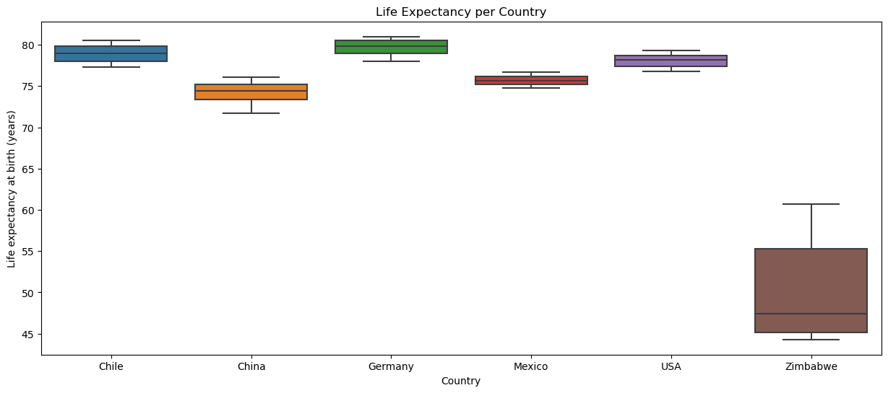
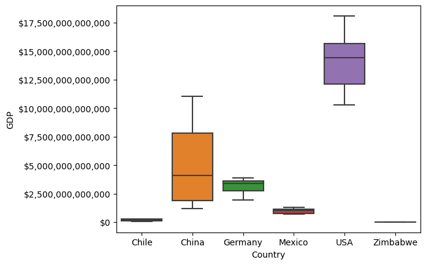
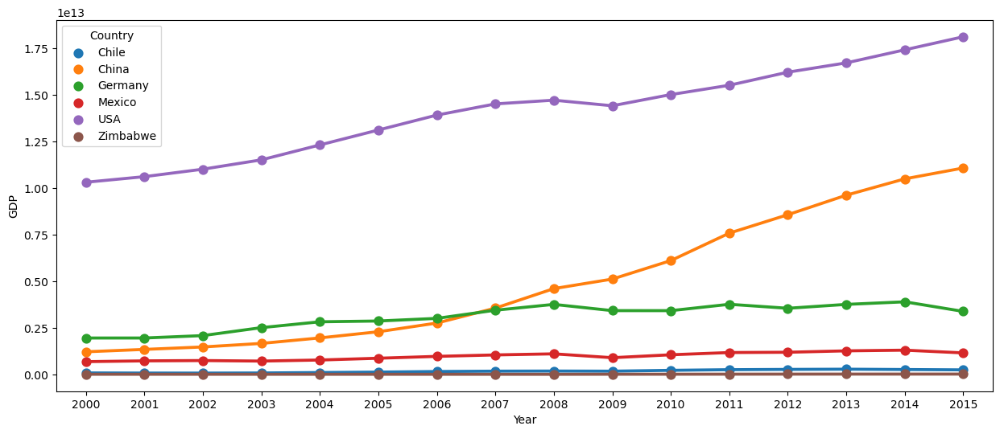

```python
import pandas as pd
import numpy as np
import seaborn as sns
import matplotlib.pyplot as plt
import matplotlib.ticker as ticker
import warnings
from sklearn.preprocessing import StandardScaler
```


```python
data = pd.read_csv("all_data.csv")
```


```python
#disable scientific notation
pd.options.display.float_format = '{:.2f}'.format
#disable warnings
warnings.filterwarnings("ignore")
data.head()
```


<div>
<style scoped>
    .dataframe tbody tr th:only-of-type {
        vertical-align: middle;
    }

    .dataframe tbody tr th {
        vertical-align: top;
    }

    .dataframe thead th {
        text-align: right;
    }
</style>
<table border="1" class="dataframe">
  <thead>
    <tr style="text-align: right;">
      <th></th>
      <th>Country</th>
      <th>Year</th>
      <th>Life expectancy at birth (years)</th>
      <th>GDP</th>
    </tr>
  </thead>
  <tbody>
    <tr>
      <th>0</th>
      <td>Chile</td>
      <td>2000</td>
      <td>77.30</td>
      <td>77860932152.00</td>
    </tr>
    <tr>
      <th>1</th>
      <td>Chile</td>
      <td>2001</td>
      <td>77.30</td>
      <td>70979923960.00</td>
    </tr>
    <tr>
      <th>2</th>
      <td>Chile</td>
      <td>2002</td>
      <td>77.80</td>
      <td>69736811435.00</td>
    </tr>
    <tr>
      <th>3</th>
      <td>Chile</td>
      <td>2003</td>
      <td>77.90</td>
      <td>75643459840.00</td>
    </tr>
    <tr>
      <th>4</th>
      <td>Chile</td>
      <td>2004</td>
      <td>78.00</td>
      <td>99210392858.00</td>
    </tr>
  </tbody>
</table>
</div>


```python
data.info()
```

    <class 'pandas.core.frame.DataFrame'>
    RangeIndex: 96 entries, 0 to 95
    Data columns (total 4 columns):
     #   Column                            Non-Null Count  Dtype  
    ---  ------                            --------------  -----  
     0   Country                           96 non-null     object 
     1   Year                              96 non-null     int64  
     2   Life expectancy at birth (years)  96 non-null     float64
     3   GDP                               96 non-null     float64
    dtypes: float64(2), int64(1), object(1)
    memory usage: 3.1+ KB
    


```python
data.isna()
```


<div>
<style scoped>
    .dataframe tbody tr th:only-of-type {
        vertical-align: middle;
    }

    .dataframe tbody tr th {
        vertical-align: top;
    }

    .dataframe thead th {
        text-align: right;
    }
</style>
<table border="1" class="dataframe">
  <thead>
    <tr style="text-align: right;">
      <th></th>
      <th>Country</th>
      <th>Year</th>
      <th>Life expectancy at birth (years)</th>
      <th>GDP</th>
    </tr>
  </thead>
  <tbody>
    <tr>
      <th>0</th>
      <td>False</td>
      <td>False</td>
      <td>False</td>
      <td>False</td>
    </tr>
    <tr>
      <th>1</th>
      <td>False</td>
      <td>False</td>
      <td>False</td>
      <td>False</td>
    </tr>
    <tr>
      <th>2</th>
      <td>False</td>
      <td>False</td>
      <td>False</td>
      <td>False</td>
    </tr>
    <tr>
      <th>3</th>
      <td>False</td>
      <td>False</td>
      <td>False</td>
      <td>False</td>
    </tr>
    <tr>
      <th>4</th>
      <td>False</td>
      <td>False</td>
      <td>False</td>
      <td>False</td>
    </tr>
    <tr>
      <th>...</th>
      <td>...</td>
      <td>...</td>
      <td>...</td>
      <td>...</td>
    </tr>
    <tr>
      <th>91</th>
      <td>False</td>
      <td>False</td>
      <td>False</td>
      <td>False</td>
    </tr>
    <tr>
      <th>92</th>
      <td>False</td>
      <td>False</td>
      <td>False</td>
      <td>False</td>
    </tr>
    <tr>
      <th>93</th>
      <td>False</td>
      <td>False</td>
      <td>False</td>
      <td>False</td>
    </tr>
    <tr>
      <th>94</th>
      <td>False</td>
      <td>False</td>
      <td>False</td>
      <td>False</td>
    </tr>
    <tr>
      <th>95</th>
      <td>False</td>
      <td>False</td>
      <td>False</td>
      <td>False</td>
    </tr>
  </tbody>
</table>
<p>96 rows × 4 columns</p>
</div>


```python
data.Country.value_counts()
```


    Chile                       16
    China                       16
    Germany                     16
    Mexico                      16
    United States of America    16
    Zimbabwe                    16
    Name: Country, dtype: int64


```python
data.Year.value_counts()
```


    2000    6
    2001    6
    2002    6
    2003    6
    2004    6
    2005    6
    2006    6
    2007    6
    2008    6
    2009    6
    2010    6
    2011    6
    2012    6
    2013    6
    2014    6
    2015    6
    Name: Year, dtype: int64


```python
data =data.rename(columns={"Life expectancy at birth (years)": "leab"})

data["Country"] = data["Country"].replace("United States of America", "USA")

data["Year"] = data["Year"].apply(str)
```


```python
data.describe()
```


<div>
<style scoped>
    .dataframe tbody tr th:only-of-type {
        vertical-align: middle;
    }

    .dataframe tbody tr th {
        vertical-align: top;
    }

    .dataframe thead th {
        text-align: right;
    }
</style>
<table border="1" class="dataframe">
  <thead>
    <tr style="text-align: right;">
      <th></th>
      <th>leab</th>
      <th>GDP</th>
    </tr>
  </thead>
  <tbody>
    <tr>
      <th>count</th>
      <td>96.00</td>
      <td>96.00</td>
    </tr>
    <tr>
      <th>mean</th>
      <td>72.79</td>
      <td>3880498570768.40</td>
    </tr>
    <tr>
      <th>std</th>
      <td>10.67</td>
      <td>5197561310975.92</td>
    </tr>
    <tr>
      <th>min</th>
      <td>44.30</td>
      <td>4415702800.00</td>
    </tr>
    <tr>
      <th>25%</th>
      <td>74.47</td>
      <td>173301750000.00</td>
    </tr>
    <tr>
      <th>50%</th>
      <td>76.75</td>
      <td>1280220000000.00</td>
    </tr>
    <tr>
      <th>75%</th>
      <td>78.90</td>
      <td>4067510000000.00</td>
    </tr>
    <tr>
      <th>max</th>
      <td>81.00</td>
      <td>18100000000000.00</td>
    </tr>
  </tbody>
</table>
</div>


```python
data.groupby("Country")["leab", "GDP"].describe()
```


<div>
<style scoped>
    .dataframe tbody tr th:only-of-type {
        vertical-align: middle;
    }

    .dataframe tbody tr th {
        vertical-align: top;
    }

    .dataframe thead tr th {
        text-align: left;
    }

    .dataframe thead tr:last-of-type th {
        text-align: right;
    }
</style>
<table border="1" class="dataframe">
  <thead>
    <tr>
      <th></th>
      <th colspan="8" halign="left">leab</th>
      <th colspan="8" halign="left">GDP</th>
    </tr>
    <tr>
      <th></th>
      <th>count</th>
      <th>mean</th>
      <th>std</th>
      <th>min</th>
      <th>25%</th>
      <th>50%</th>
      <th>75%</th>
      <th>max</th>
      <th>count</th>
      <th>mean</th>
      <th>std</th>
      <th>min</th>
      <th>25%</th>
      <th>50%</th>
      <th>75%</th>
      <th>max</th>
    </tr>
    <tr>
      <th>Country</th>
      <th></th>
      <th></th>
      <th></th>
      <th></th>
      <th></th>
      <th></th>
      <th></th>
      <th></th>
      <th></th>
      <th></th>
      <th></th>
      <th></th>
      <th></th>
      <th></th>
      <th></th>
      <th></th>
    </tr>
  </thead>
  <tbody>
    <tr>
      <th>Chile</th>
      <td>16.00</td>
      <td>78.94</td>
      <td>1.06</td>
      <td>77.30</td>
      <td>77.97</td>
      <td>79.00</td>
      <td>79.83</td>
      <td>80.50</td>
      <td>16.00</td>
      <td>169788845015.31</td>
      <td>76878841264.91</td>
      <td>69736811435.00</td>
      <td>93873027681.50</td>
      <td>172997500000.00</td>
      <td>244951500000.00</td>
      <td>278384000000.00</td>
    </tr>
    <tr>
      <th>China</th>
      <td>16.00</td>
      <td>74.26</td>
      <td>1.32</td>
      <td>71.70</td>
      <td>73.40</td>
      <td>74.45</td>
      <td>75.25</td>
      <td>76.10</td>
      <td>16.00</td>
      <td>4957713750000.00</td>
      <td>3501095794796.97</td>
      <td>1211350000000.00</td>
      <td>1881585000000.00</td>
      <td>4075195000000.00</td>
      <td>7819550000000.00</td>
      <td>11064700000000.00</td>
    </tr>
    <tr>
      <th>Germany</th>
      <td>16.00</td>
      <td>79.66</td>
      <td>0.97</td>
      <td>78.00</td>
      <td>78.95</td>
      <td>79.85</td>
      <td>80.53</td>
      <td>81.00</td>
      <td>16.00</td>
      <td>3094775625000.00</td>
      <td>667486247917.95</td>
      <td>1949950000000.00</td>
      <td>2740870000000.00</td>
      <td>3396350000000.00</td>
      <td>3596077500000.00</td>
      <td>3890610000000.00</td>
    </tr>
    <tr>
      <th>Mexico</th>
      <td>16.00</td>
      <td>75.72</td>
      <td>0.62</td>
      <td>74.80</td>
      <td>75.22</td>
      <td>75.65</td>
      <td>76.15</td>
      <td>76.70</td>
      <td>16.00</td>
      <td>976650625000.00</td>
      <td>209571645310.42</td>
      <td>683648000000.00</td>
      <td>763091000000.00</td>
      <td>1004375500000.00</td>
      <td>1156992500000.00</td>
      <td>1298460000000.00</td>
    </tr>
    <tr>
      <th>USA</th>
      <td>16.00</td>
      <td>78.06</td>
      <td>0.83</td>
      <td>76.80</td>
      <td>77.42</td>
      <td>78.15</td>
      <td>78.72</td>
      <td>79.30</td>
      <td>16.00</td>
      <td>14075000000000.00</td>
      <td>2432693979932.54</td>
      <td>10300000000000.00</td>
      <td>12100000000000.00</td>
      <td>14450000000000.00</td>
      <td>15675000000000.00</td>
      <td>18100000000000.00</td>
    </tr>
    <tr>
      <th>Zimbabwe</th>
      <td>16.00</td>
      <td>50.09</td>
      <td>5.94</td>
      <td>44.30</td>
      <td>45.17</td>
      <td>47.40</td>
      <td>55.33</td>
      <td>60.70</td>
      <td>16.00</td>
      <td>9062579595.06</td>
      <td>4298309546.64</td>
      <td>4415702800.00</td>
      <td>5748309350.00</td>
      <td>6733671150.00</td>
      <td>12634460624.75</td>
      <td>16304667807.00</td>
    </tr>
  </tbody>
</table>
</div>


```python
sns.boxplot(data = data, x = "Country", y = "leab")
plt.title("Life Expectancy per Country")
plt.ylabel("Life expectancy at birth (years)")
plt.show()
plt.close()
```


    

    


```python
ax = sns.boxplot(data = data, x = "Country", y = "GDP")
#disable scientific notation
ax.ticklabel_format(style="plain", axis="y")
#format y-notations
formatter = ticker.StrMethodFormatter("${x:,.0f}")
ax.yaxis.set_major_formatter(formatter)

plt.show()
plt.close()
```


    

    


```python
data_chile = data[data["Country"] == "Chile"]
data_usa = data[data["Country"] == "USA"]
data_zimbabwe = data[data["Country"] == "Zimbabwe"]
data_china = data[data["Country"] == "China"]
data_germany = data[data["Country"] == "Germany"]
data_mexico = data[data["Country"] == "Mexico"]

```


```python
f, ax = plt.subplots(figsize=(15,6))
ax = sns.pointplot(data=data, x = "Year", y = "GDP", hue = "Country")
plt.show()
plt.close()
```


    

    


```python
f, ax = plt.subplots(figsize=(15,6))

ax = sns.pointplot(data = data, x = "Year", y = "GDP", hue = "Country")

plt.show()
plt.close()
```


    

    


```python
sns.scatterplot(data = data, x = "GDP", y = "leab" )
plt.show()
plt.close()
```


    

    


Use StandardScaler for Z-transformation


```python
gdp_all = data["GDP"]
leab_all = data["leab"]

gdp_all = np.array(gdp_all).reshape(-1,1)
leab_all = np.array(leab_all).reshape(-1,1)

scaler = StandardScaler()
gdp_all_scaled = scaler.fit_transform(gdp_all)
leab_all_scaled = scaler.fit_transform(leab_all)

print(np.mean(gdp_all_scaled))
print(np.mean(leab_all_scaled))

# flatten 2D arrays
gdp_all_flat = gdp_all_scaled.ravel()
leab_all_flat = leab_all_scaled.ravel()


```

    -5.551115123125783e-17
    -6.291263806209221e-16
    


```python
sns.scatterplot(x=gdp_all_flat, y= leab_all_flat)
plt.show()
plt.close()
```


    

    

